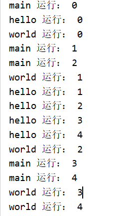

# 进程与线程

**进程：**

​	每个进程都有独立的代码的数据空间（进程上下文），进程间的切换会有较大的开销，一个进程包含1~n个线程。	

​	多进程：指OS能同时运行多个任务（程序）

> 进程是资源分配的最小单位

**线程：**

​	同一类线程共享代码和数据空间，每个线程都有独立的运行栈和程序计数器（PC），线程切换开销小。

​	多线程：指在同一个程序中有多个顺序流在执行

> 线程是CPU调度的最小单位

线程和进程一样分为五个阶段：创建、就绪、运行、阻塞、终止


# JAVA实现多线程

Java实现多线程，常用的有两种方法：

1. 继承Thread类
2. 实现Runnable接口

两者对比，第二种方法更常用


## 继承Thread类

**使用：**

​	新建一个类，继承java.lang.Thread类，重写run()方法

​	执行时调用线程类的start()方法


**例子：**

```java
public class Thread1 extends Thread {
    private String name;
    
    public Thread1(String name) {
        this.name = name;
    }

    @Override
    public void run() {
        for(int i=0;i<10;i++){
            System.out.println(name+" 运行： "+i);
            try {
                sleep((int)Math.random()*10);
            } catch (InterruptedException e) {
                e.printStackTrace();
            }
        }
    }
}

public class Main {
    public static void main(String[] args) {
        Thread1 thread1=new Thread1("hello");
        Thread1 thread2=new Thread1("world");
        thread1.start();
        thread2.start();
        for(int i=0;i<5;i++){
            System.out.println("main 运行： "+i);
            try {
                sleep((int)Math.random()*10);
            } catch (InterruptedException e) {
                e.printStackTrace();
            }
        }
    }
}
```

**输出：**


再执行一下输出：




**说明：**

​	程序启动执行main()时，Java虚拟机启动了一个进程，主线程main在main()调用时被创建

​	随着调用Thread1的两个对象的start()方法，另外两个线程也启动了

​	这样，整个应用就在多线程下运行

> main()方法其实也是一个线程，
>
> 在Java中所有的线程都是同时启动的，至于什么时候，哪个先执行，完全看谁先得到CPU的资源
>
> 每次运行Java程序至少启动2个线程：main线程、垃圾收集线程
>
> 每运行一个Java程序，都会启动一个JVM，这个JVM其实就是一个进程


**注意：**

1. 调用start()方法后，并不是立即执行多线程代码，而是使该线程变为可运行态（Runnable），至于什么时候运行是由OS决定的
2. 多线程程序是乱序执行的，因此，对于乱序执行的代码，为了加快速度，可设计为多线程
3. 调用Thread.sleep()的目的是：不让当前线程独自霸占该进程所获取的CPU资源，从而留出一定时间给其它线程执行的机会
4. 重复调用start()方法的话，会出现java.lang.IllegalThreadStateException异常

> 可运行态（Runnable），我感觉也就是就绪


## 实现Runnable接口

**使用：**

​	新建一个类，实现Runnable接口，然后重写run()方法


**例子：**

```java
public class SaySomething implements Runnable{
    private String name;

    public SaySomething(String name) {
        this.name = name;
    }

    @Override
    public void run() {
        for(int i=0;i<5;i++){
            System.out.println(name+" 运行： "+i);
            try {
                Thread.sleep((int)Math.random()*10);
            } catch (InterruptedException e) {
                e.printStackTrace();
            }
        }
    }
}

public class Main {
    public static void main(String[] args) {
        Thread thread1=new Thread(new SaySomething("hello"));
        Thread thread2=new Thread(new SaySomething("world"));
        thread1.start();
        thread2.start();
        for(int i=0;i<5;i++){
            System.out.println("main 运行： "+i);
            try {
                sleep((int)Math.random()*10);
            } catch (InterruptedException e) {
                e.printStackTrace();
            }
        }
    }
}
```

**输出：**


再执行一次输出：


**说明：**

1. SaySomething类通过实现Runnable接口，使得该类有了多线程类得特征

2. run()方法是多线程程序得一个约定，所有的多线程代码都在run()方法里

3. 其实java.lang.Thread类也是实现了Runnable接口的类
4. 在启动多线程时，需要先通过Thread类的构造方法Thread(Runnable target)构造出对象，然后调用Thread对象的start()方法来运行多线程代码
5. 其实所有的多线程代码都是通过运行Thread的start()方法来运行的


## Thread和Runnable的区别

如果一个类继承Thread，则不适合资源共享

如果一个类实现Runnable接口的话，则更容易实现资源共享

> 在Java中，一个类只能继承一个类，但可以实现多个接口


实现Runnable的优势：

1. 适合多个相同的程序代码的线程去处理同一个资源（还没体会到）
2. 可避免Java中单继承的限制
3. 增加程序的健壮性，代码可被多个线程共享，代码和数据独立（也还没体会到）
4. 线程池只能放入实现Runnable或Callable类的线程，不能直接放入继承Thread的类


## 线程状态转换


说一下**阻塞状态（Blocked）**

阻塞状态是线程因为某种原因放弃CPU使用权，暂时停止运行，直到线程进入就绪状态，才有机会转到运行状态。

阻塞的情况有三种：

1. 等待阻塞：运行的线程执行wait()方法，JVM会将该线程放入等待池中。（wait会释放持有的锁）
2. 同步阻塞：运行的线程在获取对象的同步锁时，若该同步锁被别的线程占用，则JVM会把该线程放入锁池中
3. 其它阻塞：运行的线程执行sleep()或join()方法，或者发出了I/O请求时，JVM会把该线程置为阻塞状态。当sleep()状态超时、join()等待线程终止或者超时、I/O处理完成时，线程会重新转入就绪状态。（sleep不会释放持有的锁）


## Thread常用API

### 优先级

通过调整线程的优先级，使优先级高的线程获得较多的运行机会

Java线程的优先级用int表示，取值范围：1~10，Thread也有3个关于优先级的静态常量：

```java
//Thread类的部分源代码
public class Thread implements Runnable{
    
    public final static int MIN_PRIORITY = 1;   //The minimum priority that a thread can have.
	public final static int NORM_PRIORITY = 5;   //The default priority that is assigned to a thread.
	public final static int MAX_PRIORITY = 10;    //The maximum priority that a thread can have.
    
    public final void setPriority(int newPriority){...}    //设置优先级
    
    //获取优先级
    public final int getPriority() {
        return priority;
    }
}

```

**注意：**

- 线程的优先级有继承关系，比如A线程创建了B线程，那么B线程与A线程有相同的优先级
- JVM虽然提供了10个线程优先级，但与常见的操作系统都不能很好的映射，所以最好只使用那3个静态变量来设置线程优先级


### 线程睡眠

```java
Thread.sleep(long millis)；
```

使线程转到阻塞状态，millis参数设定睡眠的时间，单位：毫秒。当睡眠结束后，就转为就绪（Runnable）状态，sleep()平台移植性好。


### 线程等待

```java
Object.wait();
```

使当前的线程等待，直到其它线程调用此对象的notify()或notifyAll()唤醒


### 线程让步

```java
Thread.yield(); 
```

暂停


<br/>

<br/>

参考：

1.[林炳文Evankaka大佬的Java多线程学习（吐血超详细总结）](https://blog.csdn.net/evankaka/article/details/44153709)