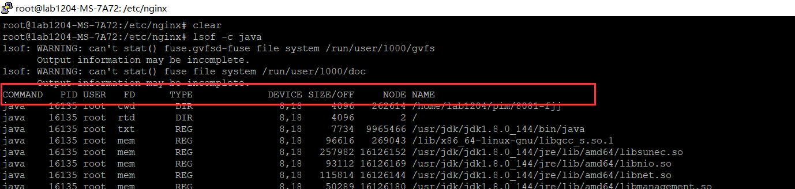

# 进程

## 查看进程

### lsof

```bash
$ lsof           ##查看所有进程  
$ lsof -i:8080   ##查看端口号为8080的进程
$ lsof -u root   ##查看用户为root的进程
$ lsof -c java   ##查看名称为java的进程
$ lsof -p 123    ##查看PID为123的进程
```

效果图：

<div style="margin:0 auto">



</div>

| COMMAND  | PID        | USER       | FD         | TYPE     | DEVICE         | SIZE/OFF | NODE                           | NAME           |
| -------- | ---------- | ---------- | ---------- | -------- | -------------- | -------- | ------------------------------ | -------------- |
| 进程名称 | 进程标识符 | 进程所有者 | 文件描述符 | 文件类型 | 文件所在的磁盘 | 文件大小 | 索引节点（文件在磁盘上的标识） | 确切的进程名称 |


当我输入`lsof -c java`时，发现有多个PID一样的进程名，我的理解是同一个PID的进程用到了多个相关的文件，在NAME中可以看得出来


## 关闭进程

### kill

kill命令通常是通过发送指定的信号到相应进程来实现的

常用信号：

- 1 终端断线
- 2 中断（等同 Ctrl + C）
- 3 退出（同 Ctrl + \）
- 15 终止（可以使得进程在退出之前清理并释放资源）
- 9 强制终止
- 19 暂停（等同 Ctrl + Z）
- 18 继续（与19相反）

```bash
$ kill -9 26889     ##强制终止PID为26889的进程
$ kill -15 26889    ##终止PID为26889的进程
```

# 文本

## 文本编辑

### vim/vi

**常用功能键**

| 功能键 | 作用                                                         |
| ------ | ------------------------------------------------------------ |
| /      | 搜索字符串，如/user：搜索user字符串。查看下一个匹配：n；查看上一个匹配：N |
|        |                                                              |
|        |                                                              |


## 文本查看

### less

```bash
less nohup.out   ## 查看nohup.out文本
```

**less功能键**

| 功能键   | 作用           |
| -------- | -------------- |
| j        | 下一行         |
| k        | 上一行         |
| 空格     | 下一页         |
| b        | 上一页         |
| G        | 到最后一行     |
| g        | 到第一行       |
| /字符串  | 向下搜索       |
| ？字符串 | 向上搜索       |
| =        | 显示当前行信息 |


# 文件目录

## 罗列文件

### ls

```bash
ls   ##列出当前目录下的全部文件（不包含隐藏文件）
ls /home    ##列出“当前目录/home”目录下的全部文件（不包含隐藏文件）
ls -a     ##列出目录下的所有文件（包含隐藏文件）  a：all的缩写

```

```bash
ls -lh  ##显示出文件的属性与权限等数据信息,文件大小更直观

# -h   文件大小显示更直观
```


每一列含义：


```bash
ls -t ##将文件依建立、修改的时间之先后次序列出
```


```bash
ls -lt  ##将-l跟-t的效果合并起来，常用
```


## 查看当前目录

```shell
pwd
```


## 删除

```shell
root@ubuntu:~/tools# rm --help
Usage: rm [OPTION]... [FILE]...
Remove (unlink) the FILE(s).

  -f, --force           ignore nonexistent files and arguments, never prompt # 强制删
  -i                    prompt before every removal   # 提示是否删除
  -I                    prompt once before removing more than three files, or
                          when removing recursively; less intrusive than -i,
                          while still giving protection against most mistakes
      --interactive[=WHEN]  prompt according to WHEN: never, once (-I), or
                          always (-i); without WHEN, prompt always
      --one-file-system  when removing a hierarchy recursively, skip any
                          directory that is on a file system different from
                          that of the corresponding command line argument
      --no-preserve-root  do not treat '/' specially
      --preserve-root   do not remove '/' (default)
  -r, -R, --recursive   remove directories and their contents recursively  # 递归删
  -d, --dir             remove empty directories
  -v, --verbose         explain what is being done    # 显示删了什么


## 常用
rm -rfv *   # 删除当前目录下的所有文件和目录
```


## 重命名文件(夹)

```shell
# 常用mv命令
mv A B   # 将目录(文件)A重命名为目录(文件)B
```


## 移动文件(夹)

```shell
# mv 命令

root@ubuntu:/usr/local/python3# mv --help
Usage: mv [OPTION]... [-T] SOURCE DEST
  or:  mv [OPTION]... SOURCE... DIRECTORY
  or:  mv [OPTION]... -t DIRECTORY SOURCE...
Rename SOURCE to DEST, or move SOURCE(s) to DIRECTORY.

Mandatory arguments to long options are mandatory for short options too.
      --backup[=CONTROL]       make a backup of each existing destination file
  -b                           like --backup but does not accept an argument
  -f, --force                  do not prompt before overwriting
  -i, --interactive            prompt before overwrite
  -n, --no-clobber             do not overwrite an existing file
If you specify more than one of -i, -f, -n, only the final one takes effect.
      --strip-trailing-slashes  remove any trailing slashes from each SOURCE
                                 argument
  -S, --suffix=SUFFIX          override the usual backup suffix
  -t, --target-directory=DIRECTORY  move all SOURCE arguments into DIRECTORY
  -T, --no-target-directory    treat DEST as a normal file
  -u, --update                 move only when the SOURCE file is newer
                                 than the destination file or when the
                                 destination file is missing
  -v, --verbose                explain what is being done
  -Z, --context                set SELinux security context of destination
                                 file to default type
                                 
# 常用
mv * ../    # 移动当前目录所有文件到上一级目录
mv /home/Download/Python3.9.0 /usr/local/python3      # 移动Download下的Python.3.9.0目录到python3中
```


# 权限

Linux下文件的权限一般有读（r）、写（w）、执行（x）

同时，文件权限身份也有三种：文件所有者（user）、文件所有者所在组（group）、其他组（others）


以这个图为例，说一下第一列的含义

第一列总共有10个字符

|        字符1        |                      字符2~4                       |                         字符5~7                          |                    字符8~10                    |
| :-----------------: | :------------------------------------------------: | :------------------------------------------------------: | :--------------------------------------------: |
| d：目录<br/>-：文件 | 依次表示文件所有者对该文件的可读、可写、可执行权限 | 依次表示文件所有者所在组对该文件的可读、可写、可执行权限 | 依次表示其他组对该文件的可读、可写、可执行权限 |

## 修改权限

1. **chmod abc filename**

   指令中的a、b、c分别表示一个数字，其中

   - a ：文件所有者的权限
   - b ： 文件所有者所在组的权限
   - c ： 其他组的权限

   a、b、c都是0~7的数字，对应由r、w、x三个二进制位**按序**组成的二进制数，比如：只读则100，也就是4，读写则110，也就是6，读写加执行则111，也就是7

   实践：

   


# 用户管理

## 查询用户信息

1. **id 用户名**

   ```shell
   wakie@ubuntu:~$ id --help
   Usage: id [OPTION]... [USER]
   Print user and group information for the specified USER,
   or (when USER omitted) for the current user.
   
     -a             ignore, for compatibility with other versions
     -Z, --context  print only the security context of the process
     -g, --group    print only the effective group ID
     -G, --groups   print all group IDs
     -n, --name     print a name instead of a number, for -ugG
     -r, --real     print the real ID instead of the effective ID, with -ugG
     -u, --user     print only the effective user ID
     -z, --zero     delimit entries with NUL characters, not whitespace;
                      not permitted in default format
         --help     display this help and exit
         --version  output version information and exit
   
   Without any OPTION, print some useful set of identified information.
   
   
   # 例子：
   wakie@ubuntu:~$ id wakie
   uid=1000(wakie) gid=1000(wakie) groups=1000(wakie),4(adm),24(cdrom),27(sudo),30(dip),46(plugdev),116(lpadmin),126(sambashare)
   # wakie的用户id为1000，其所在组id为1000，其所在组有如下组成员：wakie(id=1000),adm(id=4),sudo(id=27)……
   
   
   wakie@ubuntu:~$ id root
   uid=0(root) gid=0(root) groups=0(root)
   # root的用户id为0，其所在组id为0，其所在组有如下组成员：root(id=0)
   
   ```


## 查看组成员

```shell
groups  # 查看当前用户所在组的组成员
groups wakie     # 查看wakie用户所在组的组成员

wakie@ubuntu:~$ groups
wakie adm cdrom sudo dip plugdev lpadmin sambashare

wakie@ubuntu:~$ groups root
root : root

wakie@ubuntu:~$ groups wakie
wakie : wakie adm cdrom sudo dip plugdev lpadmin sambashare
```


## 新建用户组

```shell
wakie@ubuntu:~$ groupadd --help
Usage: groupadd [options] GROUP

Options:
  -f, --force                   exit successfully if the group already exists,
                                and cancel -g if the GID is already used
  -g, --gid GID                 use GID for the new group
  -h, --help                    display this help message and exit
  -K, --key KEY=VALUE           override /etc/login.defs defaults
  -o, --non-unique              allow to create groups with duplicate
                                (non-unique) GID
  -p, --password PASSWORD       use this encrypted password for the new group
  -r, --system                  create a system account
  -R, --root CHROOT_DIR         directory to chroot into
      --extrausers              Use the extra users database
```


## 添加组成员

```shell
wakie@ubuntu:~$ gpasswd --help
Usage: gpasswd [option] GROUP

Options:
  -a, --add USER                add USER to GROUP
  -d, --delete USER             remove USER from GROUP
  -h, --help                    display this help message and exit
  -Q, --root CHROOT_DIR         directory to chroot into
  -r, --remove-password         remove the GROUP's password
  -R, --restrict                restrict access to GROUP to its members
  -M, --members USER,...        set the list of members of GROUP
  -A, --administrators ADMIN,...
                                set the list of administrators for GROUP
Except for the -A and -M options, the options cannot be combined.


# 例子： 添加wakie到docker用户组 
wakie@ubuntu:~$ sudo gpasswd -a wakie docker
[sudo] password for wakie:
Adding user wakie to group docker
```


## 查看所有用户组

在Linux中，本机的所有用户组信息都存储在`/etc/group`文件中

```shell
root:x:0:     # 用户组名：root     密码：没设      用户组ID：0      组成员：无
daemon:x:1:
adm:x:4:syslog,wakie      # 组名：adm     密码：没    组ID：4     组成员：syslog，wakie
cdrom:x:24:wakie
floppy:x:25:
tape:x:26:
sudo:x:27:wakie
audio:x:29:pulse
dip:x:30:wakie
plugdev:x:46:wakie
lpadmin:x:116:wakie
scanner:x:118:saned
wakie:x:1000:
sambashare:x:126:wakie
mysql:x:127:
docker:x:999:
```

在该文件中，每一行都会有4个内容，分别用`:`隔开

`用户组名:用户组密码:用户组ID:用户组成员`


## 修改用户的组

1. **usermod -g 用户组 用户名**

例子：

```shell
$ usermod -g root wakie    #将用户wakie迁移到root的组	
```


# 硬盘

## 查看磁盘块设备

```shell
# lsblk 

wakie@ubuntu:~$ lsblk --help

Usage:
 lsblk [options] [<device> ...]

List information about block devices.

Options:
 -a, --all            print all devices
 -b, --bytes          print SIZE in bytes rather than in human readable format
 -d, --nodeps         don't print slaves or holders
 -D, --discard        print discard capabilities
 -z, --zoned          print zone model
 -e, --exclude <list> exclude devices by major number (default: RAM disks)
 -f, --fs             output info about filesystems
 -i, --ascii          use ascii characters only
 -I, --include <list> show only devices with specified major numbers
 -J, --json           use JSON output format
 -l, --list           use list format output
 -T, --tree           use tree format output
 -m, --perms          output info about permissions
 -n, --noheadings     don't print headings
 -o, --output <list>  output columns
 -O, --output-all     output all columns
 -p, --paths          print complete device path
 -P, --pairs          use key="value" output format
 -r, --raw            use raw output format
 -s, --inverse        inverse dependencies
 -S, --scsi           output info about SCSI devices
 -t, --topology       output info about topology
 -x, --sort <column>  sort output by <column>

 -h, --help           display this help
 -V, --version        display version
 
 
# 例子
wakie@ubuntu:~$ lsblk
NAME   MAJ:MIN RM   SIZE RO TYPE MOUNTPOINT
loop0    7:0    0  55.4M  1 loop /snap/core18/2066
loop1    7:1    0   2.5M  1 loop /snap/gnome-calculator/826
loop2    7:2    0   2.5M  1 loop /snap/gnome-calculator/884
loop3    7:3    0 162.9M  1 loop /snap/gnome-3-28-1804/145
loop4    7:4    0   219M  1 loop /snap/gnome-3-34-1804/72
loop5    7:5    0  55.5M  1 loop /snap/core18/1997
loop6    7:6    0  62.1M  1 loop /snap/gtk-common-themes/1506
loop7    7:7    0 160.2M  1 loop /snap/gnome-3-28-1804/116
loop8    7:8    0   276K  1 loop /snap/gnome-characters/708
loop9    7:9    0  65.1M  1 loop /snap/gtk-common-themes/1515
loop10   7:10   0  99.2M  1 loop /snap/core/11167
loop11   7:11   0   219M  1 loop /snap/gnome-3-34-1804/66
loop12   7:12   0   548K  1 loop /snap/gnome-logs/103
loop13   7:13   0   276K  1 loop /snap/gnome-characters/570
loop14   7:14   0   956K  1 loop /snap/gnome-logs/100
loop15   7:15   0   2.2M  1 loop /snap/gnome-system-monitor/148
loop16   7:16   0    99M  1 loop /snap/core/11081
loop17   7:17   0   2.2M  1 loop /snap/gnome-system-monitor/157
sda      8:0    0    30G  0 disk
└─sda1   8:1    0    30G  0 part /
sr0     11:0    1  1024M  0 rom
```


## 查看硬盘分区

```shell
# fdisk

wakie@ubuntu:~$ fdisk --help

Usage:
 fdisk [options] <disk>      change partition table    # 设置磁盘分区
 fdisk [options] -l [<disk>] list partition table(s)   # 查看磁盘分区

Display or manipulate a disk partition table.

Options:
 -b, --sector-size <size>      physical and logical sector size
 -B, --protect-boot            don't erase bootbits when creating a new label
 -c, --compatibility[=<mode>]  mode is 'dos' or 'nondos' (default)
 -L, --color[=<when>]          colorize output (auto, always or never)
                                 colors are enabled by default
 -l, --list                    display partitions and exit
 -o, --output <list>           output columns
 -t, --type <type>             recognize specified partition table type only
 -u, --units[=<unit>]          display units: 'cylinders' or 'sectors' (default)
 -s, --getsz                   display device size in 512-byte sectors [DEPRECATED]
     --bytes                   print SIZE in bytes rather than in human readable format
 -w, --wipe <mode>             wipe signatures (auto, always or never)
 -W, --wipe-partitions <mode>  wipe signatures from new partitions (auto, always or never)

 -C, --cylinders <number>      specify the number of cylinders
 -H, --heads <number>          specify the number of heads
 -S, --sectors <number>        specify the number of sectors per track

 -h, --help                    display this help
 -V, --version                 display version
 
 
# 例子：
wakie@ubuntu:~$ sudo fdisk -l
Disk /dev/loop0: 55.4 MiB, 58114048 bytes, 113504 sectors
Units: sectors of 1 * 512 = 512 bytes
Sector size (logical/physical): 512 bytes / 512 bytes
I/O size (minimum/optimal): 512 bytes / 512 bytes

Disk /dev/loop1: 2.5 MiB, 2600960 bytes, 5080 sectors
Units: sectors of 1 * 512 = 512 bytes
Sector size (logical/physical): 512 bytes / 512 bytes
I/O size (minimum/optimal): 512 bytes / 512 bytes

Disk /dev/loop2: 2.5 MiB, 2605056 bytes, 5088 sectors
Units: sectors of 1 * 512 = 512 bytes
Sector size (logical/physical): 512 bytes / 512 bytes
I/O size (minimum/optimal): 512 bytes / 512 bytes

Disk /dev/loop3: 162.9 MiB, 170778624 bytes, 333552 sectors
Units: sectors of 1 * 512 = 512 bytes
Sector size (logical/physical): 512 bytes / 512 bytes
I/O size (minimum/optimal): 512 bytes / 512 bytes

Disk /dev/loop4: 219 MiB, 229638144 bytes, 448512 sectors
Units: sectors of 1 * 512 = 512 bytes
Sector size (logical/physical): 512 bytes / 512 bytes
I/O size (minimum/optimal): 512 bytes / 512 bytes

Disk /dev/loop5: 55.5 MiB, 58142720 bytes, 113560 sectors
Units: sectors of 1 * 512 = 512 bytes
Sector size (logical/physical): 512 bytes / 512 bytes
I/O size (minimum/optimal): 512 bytes / 512 bytes

Disk /dev/loop6: 62.1 MiB, 65105920 bytes, 127160 sectors
Units: sectors of 1 * 512 = 512 bytes
Sector size (logical/physical): 512 bytes / 512 bytes
I/O size (minimum/optimal): 512 bytes / 512 bytes

Disk /dev/loop7: 160.2 MiB, 167931904 bytes, 327992 sectors
Units: sectors of 1 * 512 = 512 bytes
Sector size (logical/physical): 512 bytes / 512 bytes
I/O size (minimum/optimal): 512 bytes / 512 bytes

Disk /dev/sda: 30 GiB, 32212254720 bytes, 62914560 sectors
Units: sectors of 1 * 512 = 512 bytes
Sector size (logical/physical): 512 bytes / 512 bytes
I/O size (minimum/optimal): 512 bytes / 512 bytes
Disklabel type: dos
Disk identifier: 0x8f089e08

Device     Boot Start      End  Sectors Size Id Type
/dev/sda1  *     2048 62912511 62910464  30G 83 Linux


Disk /dev/loop8: 276 KiB, 282624 bytes, 552 sectors
Units: sectors of 1 * 512 = 512 bytes
Sector size (logical/physical): 512 bytes / 512 bytes
I/O size (minimum/optimal): 512 bytes / 512 bytes

Disk /dev/loop9: 65.1 MiB, 68259840 bytes, 133320 sectors
Units: sectors of 1 * 512 = 512 bytes
Sector size (logical/physical): 512 bytes / 512 bytes
I/O size (minimum/optimal): 512 bytes / 512 bytes

Disk /dev/loop10: 99.2 MiB, 103993344 bytes, 203112 sectors
Units: sectors of 1 * 512 = 512 bytes
Sector size (logical/physical): 512 bytes / 512 bytes
I/O size (minimum/optimal): 512 bytes / 512 bytes

Disk /dev/loop11: 219 MiB, 229629952 bytes, 448496 sectors
Units: sectors of 1 * 512 = 512 bytes
Sector size (logical/physical): 512 bytes / 512 bytes
I/O size (minimum/optimal): 512 bytes / 512 bytes

Disk /dev/loop12: 548 KiB, 561152 bytes, 1096 sectors
Units: sectors of 1 * 512 = 512 bytes
Sector size (logical/physical): 512 bytes / 512 bytes
I/O size (minimum/optimal): 512 bytes / 512 bytes


Disk /dev/loop13: 276 KiB, 282624 bytes, 552 sectors
Units: sectors of 1 * 512 = 512 bytes
Sector size (logical/physical): 512 bytes / 512 bytes
I/O size (minimum/optimal): 512 bytes / 512 bytes

Disk /dev/loop14: 956 KiB, 978944 bytes, 1912 sectors
Units: sectors of 1 * 512 = 512 bytes
Sector size (logical/physical): 512 bytes / 512 bytes
I/O size (minimum/optimal): 512 bytes / 512 bytes

Disk /dev/loop15: 2.2 MiB, 2273280 bytes, 4440 sectors
Units: sectors of 1 * 512 = 512 bytes
Sector size (logical/physical): 512 bytes / 512 bytes
I/O size (minimum/optimal): 512 bytes / 512 bytes

Disk /dev/loop16: 99 MiB, 103772160 bytes, 202680 sectors
Units: sectors of 1 * 512 = 512 bytes
Sector size (logical/physical): 512 bytes / 512 bytes
I/O size (minimum/optimal): 512 bytes / 512 bytes

Disk /dev/loop17: 2.2 MiB, 2342912 bytes, 4576 sectors
Units: sectors of 1 * 512 = 512 bytes
Sector size (logical/physical): 512 bytes / 512 bytes
I/O size (minimum/optimal): 512 bytes / 512 bytes
```


## 查看磁盘使用情况

```shell
df

wakie@ubuntu:~$ df --help
Usage: df [OPTION]... [FILE]...

# 显示某个文件所在的文件系统的信息，默认情况下显示所有文件系统的信息。
Show information about the file system on which each FILE resides,   
or all file systems by default.

Mandatory arguments to long options are mandatory for short options too.
  -a, --all             include pseudo, duplicate, inaccessible file systems
  -B, --block-size=SIZE  scale sizes by SIZE before printing them; e.g.,
                           '-BM' prints sizes in units of 1,048,576 bytes;
                           see SIZE format below
  -h, --human-readable  print sizes in powers of 1024 (e.g., 1023M)   # 增强可读性
  -H, --si              print sizes in powers of 1000 (e.g., 1.1G)
  -i, --inodes          list inode information instead of block usage
  -k                    like --block-size=1K
  -l, --local           limit listing to local file systems
      --no-sync         do not invoke sync before getting usage info (default)
      --output[=FIELD_LIST]  use the output format defined by FIELD_LIST,
                               or print all fields if FIELD_LIST is omitted.
  -P, --portability     use the POSIX output format
      --sync            invoke sync before getting usage info
      --total           elide all entries insignificant to available space,
                          and produce a grand total
  -t, --type=TYPE       limit listing to file systems of type TYPE
  -T, --print-type      print file system type  # 显示文件系统类型
  -x, --exclude-type=TYPE   limit listing to file systems not of type TYPE
  

# 例子1：
wakie@ubuntu:~$ df -h
Filesystem      Size  Used Avail Use% Mounted on
udev            3.0G     0  3.0G   0% /dev
tmpfs           608M  2.2M  606M   1% /run
/dev/sda1        30G   16G   13G  57% /
tmpfs           3.0G     0  3.0G   0% /dev/shm
tmpfs           5.0M  4.0K  5.0M   1% /run/lock
tmpfs           3.0G     0  3.0G   0% /sys/fs/cgroup
/dev/loop0       56M   56M     0 100% /snap/core18/2066
/dev/loop1      2.5M  2.5M     0 100% /snap/gnome-calculator/826
/dev/loop2      2.5M  2.5M     0 100% /snap/gnome-calculator/884
/dev/loop3      163M  163M     0 100% /snap/gnome-3-28-1804/145
/dev/loop4      219M  219M     0 100% /snap/gnome-3-34-1804/72
/dev/loop5       56M   56M     0 100% /snap/core18/1997
/dev/loop6       63M   63M     0 100% /snap/gtk-common-themes/1506
/dev/loop7      161M  161M     0 100% /snap/gnome-3-28-1804/116
/dev/loop8      384K  384K     0 100% /snap/gnome-characters/708
/dev/loop9       66M   66M     0 100% /snap/gtk-common-themes/1515
/dev/loop10     100M  100M     0 100% /snap/core/11167
/dev/loop11     219M  219M     0 100% /snap/gnome-3-34-1804/66
/dev/loop12     640K  640K     0 100% /snap/gnome-logs/103
/dev/loop13     384K  384K     0 100% /snap/gnome-characters/570
/dev/loop14     1.0M  1.0M     0 100% /snap/gnome-logs/100
/dev/loop15     2.3M  2.3M     0 100% /snap/gnome-system-monitor/148
/dev/loop16      99M   99M     0 100% /snap/core/11081
/dev/loop17     2.3M  2.3M     0 100% /snap/gnome-system-monitor/157
tmpfs           608M   16K  608M   1% /run/user/121
tmpfs           608M   32K  608M   1% /run/user/1000  


# 例子2：
wakie@ubuntu:~$ df -hT
Filesystem     Type      Size  Used Avail Use% Mounted on
udev           devtmpfs  3.0G     0  3.0G   0% /dev
tmpfs          tmpfs     608M  2.2M  606M   1% /run
/dev/sda1      ext4       30G   16G   13G  57% /
tmpfs          tmpfs     3.0G     0  3.0G   0% /dev/shm
tmpfs          tmpfs     5.0M  4.0K  5.0M   1% /run/lock
tmpfs          tmpfs     3.0G     0  3.0G   0% /sys/fs/cgroup
/dev/loop0     squashfs   56M   56M     0 100% /snap/core18/2066
/dev/loop1     squashfs  2.5M  2.5M     0 100% /snap/gnome-calculator/826
/dev/loop2     squashfs  2.5M  2.5M     0 100% /snap/gnome-calculator/884
/dev/loop3     squashfs  163M  163M     0 100% /snap/gnome-3-28-1804/145
/dev/loop4     squashfs  219M  219M     0 100% /snap/gnome-3-34-1804/72
/dev/loop5     squashfs   56M   56M     0 100% /snap/core18/1997
/dev/loop6     squashfs   63M   63M     0 100% /snap/gtk-common-themes/1506
/dev/loop7     squashfs  161M  161M     0 100% /snap/gnome-3-28-1804/116
/dev/loop8     squashfs  384K  384K     0 100% /snap/gnome-characters/708
/dev/loop9     squashfs   66M   66M     0 100% /snap/gtk-common-themes/1515
/dev/loop10    squashfs  100M  100M     0 100% /snap/core/11167
/dev/loop11    squashfs  219M  219M     0 100% /snap/gnome-3-34-1804/66
/dev/loop12    squashfs  640K  640K     0 100% /snap/gnome-logs/103
/dev/loop13    squashfs  384K  384K     0 100% /snap/gnome-characters/570
/dev/loop14    squashfs  1.0M  1.0M     0 100% /snap/gnome-logs/100
/dev/loop15    squashfs  2.3M  2.3M     0 100% /snap/gnome-system-monitor/148
/dev/loop16    squashfs   99M   99M     0 100% /snap/core/11081
/dev/loop17    squashfs  2.3M  2.3M     0 100% /snap/gnome-system-monitor/157
tmpfs          tmpfs     608M   16K  608M   1% /run/user/121
tmpfs          tmpfs     608M   32K  608M   1% /run/user/1000


# 例子3：
wakie@ubuntu:~$ df -hT /home
Filesystem     Type  Size  Used Avail Use% Mounted on
/dev/sda1      ext4   30G   16G   13G  57% /
wakie@ubuntu:~$ df -hT /
Filesystem     Type  Size  Used Avail Use% Mounted on
/dev/sda1      ext4   30G   16G   13G  57% /
```


## 查看文件使用磁盘情况

```shell
# 查询指定目录的磁盘占用情况，默认为当前目录
# 默认显示该目录下所有子目录的磁盘占用情况
du  
	
wakie@ubuntu:~$ du --help
Usage: du [OPTION]... [FILE]...
  or:  du [OPTION]... --files0-from=F
Summarize disk usage of the set of FILEs, recursively for directories.

Mandatory arguments to long options are mandatory for short options too.
  -0, --null            end each output line with NUL, not newline
  -a, --all             write counts for all files, not just directories
      --apparent-size   print apparent sizes, rather than disk usage; although
                          the apparent size is usually smaller, it may be
                          larger due to holes in ('sparse') files, internal
                          fragmentation, indirect blocks, and the like
  -B, --block-size=SIZE  scale sizes by SIZE before printing them; e.g.,
                           '-BM' prints sizes in units of 1,048,576 bytes;
                           see SIZE format below
  -b, --bytes           equivalent to '--apparent-size --block-size=1'
  -c, --total           produce a grand total
  -D, --dereference-args  dereference only symlinks that are listed on the
                          command line
  -d, --max-depth=N     print the total for a directory (or file, with --all)   
                          only if it is N or fewer levels below the command
                          line argument;  --max-depth=0 is the same as
                          --summarize
                          # 递归查看多少层子目录
      --files0-from=F   summarize disk usage of the
                          NUL-terminated file names specified in file F;
                          if F is -, then read names from standard input
  -H                    equivalent to --dereference-args (-D)
  -h, --human-readable  print sizes in human readable format (e.g., 1K 234M 2G)
      --inodes          list inode usage information instead of block usage
  -k                    like --block-size=1K
  -L, --dereference     dereference all symbolic links
  -l, --count-links     count sizes many times if hard linked
  -m                    like --block-size=1M
  -P, --no-dereference  don't follow any symbolic links (this is the default)
  -S, --separate-dirs   for directories do not include size of subdirectories
      --si              like -h, but use powers of 1000 not 1024
  -s, --summarize       display only a total for each argument
  -t, --threshold=SIZE  exclude entries smaller than SIZE if positive,
                          or entries greater than SIZE if negative
      --time            show time of the last modification of any file in the
                          directory, or any of its subdirectories
      --time=WORD       show time as WORD instead of modification time:
                          atime, access, use, ctime or status
      --time-style=STYLE  show times using STYLE, which can be:
                            full-iso, long-iso, iso, or +FORMAT;
                            FORMAT is interpreted like in 'date'
  -X, --exclude-from=FILE  exclude files that match any pattern in FILE
      --exclude=PATTERN    exclude files that match PATTERN
  -x, --one-file-system    skip directories on different file systems
  
  
# 例子1：
wakie@ubuntu:~/front_work$ du -h
88K     ./examSys/static/fonts
1.3M    ./examSys/static/js
680K    ./examSys/static/img
320K    ./examSys/static/css
2.4M    ./examSys/static
2.5M    ./examSys
116K    ./pipelineProject/fonts
36M     ./pipelineProject/js
1.6M    ./pipelineProject/img
39M     ./pipelineProject
41M     .


# 例子2：
wakie@ubuntu:~$ sudo du -h -d 1    # 等价于：wakie@ubuntu:~$ sudo du -h --max-depth=1
516K    ./snap
1.1G    ./.cache
1.1G    ./Downloads
4.0K    ./Templates
76K     ./.pki
8.0K    ./.ssh
4.0K    ./.gvfs
14M     ./android_work
4.0K    ./Music
43M     ./.config
4.0K    ./Public
4.0K    ./Documents
4.0K    ./Desktop
16K     ./.gnupg
4.0K    ./.accelerate
8.0K    ./baidunetdiskdownload
12K     ./.dbus
4.0K    ./Videos
31M     ./.mozilla
2.2M    ./baidunetdisk
316M    ./.local
41M     ./front_work
4.0K    ./Pictures
184M    ./java_work
898M    ./hadoop
3.6G    .
```


# 其他


