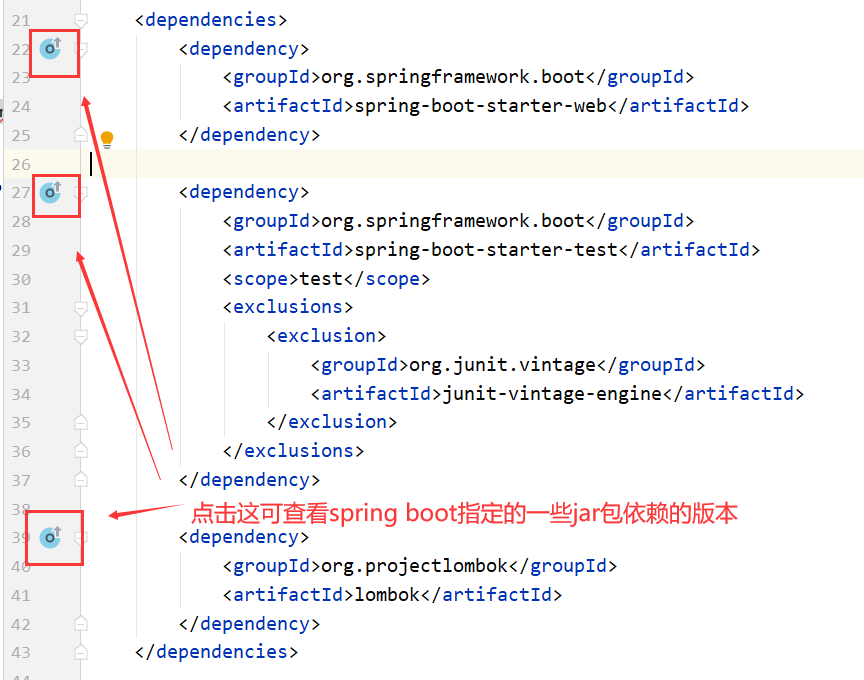
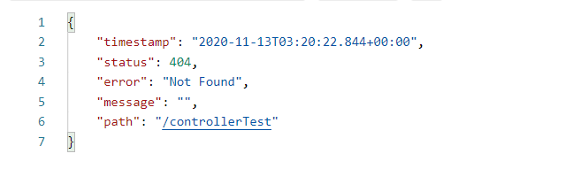

# 介绍

上一代Spring MVC缺点：

1. xml文件多，维护xml文件很麻烦
2. SSM工程部署麻烦，依赖第三方的容器
3. SSM开发很麻烦

所以，出现了Spring boot，Spring boot不是一门新的技术，只是将之前常用的Spring，Spring MVC，Data-jpa等常用的框架封装到了一起，帮助开发者隐藏这些框架的整合细节，实现敏捷开发。

Spring boot就是一个工具集。

Spring boot特点：

1. 不需要模板化的配置
2. 在整合第三方框架时，只需要导入相应的starter依赖包，就自动整合了
3. 默认只有一个.properties的配置文件，不推荐使用xml，后期会采用.java的文件去编写配置信息
4. 项目在部署时，采用的是jar包的方式，内部自动依赖Tomcat容器，提供了多环境的配置

其实，Spring boot之所以简单，总的来说是因为**`约定大于配置`**

# 快速创建项目

<div style="margin:0 auto;width:60%">


</div>

<div style="margin:0 auto;width:60%">


</div>

<div style="margin:0 auto;width:60%">


</div>

<div style="margin:0 auto;width:60%">


</div>


然后就OK了

这样默认创建的是一个spring boot SE工程


若想创建的是一个springboot web工程，只需将上面改成这样：


然后用maven重新导入一下jar包


## 文件目录

### pom.xml文件

**文件结构：**

1. 指定了一个父工程：指定当前工程为Spring boot，帮助我们声明了starter依赖的版本

   注意这个starter依赖指的是`artifactId`中的spring-boot-starter-?，如：


2. 项目的元数据：包名，项目名，版本号
3. 指定了properties信息：Java版本
4. 导入依赖：默认情况导入spring-boot-starter，spring-boot-starter-test
5. 插件：spring-boot-maven-plugin（maven项目）

pom.xml文件：

```xml
<?xml version="1.0" encoding="UTF-8"?>
<project xmlns="http://maven.apache.org/POM/4.0.0" xmlns:xsi="http://www.w3.org/2001/XMLSchema-instance"
         xsi:schemaLocation="http://maven.apache.org/POM/4.0.0 https://maven.apache.org/xsd/maven-4.0.0.xsd">
    <modelVersion>4.0.0</modelVersion>
    
    <!-- 指定了一个父工程，继承spring-boot-starter-parent的依赖管理，控制版本与打包等内容-->
    <!-- 可以默认指定子工程所引用的jar包的版本 -->
    <parent>
        <groupId>org.springframework.boot</groupId>
        <artifactId>spring-boot-starter-parent</artifactId>
        <version>2.3.5.RELEASE</version>
        <relativePath/> <!-- lookup parent from repository -->
    </parent>
    
    <!-- 项目的元数据 -->
    <groupId>com.my</groupId>
    <artifactId>springbootlearn</artifactId>
    <version>0.0.1-SNAPSHOT</version>
    <name>springbootlearn</name>
    <description>Demo project for Spring Boot</description>
	
    <!-- 指定properties信息 -->
    <properties>
        <java.version>1.8</java.version>
    </properties>
    
    <!-- 导入依赖 -->
    <dependencies>
        <!-- spring boot web 依赖 -->
        <dependency>
            <groupId>org.springframework.boot</groupId>
            <artifactId>spring-boot-starter-web</artifactId>
        </dependency>
        
		 <!-- spring boot 单元测试依赖 -->
        <dependency>
            <groupId>org.springframework.boot</groupId>
            <artifactId>spring-boot-starter-test</artifactId>
            <scope>test</scope>
            <exclusions>
                <exclusion>
                    <groupId>org.junit.vintage</groupId>
                    <artifactId>junit-vintage-engine</artifactId>
                </exclusion>
            </exclusions>
        </dependency>
    </dependencies>

    <build>
        <plugins>
             <!-- 打jar包依赖 -->
            <plugin>
                <groupId>org.springframework.boot</groupId>
                <artifactId>spring-boot-maven-plugin</artifactId>
            </plugin>
        </plugins>
    </build>

</project>

```

除此之外，还可添加以下常用依赖：


### .gitignore文件

**作用：** 忽略进行版本控制的一些文件和目录


# 常用注解

## @Configuration

**作用：**

它代表这是一个配置类，类似于`beans.xml`配置文件

同时它也是一个`@Component`的衍生注解，它所注解的类会被Spring容器托管，注册到容器中

**使用：**

```java
@Configuration
public class ApplicationConfig {
    @Bean
    public User getUser(){
        return new User();
    }
}
```

它相当于在`resources`文件夹内创建一个`beans.xml`文件，文件内容：

```xml
<?xml version="1.0" encoding="UTF-8"?>
<beans xmlns="http://www.springframework.org/schema/beans"
       xmlns:xsi="http://www.w3.org/2001/XMLSchema-instance"
       xsi:schemaLocation="http://www.springframework.org/schema/beans
        https://www.springframework.org/schema/beans/spring-beans.xsd">

    <bean id="getUser" class="com.my.springAppconfig.pojo.User" />
</beans>
```

**注意：** 如果使用了配置类的方式配置Spring，则需要通过`AnnotationConfigApplicationContext`来获取Spring容器

```java
ApplicationContext context=new AnnotationConfigApplicationContext(ApplicationConfig.class);
```

## @ComponentScan

**作用：**

组件扫描，通常与`@Configuration`搭配使用

**使用：**

```java
@Configuration
@ComponentScan(basePackages = {"com.my.springAppconfig"})
public class ApplicationConfig {
    @Bean
    public User getUser(){
        return new User();
    }
}
```

它相当于`beans.xml`文件中的：

```xml
<?xml version="1.0" encoding="UTF-8"?>
<beans xmlns="http://www.springframework.org/schema/beans"
       xmlns:xsi="http://www.w3.org/2001/XMLSchema-instance"
       xsi:schemaLocation="http://www.springframework.org/schema/beans
        https://www.springframework.org/schema/beans/spring-beans.xsd">
	
    <context:component-scan base-package="com.my.springAppconfig" />
 
</beans>
```

## @Import

**作用：** 

用于引入其他配置类

**使用：** 

```java
@Configuration
@ComponentScan(basePackages = {"com.my.springAppconfig"})
@Import({MyConfig.class})
public class ApplicationConfig {

    @Bean
    public User getUser(){
        return new User();
    }
}
```


## @Bean

**作用：**

可使用于类名前或方法前

当使用于方法前时，它就是注册一个bean，相当于`beans.xml`文件中的一个bean标签，这个方法的名字，就相当于bean标签中的id属性，这个方法的返回值，就相当于bean标签中的class属性

**使用：** 同`@Configuration`和`@ComponentScan`


## @Component

**作用：**

它是一个通用的构造型注解，表明该类是一个spring组件

Spring容器会默认构造一个id为该类名（首字母小写）的bean

当然也可以通过`@Component`下的value属性设置bean的id

**使用：**

在类名前使用

```java
//@Component("myUser")    //Spring容器将会创建id为myUser的bean
@Component  //Spring容器将会创建id为user的bean
public class User {
    private String name;

    public String getName() {
        return name;
    }

    public void setName(String name) {
        this.name = name;
    }
}
```


## @Repository

**作用：**

`@Component`的衍生注解，它也是表明该类是一个spring组件，同时，它也表明该类定义了一个数据存储库，即DAO层的注解 

## @Service

**作用：**

`@Component`的衍生注解，表明该类是一个spring组件，用于标注服务层组件

## @Data

**引入**

使用这个注解前先要引用lombok依赖

```xml
<dependency>
    <groupId>org.projectlombok</groupId>
    <artifactId>lombok</artifactId>
</dependency>
```

可见，我这里没用标注lombok的版本，因为Spring boot中已经帮我们指定了lombok的版本




**作用：**

自动生成实体类的getter和setter方法，还有toString、equals、hashCode方法


## @Accessors(chain = true)

**引入**

使用这个注解前先要引用lombok依赖

**作用：**

链式调用`setter()`方法


## @NoArgsConstructor

**引入**

使用这个注解前先要引用lombok依赖

**作用：**

自动生成实体类的无参构造函数

## @AllArgsConstructor

**引入**

使用这个注解前先要引用lombok依赖

**作用：**

自动生成实体类的全参构造函数，各个参数按顺序对应


## @ResponseBody

**作用：**

表示后端以json格式来返回数据

**用法：**

用在Controller类名前或Controller类的方法前

##  @RequestBody

**作用：**

表示请求参数以json格式来提交，即前端传给后端的数据要以json的格式

**用法：**

用在Controller类的方法的参数中，比如：

```java
@RestController
public class UserController {
    @PostMapping("/controllerTest")
    public String controllerTest(@RequestBody String hello){
        return hello;
    }
}
```

## @RequestParam

**作用：**

表示请求参数以formData的形式来提交，即前端传给后端的数据要以key-value的格式

**用法：**

@RequestParam常用参数：

- name：表示formdata的key值
- required：表示该formdata是否必须，默认true
- defaultValue：表示该formdata非必须，并设置默认值

```java
//这样默认指name
@PostMapping("/controllerTest")
public String controllerTest(@RequestParam("word") String hello){
    return hello;
}

@PostMapping("/controllerTest")
public String controllerTest(@RequestParam(name="word",defaultValue = "no word") String hello){
    return hello;
}
```


## @Controller

**作用：**

`@Component`的衍生注解，标识这是个Controller类，表示这个类是用来处理http请求的

然而，这个注解一般表示这个Controller类下的方法返回的是一个页面，如jsp页面

举个例子：

```java
@Controller
public class UserController {
 	@PostMapping("/controllerTest")
    public String controllerTest(@RequestParam("hello") String hello){
        return hello;
    }   
}
```

当我这么访问这个接口时，报404错误：



因为它要返回的是一个页面，然后spring boot找不到这个页面，所以报404错误。

@Controller正确的使用方法：

```java
//HomeController.java
@Controller
public class HomeController {
    @Autowired
    private HomeService homeService;
    
    @RequestMapping("/homepage")
    public String toHome(User user, HttpSession session, Model model){
        return homeService.toHome(user,session,model);
    }
}

//HomeService.java
public interface HomeService {
    public String toHome(User user, HttpSession session, Model model);
}

//HomeServiceImpl.java
@Service
public class HomeServiceImpl implements HomeService {
    @Autowired
    private MusicInfoDao musicInfoDao;
    
    public String toHome(User user, HttpSession session, Model model) {
        List<MusicInfo> musicInfoList=musicInfoDao.selectTop10();
        session.setAttribute("musicInfoList",musicInfoList);
        return "homepage";      //在resources/jsp/中有个homepage.jsp的文件
    }
}
```


## @RestController

现在大部分都是前后端分离，后端给前端返回的一般都是数据，比如json数据

若硬要用@Controller，则要在类前或某个方法前加个@ResponseBody，如：

```java
@Controller
public class UserController {
    @ResponseBody
 	@PostMapping("/controllerTest")
    public String controllerTest(@RequestParam("hello") String hello){
        return hello;
    }   
}

//或者
@ResponseBody
@Controller
public class UserController {
 	@PostMapping("/controllerTest")
    public String controllerTest(@RequestParam("hello") String hello){
        return hello;
    }   
}
```

为了方便点，出现了@RestController

@RestController是@Controller与@ResponseBody的结合体

**使用：**

```java
@RestController
public class UserController {
    @PostMapping("/controllerTest")
    public String controllerTest(@RequestParam("hello") String hello){
        return hello;
    }  
}
```

## @GetMapping

**作用：**


**使用：**


##  @PostMapping

**作用：**


**使用：**


## @AutoWired

**作用：**

通过注解自动注入
它自动往Spring容器中获取该类型的bean，然后注入 
当Spring容器中存在多个该类型的bean时，则需要搭配`@Qualifier`使用，`@Qualifier`可确任获取某个id的bean

**使用：**

```java
public class Person {

    @Autowired
    private Dog dog;

    public Dog getDog() {
        return dog;
    }
}
```

Spring容器：

```xml
<?xml version="1.0" encoding="UTF-8"?>
<beans xmlns="http://www.springframework.org/schema/beans"
       xmlns:xsi="http://www.w3.org/2001/XMLSchema-instance"
       xmlns:context="http://www.springframework.org/schema/context"
       xsi:schemaLocation="http://www.springframework.org/schema/beans
        https://www.springframework.org/schema/beans/spring-beans.xsd
        http://www.springframework.org/schema/context
        https://www.springframework.org/schema/context/spring-context.xsd">

	<!-- 允许使用注解配置Spring容器 -->
    <context:annotation-config />

    <bean id="myDog" class="com.my.springAutowired.pojo.Dog" />
    <bean id="person" class="com.my.springAutowired.pojo.Person" />
</beans>
```


## @Qualifier

**作用：**

用于告诉Spring容器注入哪个Bean，常与`@AutoWired`搭配使用

**使用：**

```java
//接口
public interface MemberService {
    
}

//实现类一
@Service("memberService1")
public class MemberServiceImpl1 implements MemberService{
    
}

//实现类二
@Service("memberService2")
public class MemberServiceImpl2 implements MemberService{
    
}

//调用类
@Controller("/member")
public class MemberController{
    @Autowired
    @Qualifier("memberService2")   //此处如果不使用该注解则报错，原因就是容器不知道注入哪一个实现类
    private MemberService memberService;

}
```

## @Value

**作用：**

常用于给类的属性设置默认值


## @Scope

**作用：**

设置Bean的作用域

常用的作用域有：

- `ConfigurableBeanFactory.SCOPE_SINGLETON` ：singleton
- `ConfigurableBeanFactory.SCOPE_PROTOTYPE` ：prototype

**使用：**

```java
package com.my.springAnno.pojo;

import org.springframework.beans.factory.annotation.Value;
import org.springframework.beans.factory.config.ConfigurableBeanFactory;
import org.springframework.context.annotation.Scope;
import org.springframework.stereotype.Component;

@Component
@Scope(ConfigurableBeanFactory.SCOPE_SINGLETON)
public class User {
    @Value("tonya")
    private String name;
    
    public String getName() {
        return name;
    }

    public void setName(String name) {
        this.name = name;
    }
}

```


## @SpringBootTest

**作用：**

将Spring boot容器与Junit整合起来，表明该类是Spring boot的测试类

作用域：Type，类

**使用：**

```java
@RunWith(SpringRunner.class)
@SpringBootTest
public class UserInfoMapperTests {

    @Autowired
    private UserInfoMapper userInfoMapper;

    @Test
    public void contextLoad(){
        UserInfo userInfo=new UserInfo();
    }


    @Test
    public void testSignup(){
        String name="testname";
        String phone="12345678901";
        String password="aaaaaaaa";
        boolean sex=true;
        userInfoMapper.signup(name,phone,password,sex);
    }
}
```

