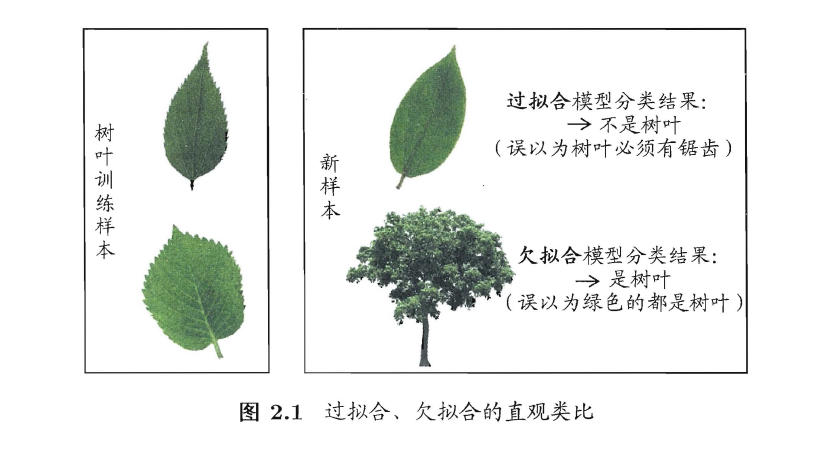
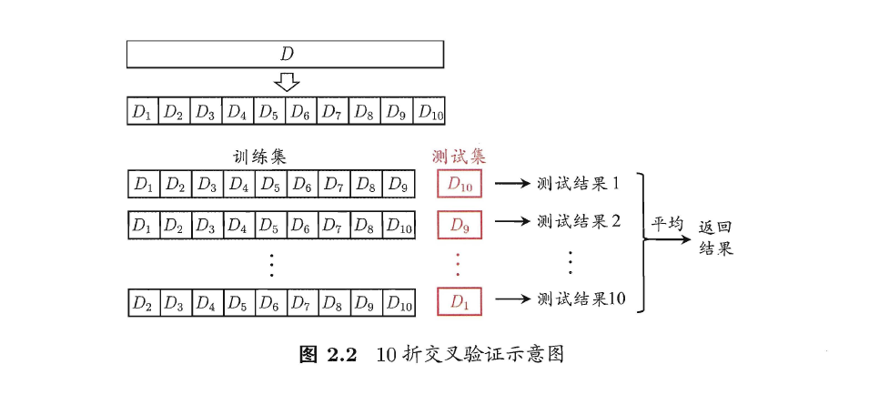
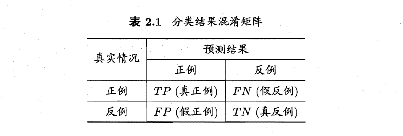
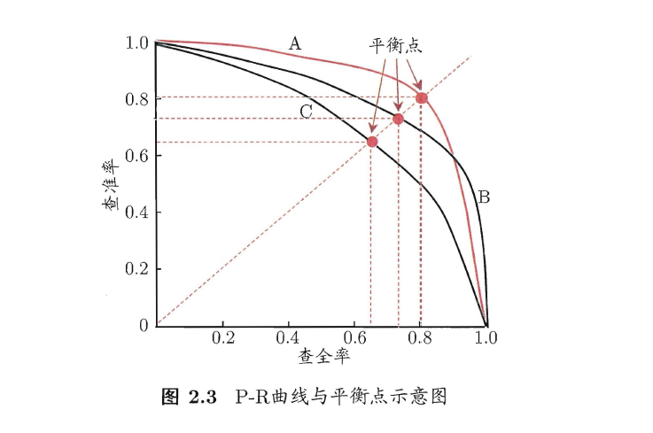

# 经验误差与过拟合

- **错误率（Error Rate）：** 分类错误的样本数占样本总数的比例

  >为什么是 **`分类错误`** ？ 

  若m个样本中有a个样本分类错误，则错误率E=a/m

- **精度（Accuracy）：** 精度（Accuracy）=（1-a/m）*100%

- **误差（Error）：** 学习器的实际预测输出与样本的真实输出之间的差异

- **训练误差（Training Error）：** 学习器在训练集上的误差

- **经验误差（Empirical Error）：** 同训练误差

- **泛化误差（Generalization Error）：** 学习器在新样本上的误差

----

- **过拟合（Overfitting）：** 通常是由于学习能力过于强大，以至于把训练样本所包含的不太一般的特性都学到了

  >过拟合是无法彻底避免的，只能“缓解”

- **欠拟合（Underfitting）：** 通常是由于学习能力低下造成的后果

  > 欠拟合比较容易解决，比如在决策树学习中扩展分支、在神经网络学习中增加训练轮数等等

# 评估方法

在现实任务中，往往有多种学习算法可供选择，甚至对同一个学习算法，当使用不同的参数配置时，也会产生不同的模型。

那么该用哪一种算法、哪些参数配置呢？其实就是该用哪一个模型呢？

这时往往对模型的`泛化误差`进行评估

那么这个`泛化误差`怎么来呢？这就是评估方法需要解决的问题

----

`泛化误差`：一般把`测试误差`近似为`泛化误差`

`测试误差` need `测试集`，而`测试集`一般也是来自`样本`，然后`训练集`也是来自`样本`，这时就涉及到怎么划分`样本`的问题。

常见的划分方法有：

- 留出法（Hold-out）

- 交叉验证法（Cross Validation）

- 自助法

## 留出法（Hold-out）

这里用`数据集D`表示`样本`，下面几个方法也是如此

留出法直接将`数据集D`划分为`训练集S`和`测试集T`，$S \cup T=D，S \cap D=\emptyset $

此时常有两个注意点：

1. 训练/测试集的划分要尽可能保持数据分布的一致性，避免因数据划分时引入额外的偏差而对最终结果产生影响，常见的用法有：分层采样（Stratified Sampling），即在划分数据集时尽量保持样本类别的比例相似

2. 就算确定训练/测试集的划分比例后，仍有多种划分方式，此时一般采用多次随机划分、重复进行实验评估，然后取这多次实验结果的平均值作为留出法的最终结果

对于划分的比例，常见是约2/3~4/5的样本用于训练，剩下的用于测试

## 交叉验证法（Cross Validation）

交叉验证法流程：

1. 将数据集D划分为k个大小相似的互斥子集，即 $D=D_1 \cup D_2 \cup …… \cup D_k$ ，其中每个子集都是分层采样获取

2. 每次将k-1个子集的并集用作训练集，剩下的那个用作测试集，如此进行k次训练和测试，最后取这k次结果的平均值

常叫此方法为`k折交叉验证法`，其中，k常用的取值为10，也有5、20

注意：

在划分k个子集的过程中，也有多种划分方式，这时为了减少因划分不同而产生的误差，也会像留出法一样，采用多次随机划分，然后做交叉验证法，然后取平均值，常见的有10次10折交叉验证法

`留一法（Leave-One-Out，简称LOO）` ————交叉验证法的一个特例

做法：假设数据集D有k个样本，然后将数据集D划分为k个互斥子集，即每个子集只有一个样本，这样就不用考虑划分方式的问题了，接下来的做法与上面一样

优点：比较精确；缺点：耗时耗力

## 自助法

`留出法`跟`交叉验证法`都会减少训练集的样本数量，而这往往会产生因训练集规模减少的误差，因为正常是将数据集D全部用来作训练集。这时，`自助法`出现了！

`自助法`以`自主采样法（Bootstrap Sampling）`为基础

自助法流程：

假设数据集D有m个样本

1. 对数据集D随机选一个样本，copy到数据集 $D^‵$，如此重复m次，然后得到包含m个样本的数据集$D^‵$

  >数据集D有一部分样本是不会出现在数据集$D^‵$ 
  >样本在m次随机copy的过程中，始终不被抽到的概率是$(1-\frac{1}{m})^m$，取极限$\displaystyle \lim_{m \to +\infty}(1-\frac{1}{m})^m=\frac{1}{e} \approx 0.368$

2. 将$D^‵$用作训练集，$D \setminus D^‵$用作测试集

  >“ $\setminus$ ”表示集合减法

这样的测试结果也称为`包外估计（Out-of-bag Estimate）`

`自助法`常用于数据集较小、难以划分训练\测试集时，然而这会改变初始数据集的分布，而这又会产生误差，所以，在数据集较大时，还是常用`留出法`和`交叉验证法`

# 调参与最终模型

为了得到最终模型，不仅需要一个好的学习算法，还需要设定好各种参数，也就是`调参（Parameter Tuning）`

学习算法的很多参数是在实数范围内取值，此时，一般会是对每个参数选定一个范围和变化步长，然后一步一步地调

一般，在模型选择完成后，学习算法和参数配置选定好之后，应用数据集D重新训练一下这个模型，然后才得到最终模型

# 性能度量（Performance Measure）

性能度量就是用来评估学习器（模型）的泛化性能

## 回归任务

回归任务最常用的性能度量是：`均方误差（Mean Squared Error）`

**均方误差**

在预测任务中，给定样例集D={($x_1,y_1),(x_2,y_2),……,(x_m,y_m)$，其中$y_i$是样本$x_i$的真实标记（真实结果），然后学习器对$x_i$的预测结果是$f(x_i)$

然后均方误差：

$$
E(f;D)=\frac{1}{m}\sum_{i=1}^{m} {(y_i-f(x_i))^2}
$$

对于数据分布和概率密度函数$p(x)$，均方误差可表示为：

$$
E(f;D)=\int_{x \sim D}^{} {(y-f(x))^2*p(x) dx}
$$

## 分类任务

分类任务最常用的性能度量是：`精度`和`错误率`，此外还有`查准率（Precision）`和`查全率（Recall）`

>查准率也叫：“准确率”，查全率也叫：“召回率”

**错误率与精度**

对数据集D，其中D有m个样本

- 分类错误率为：

  $$
  E(f;D)=\frac{1}{m} \sum_{i=1}^{m} {Ⅱ(y_i\neq f(x_i))}
  $$
  
  >Ⅱ：暂时我也不知道这是什么符号，but我感觉这是一个判断符号，$f(x_i)=y_i$时为1，$f(x_i) \neq y_i$时为0

- 精度为：
  
  $$
  acc(f;D)=\frac{1}{m} \sum_{i=1}^{m} {Ⅱ(y_i=f(x_i))}=1-E(f;D)
  $$
  

对于数据分布和概率密度函数$p(x)$，错误率和精度可分别表示为：

- 错误率：

$$
E(f;D)=\int_{x\sim D} {Ⅱ(y\neq f(x))*p(x)dx}
$$

- 精度：

$$
E(f;D)=\int_{x\sim D} {Ⅱ(y=f(x))*p(x)dx}=1-E(f;D)
$$

----

错误率与精度固然是很不错，but，它们不能显示：

1. 在预测为真的样本中，有几个是真正的真

2. 在真正为真的样本中，有几个是预测也是真

因为错误率与精度显示的是一个整体，只判断你有没有预测对，所以就出现了查准率与查全率

**查准率与查全率**

对于二分类问题，可将样例根据其真实类别与学习器预测类别的组合划分为`真正例(true positive)`、`假正例(false positive)`、`真反例(true negative)`、`假反例(false negative)`，简写：TP、FP、TN、FN

可用一个矩阵表示，而这个矩阵叫分类结果的`混淆矩阵（Confusion Matrix）`

- 查准率P：

$$
P=\frac{TP}{TP+FP}
$$

- 查全率R：

$$
R=\frac{TP}{TP+FN}
$$

**PR图**

在性能度量中不能单看查准率或查全率

当P很高时，模型往往会特别谨慎，因此FN往往会高点，TP往往会低点，这时R就会低；而当P低时，模型往往会松一点，因此FP、TP往往会高点，这时R就会高

所以，查准率与查全率都要兼顾，这时，就出现了`查准率-查全率曲线`，简称`P-R曲线`，亦称`PR曲线`、`PR图`

若一个学习器的P-R曲线被另一个学习器的曲线完全"包住"，则可断言后者的性能优于前者

如果两个学习器的P-R曲线发生了交叉，则难以一般性地断言两者孰优孰劣，只能在具体的查准率或查全率条件下进行比较，若硬要比较，可比较P-R曲线下面积的大小，但很难算。这时`平衡点（Break-Event Point）`出现了

**平衡点**

`平衡点（Break-Event Point）`，简称：`BEP`，在平衡点上，P=R

----

但平衡点对P与R的兼顾太简单了，在一些复杂的情况下难以胜任，所以就出现了`F1度量`

**F1度量**

$$
F1=\frac{2\times P\times R}{P+R} =\frac{2 \times TP}{样例总数+TP-TN} 
$$

其实，Fl 是基于查准率与查全率的调和平均(harmonic mean)定义的:

$$
\frac{1}{F1}=\frac{1}{2} \times (\frac{1}{P}+\frac{1}{R})
$$

----

因为在某些情况下，对P与R的重视程度不同，所以就出现了$F_\beta$度量

**$F_\beta$度量**

$$
F_\beta=\frac{(1+\beta^2)\times P \times R}{(\beta^2 \times P)+R}
$$

- $\beta<1$ ：查准率有更大影响

- $\beta=1$ ：F1度量

- $\beta>1$ ：查全率有更大影响

----

刚刚关于查准率、查重率，以及二者引申下来的关于PR图、平衡点、F1、$F_\beta$的度量，都是在二分类任务的前提下，那要是多分类的话，该怎么办呢

有一种思想就是：将多分类的分解成多个二分类的，然后分别算，最后取平均值

具体的有两种做法：一宏一微

----

待续。。。。

