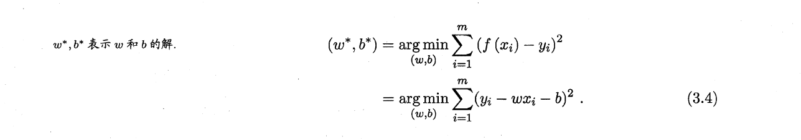

# 基本形式

线性模型（Linear Model）的基本形式就是：

$$f(x)=w_1*x_1+w_2*x_2+...+w_d*x_d+b$$

$x_i$指模型的第i个属性

其向量形式：

$$f(x)=\boldsymbol{w^Tx} +b$$

其中$\boldsymbol{w^T}=(w_1;w_2;...;w_d)$，$\boldsymbol{x}=(x_1;x_2;...;x_d)$

>显然，$\boldsymbol{w^T}$直观表达了各属性在预测中的重要性，因此线性模型有很好的`可解释性(Comprehensibility)`，也称`可理解性（Understandability）`

 

# 线性回归

望文生义，`线性回归（Linear Regression）`指回归任务中的线性模型

## 一属性

先从简单的开始入手，假定模型的属性只有一个，样本有m个，这时线性回归试图学得：

$$f(x_i)=wx_i +b，使得f(x_i)\approx y_i$$

此时$x_i$指：属性x的第i个值

确定$w$和$b$的过程，就是使$f(x_i)与y_i$接近的过程，这时我们可以使`均方误差`最小化，`均方误差`也称`平方损失（Square Loss）`即：

该函数也叫`代价函数`，这种方法也叫`最小二乘法（Least Square Method）`

求解$w$和$b$，使$E_(w,b)=\sum _{i=1}^{m}{(y_i-wx_i-b)^2}$最小化的过程也叫线性回归模型的最小二乘“参数估计”（Parameter Estimation）
