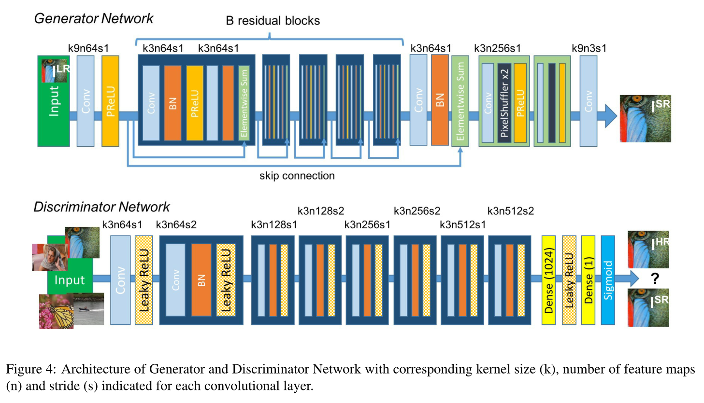

---

title: >-
  论文阅读-Photo-Realistic Single Image Super-Resolution Using a Generative
  Adversarial Network
comment: true
date: 2021-11-19 10:28:24
tags:
categories:
addrlink:
---

# 论文简介

Ledig C ,  Theis L ,  F  Huszar, et al. Photo-Realistic Single Image Super-Resolution Using a Generative Adversarial Network[C]// IEEE Computer Society. IEEE Computer Society, 2016.

引用量：6721

# 动机

1. 现有的基于CNN的SR网络，在较大的放大因子下，无法恢复较细的纹理细节
2. 现有的损失函数是基于像素级别差异的PSNR，它虽然能取得较高的峰值信噪比，但它通常缺乏高频细节，在感知上不令人满意
3. 

# 贡献

1. 基于生成对抗网络（GAN），提出SRGAN

   > 生成对抗网络（GAN）论文：
   >
   > [Goodfellow I, Pouget-Abadie J, Mirza M, et al. Generative adversarial nets[J]. Advances in neural information processing systems, 2014, 27.](https://proceedings.neurips.cc/paper/2014/hash/5ca3e9b122f61f8f06494c97b1afccf3-Abstract.html)
   >
   > 引用量：36870

2. 提出感知损失函数

## SRGAN

### 生成器

生成器网络如下图所示：

**B残差块：**

B残差块由5个相同的小模块组成，其中每个小模块间都具有了残差的思想。

每个小模块又由以下6层组成：

1. 卷积层，尺寸： $64 \times 3 \times 3$ ，步数stride：1，默认为half padding

2. 批量归一化层（BN），

   > 关于BN的论文：
   >
   > [Ioffe S, Szegedy C. Batch normalization: Accelerating deep network training by reducing internal covariate shift[C]//International conference on machine learning. PMLR, 2015: 448-456.](https://arxiv.org/abs/1502.03167)
   >
   > 引用量：31685

3. ParametricReLU激活函数

   > ParametricReLU（PReLU）激活函数，ReLU的改进版，公式：
   > $$
   > PReLU(x)=
   > 	\begin{cases}
   > 		x \;, &  x>0 \\
   > 		\alpha \, x \; , & x \leq 0
   > 	\end{cases}
   > $$
   > 其中， $\alpha$ 为可学习的，0到1之间的数。
   >
   > 值得注意的是：
   >
   > - 若 $\alpha=0$ ，则 $PReLU$ 就变为 $ReLU$ 了
   > - 若 $\alpha > 0$ ，则 $PReLU$ 就变为 $Leaky \; ReLU$ 了

4. 卷积层，尺寸： $64 \times 3 \times 3$ 

5. 批量归一化层（BN），

6. Elementwise Sum，求和

### 感知损失函数

感知损失函数，Perceptual Loss Function，用 $l^{SR}$ 表示。

 $l^{SR}$ 由两部分组成：

1. 内容损失（content loss），用 $l_X ^{SR}$ 表示，其中 $X$ 指的是用什么方法。
2. 对抗损失（adversarial loss），用 $l_{Gen}^{SR}$ 表示

$$
l^{SR}=l_X^{SR} \,+ \, 10^{-3} \, l_{Gen}^{SR}
$$

**内容损失：**

常见的就是MSE方法：
$$
l_{MSE}^{SR}=\frac 1 {r^2WH} \sum_{x=1}^{rW} \sum_{y=1}^{rH} \left( I_{x,y}^{HR}- G_{\theta _G}(I^{LR})_{x,y} \right)^2
$$

但MSE方法通常导致图像缺乏高频内容、纹理过度平滑、与人们感知不一致的问题。

所以在本文中，作者采用基于VGG损失的方法，求真实图像的特征空间与生成图像的特征空间之间的欧氏距离，公式：
$$
l_{VGG/i.j}^{SR}=\frac 1 {W_{i,j}H_{i,j}} \sum_{x=1}^{W_{i,j}} \sum_{y=1}^{H_{i,j}} \left( \phi_{i,j}(I^{HR})_{x,y} -\phi_{i,j} (G_{\theta_G}(I^{LR}))_{x,y} \right)^2
$$
其中：

- $\phi_{i,j}$ ：表示VGG19网络中的第 $i$ 个最大池化层之前的第 $j$ 个卷积（激活后），所获得的**特征图**。

- VGG19网络指19层的VGG网络，得先按照如下论文预训练好

  > 训练策略：[Simonyan K, Zisserman A. Very deep convolutional networks for large-scale image recognition[J]. arXiv preprint arXiv:1409.1556, 2014.]()

- $W_{i,j}$ 与 $H_{i,j}$ 分别为特征图的维度

**$l_{MSE}^{SR}$ 与 $l_{VGG/i.j}^{SR}$ 的区别：** 其实它们计算形式是相同的，只是其计算空间从图像像素转移到了图像特征空间。

**对抗损失：**

对抗损失公式：
$$
l_{Gen}^{SR}=\sum_{n=1}^N -log \, D_{\theta_D} \left( G_{\theta_G}(I^{LR}) \right)
$$
其中：

- $N$ ：图片数量
- $D_{\theta_D} \left( G_{\theta_G}(I^{LR}) \right)$ ： 表示判别器将生成器生成的图像为自然图像的概率

要让 $l_{Gen}^{SR}$ $\Downarrow$ ，即要让 $log \, D_{\theta_D} \left( G_{\theta_G}(I^{LR}) \right)$ $\Uparrow$  ，即要让 $D_{\theta_D} \left( G_{\theta_G}(I^{LR}) \right)$ $\Uparrow$ ，即要尽可能地让判别器认为生成器生成的图像为自然图像。

## 实践细节

1. 对高分辨率图像 $I^{HR}$ 进行双三次下采样，得到低分辨率图像 $I^{LR}$ ，缩放因子为 $r$ =4
2. mini-batch=16
3. 

# 结论

# 想法

1. 尽管生成的图像看起来逼真，但补偿的高频细节（如图像边缘）可能会导致与HR地面真实图像不一致