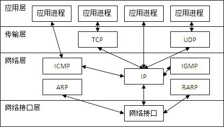

# 概述

ARP协议，Address Resolution Protocol，地址解析协议，用于实现从IP地址到MAC地址的映射

> OSI七层模型：物、联、网、输、会、试、用
>
> 

# ARP解析过程

ARP的解析过程可分为静态映射与动态映射

每个主机都有一张ARP表，主机A与主机B进行通信时，主机A知道主机B的IP地址，但不知道主机B的MAC地址，怎么办呢？

这时主机A会先检索本地的ARP表，看看有无对应的MAC地址，有的话就是映射成功，这个过程叫**静态映射**；没有的话，就进行**动态映射**

## 静态映射

在网络层到数据链路层的打包过程中，需要将IP地址映射成MAC地址

主机本地都有一张ARP表，用来存储IP地址与MAC地址的映射关系，因为MAC地址可能会变，所以ARP表每隔一段时间就要更新一次，就好像缓存那样。

## 动态映射

当主机A本地的ARP表没有对应IP的MAC地址时，主机A会在局域网中`广播`一个ARP请求报文

这个ARP请求报文有以下内容：

- 发送方的IP地址
  
- 发送方的MAC地址
  
- 接收方的IP地址
  
- 其它信息

局域网中的每个主机收到这个ARP请求报文之后，都会查询以下本地的ARP表，看看有无对应的MAC地址，有的话就`单播`返回给主机A一个ARP响应报文

这个ARP响应报文有以下内容：

- 发送方的IP地址
  
- 发送方的MAC地址
  
- 接收方的IP地址
  
- 接收方的MAC地址
  
- 其它信息

主机A收到之后就会更新本地的ARP表

 

 

参考：
1.[csguo的图解ARP协议（一）](https://www.cnblogs.com/csguo/p/7527303.html)
2.[沉默的鹏先生的ARP学习总结](https://blog.csdn.net/ever_peng/article/details/80008638)
3.[小鹏_加油的OSI七层模型详解](https://blog.csdn.net/yaopeng_2005/article/details/7064869)

