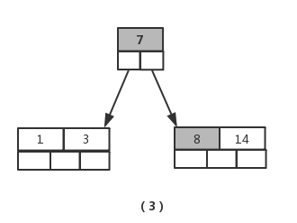
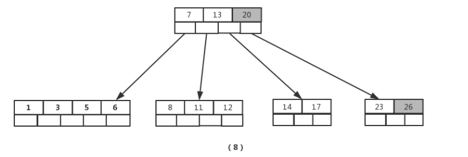

# 前言

除了 **B树** 与 **B+树** ，还会听到一种叫 **B-树** 。其实，B-树，即为B树。因为B树的原英文名称为 B-tree ，而国内很多人喜欢把 B-tree 译作 B-树，而事实上是，B-tree 就是指的B树，目前理解B的意思为平衡。

B树的出现是为了弥合不同的存储级别之间的访问速度上的巨大差异，实现高效的 I/O。

平衡二叉树的查找效率是非常高的，并可以通过降低树的深度来提高查找的效率。但是当数据量非常大，树的存储的元素数量是有限的，这样会导致二叉查找树结构由于树的深度过大而造成磁盘I/O读写过于频繁，进而导致查询效率低下。另外数据量过大会导致内存空间不够容纳平衡二叉树所有结点的情况。

而B树就是解决这个问题的很好的数据结构。

# B树

## 定义

B树是一种平衡的多分树，通常我们说m阶的B树，指的是：

- 每个节点最多只有m个子节点
- 每个非叶子节点（除了根）具有至少 $⌈ m/2⌉$ 子节点。
- 如果根不是叶节点，则根至少有两个子节点。
- 具有*k*个子节点的非叶节点包含*k* -1个键。
- 所有叶子都出现在同一水平，没有任何信息（高度一致）。

下面以下图来分别说明一下。

### B树的阶

B树的阶指：B树中一个节点的子节点数目的最大值，用m表示，假如最大值为10，则为10阶

在上图中，所有节点中，节点【13,16,19】拥有的子节点数目最多，四个子节点（灰色节点），所以可以定义上面的图片为4阶B树。

### 根节点

在上图中，节点【10】即为根节点

即，第一层的节点叫根节点。

特征：根节点拥有的子节点数量的上限和内部节点相同。

**在m阶B树中（根节点非树中唯一节点），根节点的子节点数量M满足 $2 \leq M \leq m$ 关系式，而根节点包含的元素数量K满足 $1 \leq K \leq m-1$ 关系式**

### 内部节点

在上图中，节点【13,16,19】、节点【3,6】都为内部节点

即，除叶子节点和根节点之外，中间的所有节点都叫内部节点。

**在m阶B树中，某个内部节点的子节点数量M满足 $\lceil m/2 \rceil \leq M \leq m$ 关系式，而其包含的元素数量K，满足  $\lceil m/2 \rceil -1 \leq K \leq m-1$ 关系式** 

### 叶子节点

在上图中，节点【1,2】、节点【11,12】等最后一层都为叶子节点。

叶子节点对元素数量的限制与内部节点的相同，但它没有子节点，也没有指向子节点的指针。

**在m阶B树中，某个叶子节点的元素数量K满足 $\lceil m/2 \rceil -1 \leq K \leq m-1$ 关系式**

## B树的操作

### 插入

针对m阶高度h的B树，插入一个元素时，首先会查找该元素在B树中是否存在，如果不存在，则该查找会在某个叶子节点处结束，然后就在该叶子节点中插入该新的元素。

- **若该节点元素个数小于m-1，直接插入；**
- **若该节点元素个数等于m-1，引起节点分裂；以该节点中间元素为分界，取中间元素（元素个数为偶数时，中间两个随机选取）插入到父节点中；**
- **重复上面动作，直到所有节点符合B树的规则；最坏的情况一直分裂到根节点，生成新的根节点，高度增加1；**

上面三段话为插入动作的核心，接下来以5阶B树为例，详细讲解插入的动作；

5阶B树关键点：

- 2<=根节点子节点个数<=5
- 3<=内部节点子节点个数<=5
- 1<=根节点元素个数<=4
- 2<=非根节点元素个数<=4

1. 图（1）插入元素【8】后变为图（2），此时根节点元素个数为5，不符合 1<=根节点元素个数<=4，进行分裂，取节点中间元素【7】，加入到父节点，左右分裂为2个节点，如图（3）

   
   
                      
   
   
   
   > 真实情况是先分裂，然后插入元素，这里是为了直观而先插入元素，下面的操作都一样，不再赘述

2. 接着插入元素【5】，【11】，【17】时，不需要任何分裂操作，如图（4）

   

3. 插入元素【13】

   

4. 接着插入元素【6】，【12】，【20】，【23】时，不需要任何分裂操作，如图（7）

   

5. 插入【26】时，最右的叶子结点空间满了，需要进行分裂操作，中间元素【20】上移到父节点中，注意通过上移中间元素，树最终还是保持平衡，分裂结果的结点存在2个关键字元素。

   

6. 插入【4】时，导致最左边的叶子结点被分裂，【4】恰好也是中间元素，上移到父节点中，然后元素【16】,【18】,【24】,【25】陆续插入不需要任何分裂操作

   

7. 最后，当插入【19】时，含有【14】,【16】,【17】,【18】的结点需要分裂，把中间元素【17】上移到父节点中，但是情况来了，父节点中空间已经满了，所以也要进行分裂，将父节点中的中间元素【13】上移到新形成的根结点中。

   

### 删除

删除一个元素时，

1. 首先查找B树中需删除的元素，如果该元素在B树中存在，则将该元素在其结点中进行删除，

2. 删除该元素时，首先判断该元素是否有左右孩子结点，

   如果有，则上移孩子结点中的某相近元素(“左孩子最右边的节点”或“右孩子最左边的节点”)到父节点中，然后是移动之后的情况；

   - **某结点中元素数目小于 $\lceil m/2 \rceil -1$ ，则需要看其某相邻兄弟结点是否丰满；** 
   - **如果丰满（节点中元素个数大于 $\lceil m/2 \rceil -1$ ），则父节点先给不满足条件的节点一个元素，然后丰满的节点再给父节点一个元素，从而满足条件；** 
   - **如果其相邻兄弟都不丰满，即其结点数目等于 $\lceil m/2 \rceil -1$ ，则该结点与其相邻的某一兄弟结点，和父节点的某一个元素进行“合并”成一个结点；**  
   - **重复上面动作，直到所有节点符合B树的规则；最坏的情况一直“合并”到根节点，高度减一；** 

   如果没有，直接删除。

接下来还以5阶B树为例，详细讲解删除的动作；

> 关键要领，元素个数小于 2（ $\lceil m/2 \rceil -1 $ ）就合并，大于4（ $m-1$ ）就分裂

如图依次删除依次删除【8】,【20】,【18】,【5】

1. 首先删除元素【8】，当然首先查找【8】，【8】在一个叶子结点中，删除后该叶子结点元素个数为2，符合B树规则，操作很简单，咱们只需要移动【11】至原来【8】的位置，移动【12】至【11】的位置（也就是结点中删除元素后面的元素向前移动）

   

2. 下一步，删除【20】,因为【20】没有在叶子结点中，而是在中间结点中找到，咱们发现他的继承者【23】(字母升序的下个元素)，将【23】上移到【20】的位置，然后将孩子结点中的【23】进行删除，这里恰好删除后，该孩子结点中元素个数符合B树规则，无需进行合并操作。

   

3. 下一步删除【18】，【18】在叶子结点中,但是该结点中元素数目为2，删除导致只有1个元素，已经小于最小元素数目2。

   而由前面我们已经知道：如果其某个相邻兄弟结点中比较丰满（元素个数大于$\lceil 5/2 \rceil -1=2$ ），则可以向父结点借一个元素，然后将最丰满的相邻兄弟结点中上移最后或最前一个元素到父节点中。

   在这个实例中，右相邻兄弟结点中比较丰满（3个元素大于2），所以先向父节点借一个元素【23】下移到该叶子结点中，代替原来【19】的位置，【19】前移；然后【24】在相邻右兄弟结点中上移到父结点中，最后在相邻右兄弟结点中删除【24】，后面元素前移。

   

4. 最后一步删除【5】， 删除后会导致很多问题，因为【5】所在的结点数目刚好达标，刚好满足最小元素个数2，而相邻的兄弟结点也是同样的情况，删除一个元素都不能满足条件，所以需要该节点与某相邻兄弟结点进行合并操作；

   首先移动父结点中的元素（该元素在两个需要合并的两个结点元素之间），下移到其子结点中，然后将这两个结点进行合并成一个结点。

   所以在该实例中，咱们首先将父节点中的元素【4】下移到已经删除【5】而只有【6】的结点中，然后将含有【4】和【6】的结点和含有【1】,【3】的相邻兄弟结点进行合并成一个结点。

   

   接着会发现内部节点【7】只有一个元素，不符合B树要求。这时候如果该节点的相邻兄弟比较丰满，则可以借给父结点一个元素，然后该节点又向父节点借一个元素。而此时兄弟节点元素刚好为2个，只能进行合并，根结点中的唯一元素【13】下移到子结点，这样，树的高度减少一层。

   

## 磁盘IO与预读

计算机存储设备一般分为两种：内存储器（main memory） 和外存储器（external memory）。 

**内存储器** 为内存，内存存取速度快，但容量小，价格昂贵，而且不能长期保存数据(在不通电情况下数据会消失)。

**外存储器** 即为磁盘读取，磁盘读取数据靠的是机械运动，每次读取数据花费的时间可以分为==寻道时间==、==旋转延迟==、==传输时间==三个部分：

1. 寻道时间，指的是磁臂移动到指定磁道所需要的时间，主流磁盘一般在5ms以下
2. 旋转延迟，就是我们经常听说的磁盘转速，比如一个磁盘7200转，表示每分钟能转7200次，也就是说1秒钟能转120次，旋转延迟就是 1/120/2 = 4.17ms；
3. 传输时间，指的是从磁盘读出或将数据写入磁盘的时间，一般在零点几毫秒，相对于前两个时间可以忽略不计

那么访问一次磁盘的时间，即一次磁盘IO的时间约等于5+4.17 = 9ms左右，听起来还挺不错的，但要知道一台500 -MIPS的机器每秒可以执行5亿条指令，因为指令依靠的是电的性质，换句话说执行一次IO的时间可以执行40万条指令，数据库动辄十万百万乃至千万级数据，每次9毫秒的时间，显然是个灾难。

考虑到磁盘IO是非常高昂的操作，计算机操作系统做了一些优化，当一次IO时，不光把当前磁盘地址的数据，而是把相邻的数据也都读取到内存缓冲区内，因为局部预读性原理告诉我们，当计算机访问一个地址的数据的时候，与其相邻的数据也会很快被访问到。每一次IO读取的数据我们称之为一页(page)。具体一页有多大数据跟操作系统有关，一般为4k或8k，也就是我们读取一页内的数据时候，实际上才发生了一次IO，这个理论对于索引的数据结构设计非常有帮助。

事实1 ： 不同容量的存储器，访问速度差异悬殊。

- 磁盘(ms级别) << 内存(ns级别)， 100000倍
- 若内存访问需要1s，则一次外存访问需要一天
- 为了避免1次外存访问，宁愿访问内存100次...所以将最常用的数据存储在最快的存储器中

事实2 ： 从磁盘中读 1 B，与读写 1KB 的时间成本几乎一样

**从以上数据中可以总结出一个道理，索引查询的数据主要受限于硬盘的I/O速度，查询I/O次数越少，速度越快，所以B树的结构才应需求而生；**

**B树的每个节点的元素可以视为一次I/O读取，树的高度表示最多的I/O次数，在相同数量的总元素个数下，每个节点的元素个数越多，高度越低，查询所需的I/O次数越少；假设，一次硬盘一次I/O数据为8K，索引用int(4字节)类型数据建立，理论上一个节点最多可以为2000个元素，2000\*2000\*2000=8000000000，80亿条的数据只需3次I/O（理论值），可想而知，B树做为索引的查询效率有多高；** 

## B树的高度

一棵含有K个元素的m阶B树的最大高度为（m>1）：
$$
log_{\lceil m/2 \rceil}\frac{K+1}2 +1
$$
最小高度为：
$$
log_m(K+1)
$$

# B+树

B+树是应文件系统所需而产生的B树的变形树，那么可能一定会想到，既然有了B树，又出一个B+树，那B+树必然是有很多优点的

## B+树的定义

对于m阶的B+树，满足以下条件：

1. 非叶的根节点的子节点数M： $2 \leq M \leq m$ ，每个内部节点的子节点数M： $\lceil m/2 \rceil \leq M \leq m$  

2. 内部节点中的每个元素只用来索引，不保存数据

3. 节点的子节点个数与元素个数相等

   > B树中，每个节点元素个数比其子节点数少一。

4. 所有叶节点包含了全部的元素，以及指向这些元素的指针，且叶子节点中的元素按大小顺序链接

   > B树中，叶子节点并没有包括全部需要查找的信息

5. 所有非叶子节点都可看成是索引，且节点中仅含有其子节点中最大（或最小）的元素。

   > B树中，非叶节点也包含需要查找的有效信息

举个例子说明一下B+树：

下图为一棵B+树

可以直观地看出节点之间含有重复元素，叶子节点还用指针连在了一起，每个父节点中的元素都出现在了子节点中，是子节点中的最大（或最小）元素。

需要注意的是，根节点的最大元素（此处是15）等同于整个B+树的最大元素。无论插入或删除多少元素，始终要保持最大元素在根节点当中。至于叶子节点，由于父节点的元素都出现在了子节点，所以叶子节点包含了全部元素信息。并且每个叶子节点都带有指向下一个节点的指针，形成了一个有序链表。

B+树还有一个至关重要的特点，那就是”卫星数据“的位置，所谓”卫星数据“，指的是索引元素所指向的数据记录（比如数据库中的某一行），而在B树中，无论中间节点还是叶子节点都带有卫星数据。

而在B+树中，只有叶子节点带有卫星数据，其余中间节点仅仅是索引，没有任何数据关联。

## B+树的操作

### 单元素查询

单元素查询的时候，B+树会自顶向下逐层查找节点，最终找到匹配的叶子节点，比如我们查找元素3：

1. 第一次磁盘IO

   

2. 第二次磁盘IO

   

3. 第三次磁盘IO

   

查询过程看上去跟B树差不多，但还是有两点不同的：

首先，B+树中间节点没有卫星数据，只存索引数据，所以同样大小的磁盘页可以容纳更多的节点元素，这就意味着，数据量相同的情况下B+树比B树更加的“矮胖”，相应会减小IO次数。

其次，B+树的查询必须最终查找到叶子节点，而B树只要找到匹配元素即可，无论匹配元素处于中间节点还是叶子节点。因此，B树的查找性能并不稳定，最好的情况是只查根节点即可，最坏的情况是要查到叶子节点，而B+树每一次查找都是稳定的。

### 范围查询

先看看B树如何做范围查询的呢？B树只能依靠中序遍历，以查询3到11范围的元素为例：

1. 先自顶向下查找到下限3

   

2. 然后开始从3中序遍历到元素6

   

3. 中序遍历到9

   

4. 中序遍历到11，遍历结束

   

可见B树的范围查询确实有点繁琐，反观B+树的范围查询则简单的多，只需在链表上做遍历即可：

1. 自顶向下，查找到范围下限3

   

2. 通过链表指针，遍历到元素6，8

   

3. 通过链表指针，遍历到元素9，11，遍历结束

   

如此看来B+树的链表遍历要比B树的中序遍历简单很多的

## 对比B树

为什么说B+树比B树更适合数据库索引？ 

综合起来，B+树对比B树有三个优势：

1. **B+树的单一节点存储更多的元素，使得查询的IO次数减少，磁盘读写代价更低。**

   B+树的内部结点并没有指向关键字具体信息的指针。因此其内部结点相对B 树更小。如果把所有同一内部结点的关键字存放在同一盘块中，那么盘块所能容纳的关键字数量也越多。一次性读入内存中的需要查找的关键字也就越多。相对来说IO读写次数也就降低了；

2. **B+树的所有查询都要查找到叶子节点，查询效率更加稳定。** 

   由于非终结点并不是最终指向文件内容的结点，而只是叶子结点中关键字的索引。所以任何关键字的查找必须走一条从根结点到叶子结点的路。所有关键字查询的路径长度相同，导致每一个数据的查询效率相当；

3. **B+树所有叶子节点形成有序链表，更便于范围查询（最重要的原因，范围查找是数据库的常态）。**

   B树在提高了IO性能的同时并没有解决元素遍历的我效率低下的问题，正是为了解决这个问题，B+树应用而生。B+树只需要去遍历叶子节点就可以实现整棵树的遍历。而且在数据库中基于范围的查询是非常频繁的，而B树的范围查找用的是中序遍历，效率太低。

# 参考

1. [B+树原理详解](https://www.jianshu.com/p/58562aec3d1c)
2. [B树、B+树详解](https://www.cnblogs.com/lianzhilei/p/11250589.html)
