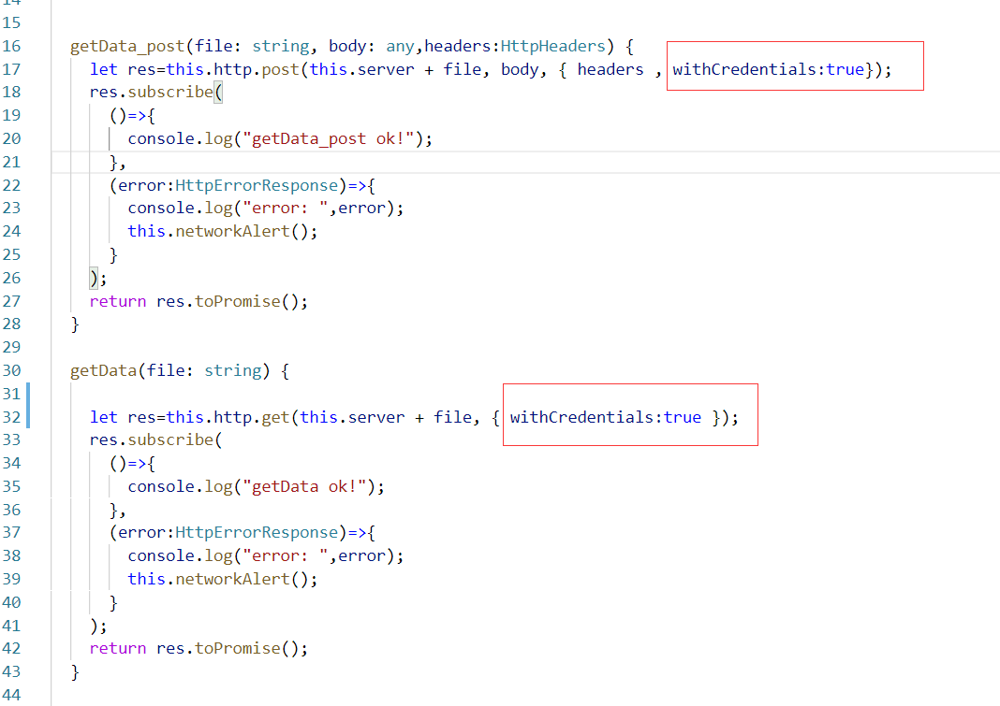
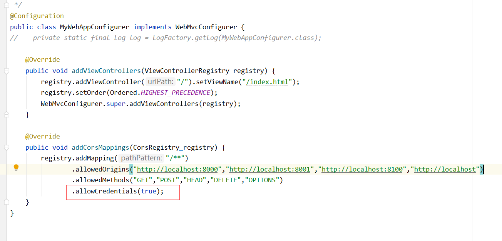
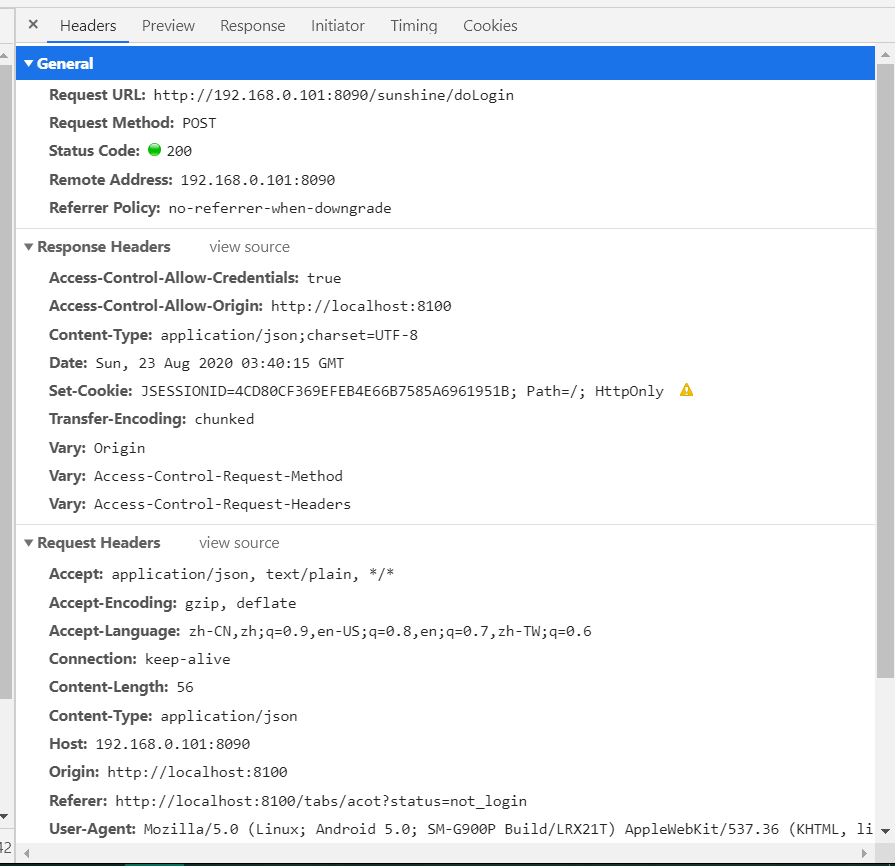
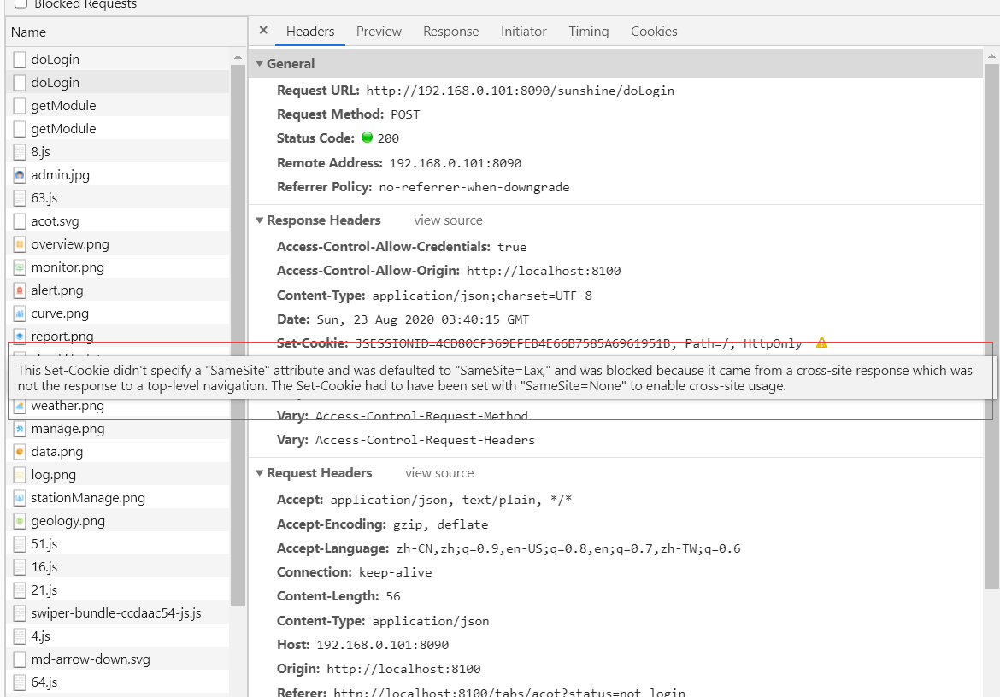

最近突然发现一个问题，之前前端访问后端时都没问题，最近突然出问题了！！

一开始我还想是跨域问题吗？是Cookie跨域？每次访问后端时，所获取的Session ID都不一样，可是这些CORS我都配置好了

而且Chrome的DevTools也没显示什么问题，仿佛一切正常

发呆了很久。。。。。。。。。。

终于注意到`Set-Cookie`处的感叹号 ❗

那里显示 this set-cookie didn't specify a "SameSite" attribute……

然后就一通查询啊，发现CHROME 80版本以后，[SAMESITE COOKIE验证跨站问题](http://www.0x55aa.com/%E7%AE%97%E6%B3%95-%E7%BC%96%E7%A8%8B/1774.html)

具体什么鬼我还没弄清楚，

然后经过一番无脑操作，就OK了

> chrome浏览器中搜索下面地址：
> chrome://flags/#same-site-by-default-cookies
> chrome://flags/#cookies-without-same-site-must-be-secure
> 这两项设置为Disabled，并重启浏览器

最后我用Edge试一下，发现一切正常，估计这是Chrome新出的什么防爬虫规则