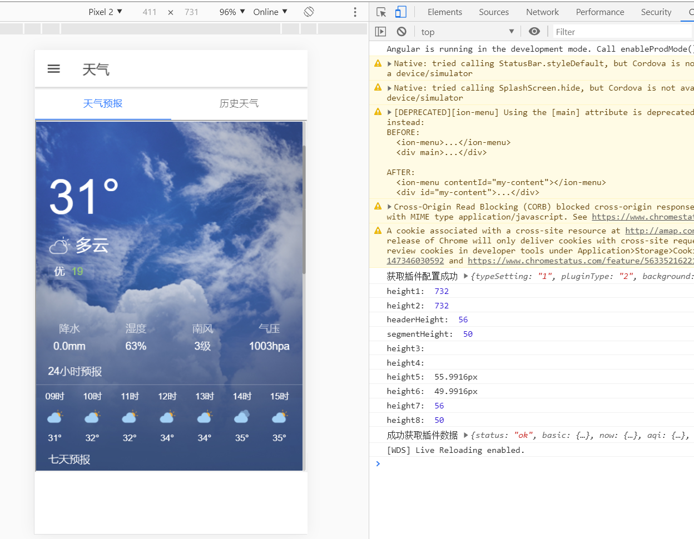

## 前言

js获取窗口和组件的style高度的方法有很多

具体有[js中如何获取元素的高度](https://blog.csdn.net/qq_32786873/article/details/53219416) 还有这个[js中获取窗口高度的](https://www.jianshu.com/p/193789c14138)


## 我的实践

- typescript代码

```typescript
ionViewDidEnter(){
    let header_wea=document.getElementById("header_wea");
    let segment_wea=document.getElementById("segment_wea");
    
    let height1=document.body.clientHeight;     //BODY对象高度
    let height2=document.documentElement.clientHeight;    //窗口可见区域高
    console.log("height1: ",height1);
    console.log("height2: ",height2);
    
    let headerHeight=header_wea.clientHeight;   //组件(内容)可见区域高
    let segmentHeight=segment_wea.clientHeight;
    console.log("headerHeight: ",headerHeight);
    console.log("segmentHeight: ",segmentHeight);
    
    let height3=header_wea.style.height;     //需要显式设置style的height属性才能获取到高度
    let height4=segment_wea.style.height;
    console.log("height3: ",height3);
    console.log("height4: ",height4);

    let height5=window.getComputedStyle(header_wea).height;   //获取当前元素所有最终使用的CSS属性值
    let height6=window.getComputedStyle(segment_wea).height;
    console.log("height5: ",height5);
    console.log("height6: ",height6);

    let height7=header_wea.offsetHeight;   //跟clientHeight差不多，感觉都是组件(内容)可见区域高
    let height8=segment_wea.offsetHeight;
    console.log("height7: ",height7);
    console.log("height8: ",height8);
}

```

- 运行结果




## 最终采用

```typescript
ionViewDidEnter(){
    let height1=document.body.clientHeight;     
    let header_wea=document.getElementById("header_wea");
    let segment_wea=document.getElementById("segment_wea");
    let headerHeight=header_wea.clientHeight;   
    let segmentHeight=segment_wea.clientHeight;
    document.getElementById("iframe_wea").style.height=height1-headerHeight-segmentHeight+"px";
}
```


