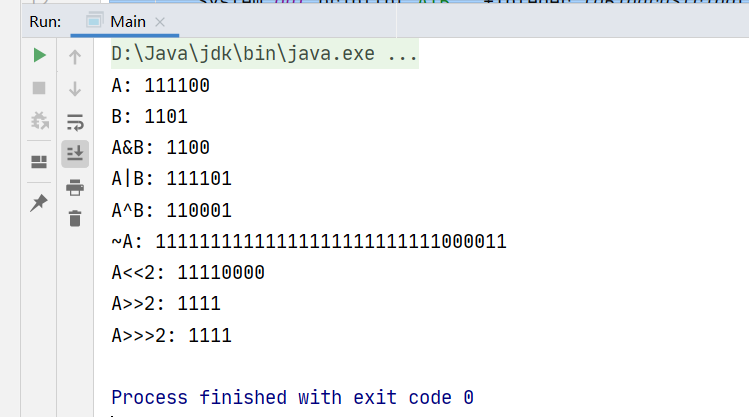

最近碰到了一些奇奇怪怪的运算符，不认识，结果被吐槽基础太差了

Java运算符主要分为以下几大类：

- 算术运算符
- 关系运算符
- 位运算符
- 逻辑运算符
- 赋值运算符


# 算术运算符

就是常用的

- `+`
- `-`
- `*`
- `/`
- `%` ：求余
- `++`
- `--`


# 关系运算符

也是常用的

- `==`
- `!=`
- `>`
- `>=`
- `<`
- `<=`


# 逻辑运算符

也是常用的

- `&&`
- `||`
- `!`


# 条件运算符

也是常用的

- `?:` 如：

  ```java
  int a=1>2? 3:4;
  ```

  

# 赋值运算符

渐渐不常用了

- `=`
- `+=`
- `-=`
- `*=`
- `/=`
- `%=`
- `<<=` ：左移位赋值运算符，C << = 2等价于C = C << 2
- `>>=` ：右移位赋值运算符，C >> = 2等价于C = C >> 2
- `&=` ：按位与赋值运算符，C＆= 2等价于C = C＆2
- `^=` ：按位异或赋值操作符，C ^ = 2等价于C = C ^ 2
- `|=` ：按位或赋值操作符，C | = 2等价于C = C | 2


# 位运算符

这个就不常用了，但还是要知道的，位运算符常用来操作二进制数的

- `&` ：与运算符，如果相对应位都是1，则结果为1，否则为0
- `|` ：如果相对应位都是 0，则结果为 0，否则为 1
- `^` ：如果相对应位值相同，则结果为0，否则为1
- `~` ：按位取反运算符翻转操作数的每一位，即0变成1，1变成0
- `<<` ：按位左移运算符。左操作数按位左移右操作数指定的位数
- `>>` ：按位右移运算符。左操作数按位右移右操作数指定的位数
- `>>>` ：按位右移补零操作符。左操作数的值按右操作数指定的位数右移，移动得到的空位以零填充


例子：

```java
    public static void main(String[] args) {
        int A=60;
        int B=13;
        System.out.println("A: "+Integer.toBinaryString(A));
        System.out.println("B: "+Integer.toBinaryString(B));
        System.out.println("A&B: "+Integer.toBinaryString(A&B));
        System.out.println("A|B: "+Integer.toBinaryString(A|B));
        System.out.println("A^B: "+Integer.toBinaryString(A^B));
        System.out.println("~A: "+Integer.toBinaryString(~A));
        System.out.println("A<<2: "+Integer.toBinaryString(A<<2));
        System.out.println("A>>2: "+Integer.toBinaryString(A>>2));
        System.out.println("A>>>2: "+Integer.toBinaryString(A>>>2));
    }
```

结果：




参考：

[java运算符 与（&）、非（~）、或（|）、异或（^）](https://blog.csdn.net/riemann_/article/details/87870413)

[Java 运算符-菜鸟教程](https://www.runoob.com/java/java-operators.html?_t_t_t=0.3133259497117251)

