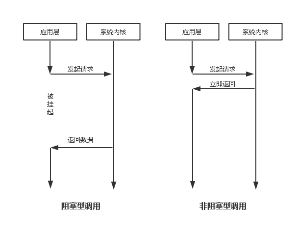
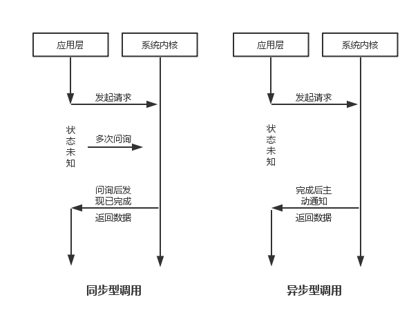
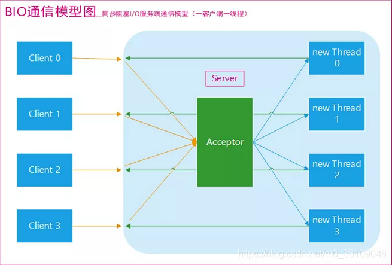
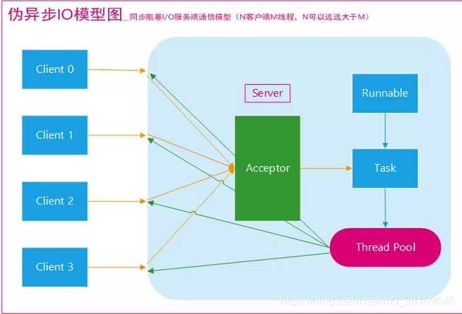
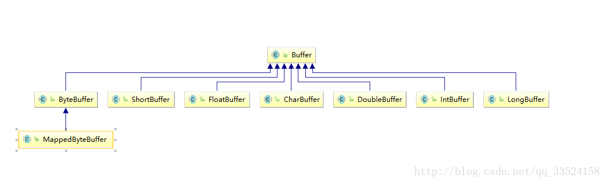
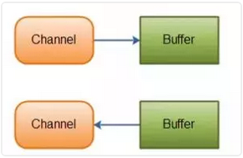
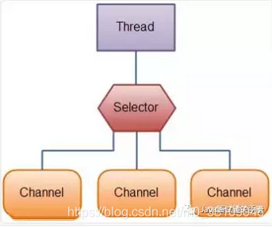

在学习BIO、NIO与AIO前，得先了解一下同步与异步、阻塞与非阻塞


# 阻塞与非阻塞、同步与异步

## 阻塞与非阻塞

阻塞与非阻塞，**关注的是接口调用（发出请求）后等待数据返回时的状态。** 被挂起无法执行其他操作的是阻塞型；可以立即「抽离」去完成其他「任务」的则是非阻塞型。



## 同步与异步

同步与异步，**关注的是任务完成时消息通知的方式。** 由调用方盲目主动去问询的方式为同步调用，由被调用方主动去通知调用方任务已完成的方式为异步调用。



最后再看一个故事：老王烧开水。

出场人物：老张，水壶两把（普通水壶，简称水壶；会响的水壶，简称响水壶）。

老王想了想，有好几种等待方式

1. 老王用水壶煮水，并且*站在那里*，*不管水开没开，每隔一定时间看看水开了没*。－**同步阻塞**

   老王想了想，这种方法不够聪明。

2. 老王还是用水壶煮水，不再傻傻的站在那里看水开，*跑去寝室上网*，*但是还是会每隔一段时间过来看看水开了没有，水没有开就走人*。－**同步非阻塞**

   老王想了想，现在的方法聪明了些，但是还是不够好。

3. 老王这次使用高大上的响水壶来煮水，*站在那里*，*但是不会再每隔一段时间去看水开，而是等水开了，水壶会自动的通知他*。－**异步阻塞**

   老王想了想，不会呀，既然水壶可以通知我，那我为什么还要傻傻的站在那里等呢，嗯，得换个方法。

4. 老王还是使用响水壶煮水，*跑到客厅上网去*，等着响水壶*自己把水煮熟了以后通知他*。－**异步非阻塞**

老王豁然，这下感觉轻松了很多。


# BIO（Blocking I/O）

同步阻塞I/O模式，数据的读取写入必须阻塞在一个线程内等待其完成。


## 传统 BIO

传统BIO通信，一请求一应答。

采用 **BIO 通信模型** 的服务端，通常由一个独立的 Acceptor 线程负责监听客户端的连接。服务端在 `while(true)` 循环中调用 `accept()` 方法等待接收客户端的连接，服务端一旦接收到一个连接请求，就可以建立通信套接字，并在这个通信套接字上进行读写操作，此时就不能再接收其他客户端连接请求，只能等待当前连接的客户端的操作执行完成，不过可以通过多线程来支持多个客户端的连接，如下图所示。



如果要让 **BIO 通信模型** 能够同时处理多个客户端请求，就必须使用多线程（主要原因是 `socket.accept()`、 `socket.read()`、 `socket.write()` 涉及的三个主要函数都是同步阻塞的），也就是说它在接收到客户端连接请求之后为每个客户端创建一个新的线程进行链路处理，处理完成之后，通过输出流返回应答给客户端，线程销毁。这就是典型的 **一请求一应答通信模型** 。

我们可以设想一下如果这个连接不做任何事情的话就会造成不必要的线程开销，不过可以通过 **线程池机制** 改善，线程池还可以让线程的创建和回收成本相对较低。使用 `FixedThreadPool` 可以有效的控制了线程的最大数量，保证了系统有限的资源的控制，实现了`N（客户端请求数量）：M（处理客户端请求的线程数量）`的***伪异步I/O模型***（N 可以远远大于 M）

> **池化（pool）技术：** 其本质是通过复用对象、连接等资源，减少创建对象、连接，降低垃圾回收（GC）的开销，适当使用池化相关技术能够显著提高系统效率，优化性能。


**Q：当客户端并发访问量增加后这种模型会出现什么问题？**

在 Java 虚拟机中，线程是宝贵的资源，线程的创建和销毁成本很高，除此之外，线程的切换成本也是很高的。尤其在 Linux 这样的操作系统中，线程本质上就是一个进程，创建和销毁线程都是重量级的系统函数。如果并发访问量增加会导致线程数急剧膨胀可能会导致线程堆栈溢出、创建新线程失败等问题，最终导致进程宕机或者僵死，不能对外提供服务。


### 代码示例

客户端：

```java
public class IOClient {

   public static void main(String[] args) {
       // TODO 创建多个线程，模拟多个客户端连接服务端
 
       new Thread(() -> {
           try {
               Socket socket = new Socket("127.0.0.1", 3333);
               while (true) {
                   try {
                       socket.getOutputStream().write((new Date() + ": hello world").getBytes());
                       Thread.sleep(2000);
                   } catch (Exception e) {}
               }
 
           } catch (IOException e) {}
 
       }).start();
   }
}
```

服务端：

```java
public class IOServer {
    
   public static void main(String[] args) throws IOException {
       // TODO 服务端处理客户端连接请求

       ServerSocket serverSocket = new ServerSocket(3333);
       // 接收到客户端连接请求之后为每个客户端创建一个新的线程进行链路处理 
       new Thread(() -> {
           while (true) {
               try {
                   // 阻塞方法获取新的连接
                   Socket socket = serverSocket.accept();
                   // 每一个新的连接都创建一个线程，负责读取数据
                   new Thread(() -> {
                       try {
                           int len;
                           byte[] data = new byte[1024];
                           InputStream inputStream = socket.getInputStream();
 
                           // 按字节流方式读取数据
                           while ((len = inputStream.read(data)) != -1) { 
                               System.out.println(new String(data, 0, len));
                           }
                           
                       } catch (IOException e) {}
                       
                   }).start();

               } catch (IOException e) { }  
           }
       }).start();
   }
}
```


## 伪异步 IO

为了解决同步阻塞I/O面临的一个链路需要一个线程处理的问题，后来有人对它的线程模型进行了优化：

后端通过一个**线程池**来处理多个客户端的请求接入，形成 `客户端个数M：线程池最大线程数N` 的比例关系，其中M可以远远大于N。通过线程池可以灵活地调配线程资源，设置线程的最大值，防止由于海量并发接入导致线程耗尽。

伪异步IO模型图：




采用线程池和任务队列可以实现一种叫做伪异步的 I/O 通信框架。当有新的客户端接入时，将客户端的 Socket 封装成一个Task（该任务实现 `java.lang.Runnable` 接口）投递到后端的线程池中进行处理，JDK 的线程池维护一个消息队列和 N 个活跃线程，对消息队列中的任务进行处理。由于线程池可以设置消息队列的大小和最大线程数，因此，它的资源占用是可控的，无论多少个客户端并发访问，都不会导致资源的耗尽和宕机。

伪异步I/O通信框架采用了线程池实现，因此避免了为每个请求都创建一个独立线程造成的线程资源耗尽问题。不过因为它的底层任然是同步阻塞的BIO模型，因此无法从根本上解决同步IO导致的通信线程阻塞的问题。


### 代码示例

客户端：

```java
public class Client {

    final static String ADDRESS = "127.0.0.1";
    final static int PORT =8765;

    public static void main(String[] args) {
        Socket socket = null;
        BufferedReader in = null;
        PrintWriter out = null;
        try {
            socket = new Socket(ADDRESS, PORT);
            in = new BufferedReader(new InputStreamReader(socket.getInputStream()));
            out = new PrintWriter(socket.getOutputStream(), true);

            out.println("Client request");

            String response = in.readLine();
            System.out.println("Client:" + response);


        }  catch (Exception e) {
            // TODO Auto-generated catch block
            e.printStackTrace();
        } finally {
            if(in != null){
                try {
                    in.close();
                } catch (Exception e1) {
                    e1.printStackTrace();
                }
            }
            if(out != null){
                try {
                    out.close();
                } catch (Exception e2) {
                    e2.printStackTrace();
                }
            }
            if(socket != null){
                try {
                    socket.close();
                } catch (Exception e3) {
                    e3.printStackTrace();
                }
            }
            socket = null;              
        }
    }
}
```

服务端：

```java
public class Server {

    final static int PORT = 8765;

    public static void main(String[] args) {
        ServerSocket server = null;
        BufferedReader in = null;
        PrintWriter out = null;
        try {
            server = new ServerSocket(PORT);
            System.out.println("server start");
            Socket socket = null;
            //创建线程池
            HandlerExecutorPool executorPool = new HandlerExecutorPool(50, 1000);
            while(true){
                //阻塞
                socket = server.accept();
                // 执行客户端任务
                // 每一个新的连接都在线程池中创建一个线程，
                executorPool.execute(new ServerHandler(socket));
            }

        } catch (Exception e) {
            e.printStackTrace();
        } finally {
            if(in != null){
                try {
                    in.close();
                } catch (Exception e1) {
                    e1.printStackTrace();
                }
            }
            if(out != null){
                try {
                    out.close();
                } catch (Exception e2) {
                    e2.printStackTrace();
                }
            }
            if(server != null){
                try {
                    server.close();
                } catch (Exception e3) {
                    e3.printStackTrace();
                }
            }
            server = null;              
        }
    }
}
```

```java
public class HandlerExecutorPool {

    private ExecutorService executor;
    
    public HandlerExecutorPool(int maxPoolSize, int queueSize){
        this.executor = new ThreadPoolExecutor(
                Runtime.getRuntime().availableProcessors(),
                maxPoolSize, 
                120L, 
                TimeUnit.SECONDS,
                new ArrayBlockingQueue<Runnable>(queueSize));
    }

    public void execute(Runnable task){
        this.executor.execute(task);
    }
}
```

```java
public class ServerHandler implements Runnable {

    private Socket socket;
    public ServerHandler (Socket socket){
        this.socket = socket;
    }

    @Override
    public void run() {
        BufferedReader in = null;
        PrintWriter out = null;
        try {
            in = new BufferedReader(new InputStreamReader(this.socket.getInputStream()));
            out = new PrintWriter(this.socket.getOutputStream(), true);
            String body = null;
            while(true){
                body = in.readLine();
                if(body == null) break;
                System.out.println("Server:" + body);
                out.println("Server response");
            }
        } catch (Exception e) {
            e.printStackTrace();
        } finally {
            if(in != null){
                try {
                    in.close();
                } catch (Exception e1) {
                    e1.printStackTrace();
                }
            }
            if(out != null){
                try {
                    out.close();
                } catch (Exception e2) {
                    e2.printStackTrace();
                }
            }
            if(socket != null){
                try {
                    socket.close();
                } catch (Exception e3) {
                    e3.printStackTrace();
                }
            }
            socket = null;          
        }
    }
}
```


## 总结

在活动连接数不是特别高（小于单机1000）的情况下，这种模型是比较不错的，可以让每一个连接专注于自己的 I/O 并且编程模型简单，也不用过多考虑系统的过载、限流等问题。线程池本身就是一个天然的漏斗，可以缓冲一些系统处理不了的连接或请求。但是，当面对十万甚至百万级连接的时候，传统的 BIO 模型是无能为力的。因此，我们需要一种更高效的 I/O 处理模型来应对更高的并发量。


# NIO (Non-blocking I/O)

NIO是一种同步非阻塞的I/O模型，在Java 1.4 中引入了NIO框架，对应 `java.nio` 包，提供了`Channel` 、 `Selector` 、 `Buffer` 三个核心组件。

NIO中的N还可以理解为New。它支持面向缓冲的，基于通道的I/O操作方法。 

NIO提供了与传统BIO模型中的 `Socket` 和 `ServerSocket` 相对应的 `SocketChannel` 和 `ServerSocketChannel` 两种不同的套接字通道实现，两种通道都支持阻塞和非阻塞两种模式。

阻塞模式使用就像BIO一样，比较简单，但是性能和可靠性都不好；非阻塞模式正好与之相反。对于低负载、低并发的应用程序，可以使用同步阻塞I/O来提升开发速率和更好的维护性；对于高负载、高并发的（网络）应用，应使用 NIO 的非阻塞模式来开发。


## NIO特性

### 非阻塞

BIO流是阻塞的，NIO流是不阻塞的。

Java NIO使我们可以进行非阻塞IO操作。比如说，一个线程从通道读取数据到buffer的同时，可以继续做别的事情，当数据全部读取到buffer中后，线程再继续处理数据。写数据也是如此，一个线程请求写入一些数据到某通道，在写入的同时，这个线程可以去做别的事情。


### 面向缓冲区

BIO是面向流（Stream oriented），而NIO是面向缓存区的（Buffer oriented）。

在面向流的I/O中，可以将数据直接写入或者将数据直接读到 Stream 对象中。虽然 Stream 中也有 Buffer 开头的扩展类，但只是流的包装类，最终还是从流读到缓冲区，而 NIO 则是直接读到 Buffer 中进行操作。

在NIO厍中，所有数据都是在缓冲区处理的。在读取数据时，它是直接读到缓冲区中的；在写入数据时，写入到缓冲区中。任何时候访问NIO中的数据，都是通过缓冲区进行操作。

最常用的缓冲区是 `ByteBuffer` ，一个 `ByteBuffer` 提供了一组功能用于操作 byte 数组。除了`ByteBuffer ，还有其他的一些缓冲区，事实上，每一种Java基本类型（除了Boolean类型）都对应有一种缓冲区。




### 通道

NIO 通过 Channel（通道）进行读写。

通道是双向的，可读也可写，而流的读写是单向的。一个流必须是Inputstream或OutputStream的子类。而通道可以用于读、写或者二者同时进行，最关键的是可以与多路复用器结合起来，有多种的状态位，方便多路复用器去识别。

此外，无论读写，通道都和Buffer交互的：

- 从通道进行数据读取 ：创建一个缓冲区，然后请求通道读取数据。
- 从通道进行数据写入 ：创建一个缓冲区，填充数据，并请求通道写入数据。

同时也因为有 Buffer，通道可以异步地读写。




### 选择器

NIO 有选择器（Selector），而 BIO 没有。此外，选择器又叫多路复用器。

选择器能使单个线程处理多个通道，因此，NIO能减少线程之间的切换，提高系统效率。

其实，选择器的工作原理就是不断地轮询注册在其上的通道（Channel），如果某个通道发生了读写操作，这个通道就处于就绪状态，会被Selector轮询出来，然后通过SelectionKey可以取得就绪的Channel集合，从而通知CPU进行后续的 IO 操作。




# AIO（Asynchronous I/O）

AIO 也就是 NIO2。在 Java 7 中引入了 NIO 的改进版 NIO2，它是异步非阻塞的IO模型。

AIO的异步IO是基于事件和回调机制实现的，也就是应用操作之后会直接返回，不会堵塞在那里，当后台处理完成，操作系统会通知相应的线程进行后续的操作。

虽然 NIO 在网络操作中，提供了非阻塞的方法，但是 NIO 的 IO 行为还是同步的。


# 参考

1. [Java面试常考的 BIO，NIO，AIO 总结](https://blog.csdn.net/m0_38109046/article/details/89449305)
2. [JAVA BIO与NIO、AIO的区别(这个容易理解)](https://blog.csdn.net/ty497122758/article/details/78979302)
3. [Java BIO改良（伪异步IO）](https://www.jianshu.com/p/f1bdeea7f19f)
3. [阻塞和非阻塞，同步和异步 总结](https://www.cnblogs.com/George1994/p/6702084.html)
3. [完全理解同步/异步与阻塞/非阻塞](https://zhuanlan.zhihu.com/p/22707398)
3. [java网络编程之传统IO与伪异步IO（一）](https://blog.csdn.net/qq_33524158/article/details/78605725) 
3. [java网络编程之NIO（二）](https://blog.csdn.net/qq_33524158/article/details/78609634?ops_request_misc=%257B%2522request%255Fid%2522%253A%2522164631507416780265427852%2522%252C%2522scm%2522%253A%252220140713.130102334.pc%255Fblog.%2522%257D&request_id=164631507416780265427852&biz_id=0&utm_medium=distribute.pc_search_result.none-task-blog-2~blog~first_rank_ecpm_v1~rank_v31_ecpm-1-78609634.nonecase&utm_term=java%E7%BD%91%E7%BB%9C%E7%BC%96%E7%A8%8B&spm=1018.2226.3001.4450)
3. [java网络编程之AIO/NIO2.0（三）](https://blog.csdn.net/qq_33524158/article/details/78609899)
