# 进程与线程

**进程：**

​	每个进程都有独立的代码的数据空间（进程上下文），进程间的切换会有较大的开销，一个进程包含1~n个线程。	

​	多进程：指OS能同时运行多个任务（程序）

> 进程是资源分配的最小单位

**线程：**

​	同一类线程共享代码和数据空间，每个线程都有独立的运行栈和程序计数器（PC），线程切换开销小。

​	多线程：指在同一个程序中有多个顺序流在执行

> 线程是CPU调度的最小单位

线程和进程一样分为五个阶段：创建、就绪、运行、阻塞、终止


# 常见线程名词

- **主线程：** JVM调用程序Main()所产生的线程

- **当前线程：** 当前运行的线程，可通过Thread.currentThread()获取

- **守护线程（Daemon）：** 也叫后台线程，指为其他线程提供服务的线程，JVM的垃圾回收线程就是一个后台线程

- **前台线程：** 指接受后台线程服务的线程

- **对象锁：** 

  可以理解为对象的钥匙，一个对象只有一把对象锁。

  当一个对象中有同步方法、同步块时，当线程调用此对象并进入该同步区域时，必须要先获得对象锁，如果此对象的对象锁被其它线程占用，则会进入阻塞队列，等待此对象锁的释放。

  注意，线程执行完同步方法、同步块后，就会马上把对象锁还给该对象。

  这样就保证了同步方法、同步块每时每刻都只能有一个线程在执行。

- **方法锁：** 方法锁也是一种对象锁

- **类锁：** 

  可以理解为类的钥匙，一个类只有一把类锁

  当一个类中有同步静态的东西时（包括变量、方法、块），当线程调用此类中的同步静态东西时，必须要先获得类锁，类似于对象锁。

  类锁保证了类中的同步静态东西每时每刻都只能有一个线程在执行


# JAVA实现多线程

Java实现多线程，常用的有两种方法：

1. 继承Thread类
   
2. 实现Runnable接口

两者对比，第二种方法更常用


## 继承Thread类

**使用：**

​	新建一个类，继承java.lang.Thread类，重写run()方法

​	执行时调用线程类的start()方法


**例子：**

```java
public class Thread1 extends Thread {
    private String name;
    
    public Thread1(String name) {
        this.name = name;
    }

    @Override
    public void run() {
        for(int i=0;i<10;i++){
            System.out.println(name+" 运行： "+i);
            try {
                sleep((int)Math.random()*10);
            } catch (InterruptedException e) {
                e.printStackTrace();
            }
        }
    }
}

public class Main {
    public static void main(String[] args) {
        Thread1 thread1=new Thread1("hello");
        Thread1 thread2=new Thread1("world");
        thread1.start();
        thread2.start();
        for(int i=0;i<5;i++){
            System.out.println("main 运行： "+i);
            try {
                sleep((int)Math.random()*10);
            } catch (InterruptedException e) {
                e.printStackTrace();
            }
        }
    }
}
```

**输出：**

<div style="width:40%;margin:auto">

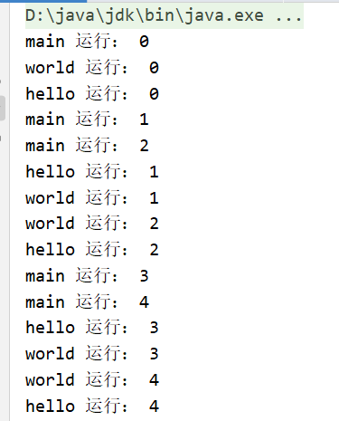

</div>

再执行一下输出：

<div style="width:30%;margin:auto">

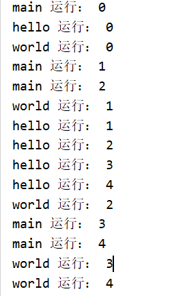

</div>


**说明：**

​	程序启动执行main()时，Java虚拟机启动了一个进程，主线程main在main()调用时被创建

​	随着调用Thread1的两个对象的start()方法，另外两个线程也启动了

​	这样，整个应用就在多线程下运行

> main()方法其实也是一个线程，
>
> 在Java中所有的线程都是同时启动的，至于什么时候，哪个先执行，完全看谁先得到CPU的资源
>
> 每次运行Java程序至少启动2个线程：main线程、垃圾收集线程
>
> 每运行一个Java程序，都会启动一个JVM，这个JVM其实就是一个进程


**注意：**

1. 调用start()方法后，并不是立即执行多线程代码，而是使该线程变为可运行态（Runnable），至于什么时候运行是由OS决定的
   
2. 多线程程序是乱序执行的，因此，对于乱序执行的代码，为了加快速度，可设计为多线程
   
3. 调用Thread.sleep()的目的是：不让当前线程独自霸占该进程所获取的CPU资源，从而留出一定时间给其它线程执行的机会
   
4. 重复调用start()方法的话，会出现java.lang.IllegalThreadStateException异常

> 可运行态（Runnable），我感觉也就是就绪


## 实现Runnable接口

**使用：**

​	新建一个类，实现Runnable接口，然后重写run()方法


**例子：**

```java
public class SaySomething implements Runnable{
    private String name;

    public SaySomething(String name) {
        this.name = name;
    }

    @Override
    public void run() {
        for(int i=0;i<5;i++){
            System.out.println(name+" 运行： "+i);
            try {
                Thread.sleep((int)Math.random()*10);
            } catch (InterruptedException e) {
                e.printStackTrace();
            }
        }
    }
}

public class Main {
    public static void main(String[] args) {
        Thread thread1=new Thread(new SaySomething("hello"));
        Thread thread2=new Thread(new SaySomething("world"));
        thread1.start();
        thread2.start();
        for(int i=0;i<5;i++){
            System.out.println("main 运行： "+i);
            try {
                sleep((int)Math.random()*10);
            } catch (InterruptedException e) {
                e.printStackTrace();
            }
        }
    }
}
```

**输出：**


<div style="width:50%;margin:auto">

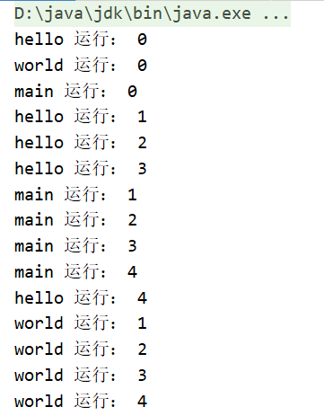

</div>

再执行一次输出：


<div style="width:50%;margin:auto">

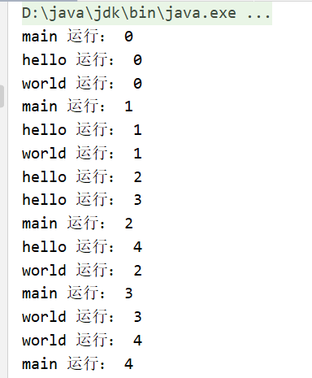

</div>

**说明：**

1. SaySomething类通过实现Runnable接口，使得该类有了多线程类得特征

2. run()方法是多线程程序得一个约定，所有的多线程代码都在run()方法里

3. 其实java.lang.Thread类也是实现了Runnable接口的类
   
4. 在启动多线程时，需要先通过Thread类的构造方法Thread(Runnable target)构造出对象，然后调用Thread对象的start()方法来运行多线程代码
   
5. 其实所有的多线程代码都是通过运行Thread的start()方法来运行的


## Thread和Runnable的区别

如果一个类继承Thread，则不适合资源共享

如果一个类实现Runnable接口的话，则更容易实现资源共享

> 在Java中，一个类只能继承一个类，但可以实现多个接口


实现Runnable的优势：

1. 适合多个相同的程序代码的线程去处理同一个资源（还没体会到）
   
2. 可避免Java中单继承的限制
   
3. 增加程序的健壮性，代码可被多个线程共享，代码和数据独立（也还没体会到）
   
4. 线程池只能放入实现Runnable或Callable类的线程，不能直接放入继承Thread的类


## 线程状态转换


<div style="width:100%;margin:auto">


</div>

说一下**阻塞状态（Blocked）**

阻塞状态是线程因为某种原因放弃CPU使用权，暂时停止运行，直到线程进入就绪状态，才有机会转到运行状态。

阻塞的情况有三种：

1. 等待阻塞：运行的线程执行wait()方法，JVM会将该线程放入等待池中。（wait会释放持有的锁）
   
2. 同步阻塞：运行的线程在获取对象的同步锁时，若该同步锁被别的线程占用，则JVM会把该线程放入锁池中
   
3. 其它阻塞：运行的线程执行sleep()或join()方法，或者发出了I/O请求时，JVM会把该线程置为阻塞状态。当sleep()状态超时、join()等待线程终止或者超时、I/O处理完成时，线程会重新转入就绪状态。（sleep不会释放持有的锁）


## Thread常用API

### 优先级

通过调整线程的优先级，使优先级高的线程获得较多的运行机会

Java线程的优先级用int表示，取值范围：1~10，Thread也有3个关于优先级的静态常量：

```java
//Thread类的部分源代码
public class Thread implements Runnable{
    
    public final static int MIN_PRIORITY = 1;   //The minimum priority that a thread can have.
	public final static int NORM_PRIORITY = 5;   //The default priority that is assigned to a thread.
	public final static int MAX_PRIORITY = 10;    //The maximum priority that a thread can have.
    
    public final void setPriority(int newPriority){...}    //设置优先级
    
    //获取优先级
    public final int getPriority() {
        return priority;
    }
}

```

**注意：**

- 线程的优先级有继承关系，比如A线程创建了B线程，那么B线程与A线程有相同的优先级
- JVM虽然提供了10个线程优先级，但与常见的操作系统都不能很好的映射，所以最好只使用那3个静态变量来设置线程优先级


### 线程睡眠

```java
Thread.sleep(long millis)；
```

使线程转到阻塞状态，millis参数设定睡眠的时间，单位：毫秒。当睡眠结束后，就转为就绪（Runnable）状态，sleep()平台移植性好。


### 线程等待

```java
Object.wait();
Object.wait(long timeout);     //超时被唤醒
```

使当前的线程等待，直到其它线程调用此对象的notify()或notifyAll()唤醒

不过，wait()方法只能在`同步控制方法`或者`同步控制块`里使用，即要与`synchronized`关键字连用

还有，wait()方法会释放`对象锁`

### 线程唤醒

```java
Object.notify();       //唤醒此对象监视器上的随意一个等待的线程
Object.notifyAll();     //唤醒此对象监视器上的所有等待的线程
```

注意：wait()、notify()、synchronized这三个一般是连着用的

**例子：**

```java
public class NotifyDemo {
    public static void main(String[] args) {
        byte[] obj=new byte[0];     //用来表示一个对象锁
        Thread download=new Thread(){
            public void run(){
                System.out.println("开始下载图片");
                for (int i=0;i<=100;i+=20){
                    System.out.println("already download "+i+"%");
                    try {
                        sleep(500);
                    } catch (InterruptedException e) {
                        e.printStackTrace();
                    }
                }
                System.out.println("图片下载成功");
                synchronized (obj){
                    obj.notify();    //释放obj对象锁
                }
                System.out.println("开始下载附件");
                for (int i=0;i<=100;i+=20){
                    System.out.println("already download "+i+"%");
                    try {
                        sleep(500);
                    } catch (InterruptedException e) {
                        e.printStackTrace();
                    }
                }
                System.out.println("附件下载成功");
            }
        };
        Thread show=new Thread(){
            public void run(){
                synchronized (obj){
                    try {
                        obj.wait();     //锁上obj
                        System.out.println("show: 开始展示图片");
                        sleep(2000);
                        System.out.println("图片展示完毕");
                    } catch (InterruptedException e) {
                        e.printStackTrace();
                    }
                }
            }
        };
        download.start();
        show.start();
    }
}
```

**结果：**


<div style="width:70%;margin:auto">

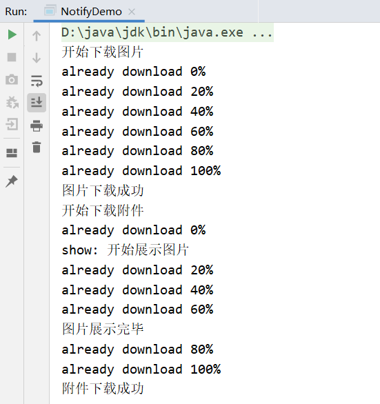

</div>

### 线程让步

```java
Thread.yield(); 
```

暂停当前正在执行的线程对象，把执行机会让给相同或优先级更高的线程

具体来说，就是：让当前运行线程回到可运行状态，以允许具有相同优先级的其他线程获得运行机会

> **注意：**yield()从未导致线程转到等待/睡眠/阻塞状态

因此，使用yield()的目的是让相同优先级的线程之间能适当的轮转执行。但是，实际中无法保证yield()达到让步目的，因为让步的线程还有可能被线程调度程序再次选中

**例子：**

```java
public class YieldLearn {
    public static void main(String[] args) {
        new NumPrint("A").start();
        new NumPrint("B").start();
    }
}

class NumPrint extends Thread{

    NumPrint(String name){
        super(name);
    }

    @Override
    public void run() {
        for(int i=0;i<10;i++){
            System.out.println(currentThread().getName()+" is running "+i);
            if(i==5){
                yield();
            }
        }
    }
}
```

**输出：**

<div style="width:50%;margin:auto">

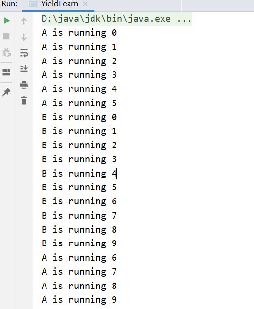

</div>

还有很多种输出。。。。

### 线程加入

```java
Thread.join();
```

表示一个线程A加入到当前运行的线程B中，当运行到加入的那个线程A时，当前运行的线程B就会进入阻塞状态，然后线程A进入运行状态，当线程A运行结束时，线程B才会再回到就绪状态。

**例子1：**

```java
public class JoinLearn {
    public static void main(String[] args) throws InterruptedException {
        System.out.println(Thread.currentThread().getName()+" begin running");
        NumPrintThread numPrint1=new NumPrintThread("numPrint1");
        numPrint1.start();
        System.out.println(Thread.currentThread().getName()+" is still running1");
        numPrint1.join();
        System.out.println(Thread.currentThread().getName()+" is still running2");
        System.out.println(Thread.currentThread().getName()+" end running");
    }
}

class NumPrintThread extends Thread{

    public NumPrintThread(String name){
        super(name);
    }

    @Override
    public void run() {
        System.out.println(Thread.currentThread().getName()+" begin running");
        for(int i=0;i<10;i++){
            System.out.println(Thread.currentThread().getName()+" is running:  "+i);
        }
        System.out.println(Thread.currentThread().getName()+" end running");
    }
}
```

一开始，Main线程运行，当执行了numPrint1.join()时，Main线程进入阻塞状态，numPrint1运行，numPrint1运行结束后，Main继续运行

**输出：**

<div style="width:70%;margin:auto">

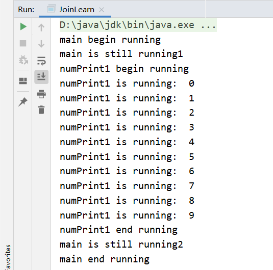

</div>

**例子2：**

```java
public class JoinLearn {
    public static void main(String[] args) throws InterruptedException {
        System.out.println(Thread.currentThread().getName()+" begin running");

        NumPrintThread numPrint1=new NumPrintThread("numPrint1");
        numPrint1.start();

        NumPrintThread numPrint2=new NumPrintThread("numPrint2");
        numPrint2.start();

        System.out.println(Thread.currentThread().getName()+" is still running1");

        numPrint1.join();

        System.out.println(Thread.currentThread().getName()+" is still running2");
        System.out.println(Thread.currentThread().getName()+" end running");
    }
}

class NumPrintThread extends Thread{

    public NumPrintThread(String name){
        super(name);
    }

    @Override
    public void run() {
        System.out.println(Thread.currentThread().getName()+" begin running");
        for(int i=0;i<5;i++){
            System.out.println(Thread.currentThread().getName()+" is running:  "+i);
        }
        System.out.println(Thread.currentThread().getName()+" end running");
    }
}
```

一开始，Main线程运行，当运行到numPrint1.join()时，Main线程进入阻塞状态，然后numPrint1线程与numPrint2线程随机、没有顺序地执行，当numPrint1线程运行结束时，Main线程可以重回运行状态了，若是numPrint2线程还没运行结束，则Main线程会与numPrint2线程随机、没有顺序地执行

**输出：**

<div style="width:70%;margin:auto">

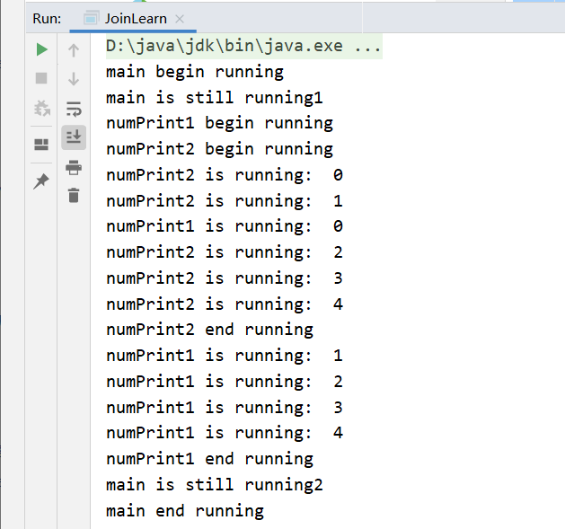

</div>

<div style="width:70%;margin:auto">

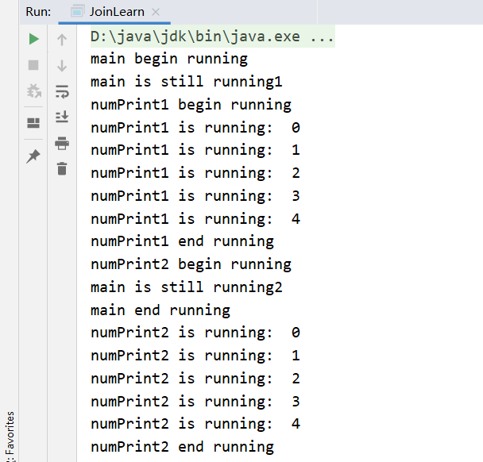

</div>

<div style="width:70%;margin:auto">

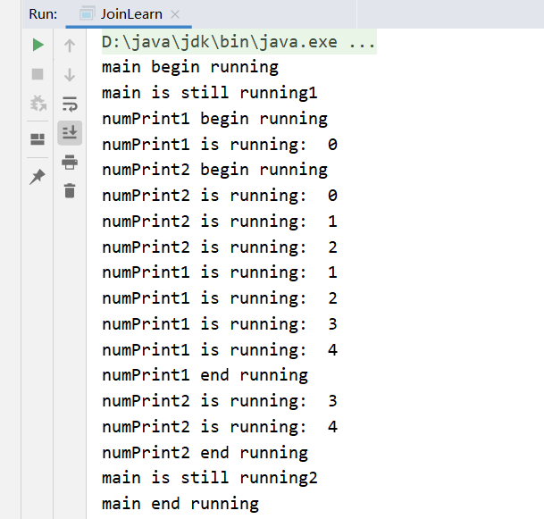

</div>


**例子3：**

```java
public class JoinLearn {
    public static void main(String[] args) throws InterruptedException {
        System.out.println(Thread.currentThread().getName()+" begin running");

        NumPrintThread numPrint1=new NumPrintThread("numPrint1");
        numPrint1.start();

        NumPrintThread numPrint2=new NumPrintThread("numPrint2");
        numPrint2.start();
        numPrint2.sleep(5000);
        
        System.out.println(Thread.currentThread().getName()+" is still running1");

        numPrint1.join();

        System.out.println(Thread.currentThread().getName()+" is still running2");
        System.out.println(Thread.currentThread().getName()+" end running");
    }
}

class NumPrintThread extends Thread{

    public NumPrintThread(String name){
        super(name);
    }

    @Override
    public void run() {
        System.out.println(Thread.currentThread().getName()+" begin running");
        for(int i=0;i<5;i++){
            System.out.println(Thread.currentThread().getName()+" is running:  "+i);
        }
        System.out.println(Thread.currentThread().getName()+" end running");
    }
}
```

我本来的想法是：Main线程先执行，然后中途阻塞，然后numPrint1执行，numPrint2阻塞，numPrint1执行完了，到Main执行，最后才numPrint2执行

可是很奇怪，不管执行多少次，main is still running1，main is still running2，main end running这三句话永远是最后sleep完之后再执行，我本来是想让numPrint2阻塞，结果变成了Main的阻塞

为什么呢？

我想应该是这样的。numPrint2 继承 Thread，执行numPrint2.sleep()就就相当于执行Thread.sleep()，表示让该线程睡眠。即numPrint2.sleep()不是让numPrint2睡眠，而是让Main睡眠

**输出：**


<div style="width:70%;margin:auto">

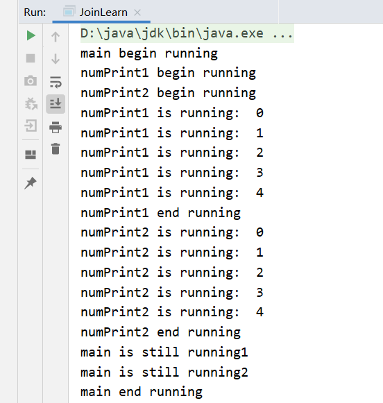

</div>


# 线程同步

线程同步主要指的是`synchronized关键字`的使用，使用`synchronized关键字`可实现对象锁、类锁

## 同步方法

- ***同步一般方法：***

  synchronized方法，可以防止多个线程同时访问这个对象的synchronized方法

  如果一个对象有多个synchronized方法，只要一个线程访问了其中一个synchronized方法，其它线程就不能访问这个对象的任何一个synchronized方法，注意，不同的对象实例的synchronized方法是互不干扰的，即其它线程可以同时访问相同类的另一个对象实例的synchronized方法，这就是对象锁

  还有，synchronized方法是不能继承的，继承类需要手动显式地指定synchronized方法，比如：

  ```java
  synchronized f(){}     //父类的方法
  f(){}      //继承之后，子类的方法就会变成这样，
  ```

  **使用：**

  ```java
  //写法一
  public synchronized void method(){
      // todo
  }
  
  //写法二
  public void method(){
      synchronized(this){      //这个this指的是调用这个方法的对象
          // todo
      }
  }
  ```

  写法一修饰的是一个方法，写法二修饰的是一个代码块，但写法一与写法二是等价的，都锁定了整个方法时的内容

  

  **例子一：**

  ```java
  public class SynchronizedLearn implements Runnable{
  
      @Override
      public void run() {
          printNum();
      }
  
      public synchronized void printNum(){
          for(int i=0;i<5;i++){
              System.out.println(Thread.currentThread().getName()+"  "+i);
          	try {
                  Thread.sleep(100);
              } catch (InterruptedException e) {
                  e.printStackTrace();
              }
          }
      }
  
      public static void main(String[] args) {
          Thread A=new Thread(new SynchronizedLearn(),"A");
          Thread B=new Thread(new SynchronizedLearn(),"B");
          A.start();
          B.start();
      }
  }
  ```

  **结果：**

  A、B随机乱序运行

  因为上例新建了两个SynchronizedLearn对象，其对应两个不同的对象锁，而这两把锁是互不干扰的，不形成互斥，所以两个线程可以同时执行

  

  **例子二：**

  ```java
  public class SynchronizedLearn implements Runnable{
  
      @Override
      public void run() {
          printNum();
      }
  
      public synchronized void printNum(){
          for(int i=0;i<5;i++){
              System.out.println(Thread.currentThread().getName()+"  "+i);
          	try {
                  Thread.sleep(100);
              } catch (InterruptedException e) {
                  e.printStackTrace();
              }
          }
      }
  
      public static void main(String[] args) {
          SynchronizedLearn synchronizedLearn=new SynchronizedLearn();
          Thread A=new Thread(synchronizedLearn,"A");
          Thread B=new Thread(synchronizedLearn,"B");
          A.start();
          B.start();
      }
  }
  ```

  **结果：**

  A先运行完，然后B再运行

  因为上例使用的就是同一个对象锁


- ***同步静态方法：***

  synchronized静态方法，可以防止多个线程同时访问这个类的synchronized静态方法

  **使用：**

  ```java
  public synchronized static void method(){
      // todo 
  } 
  ```

  **例子：**

  ```java
  public class SynchronizedLearn implements Runnable{
  
      public synchronized static void printNum2(){
          for(int i=0;i<5;i++){
              System.out.println(Thread.currentThread().getName()+"  "+i);
          	try {
                  Thread.sleep(50);
              } catch (InterruptedException e) {
                  e.printStackTrace();
              }
          }
      }
  
      @Override
      public void run() {
          printNum2();
      }
  
      public static void main(String[] args) {
          Thread A=new Thread(new SynchronizedLearn(),"A");
          Thread B=new Thread(new SynchronizedLearn(),"B");
          A.start();
          B.start();
      }
  }
  ```

  **结果：**

  A先运行完，然后B再运行

  毕竟是类锁

## 同步块

其使用方法与同步方法差不多

**使用：**

```java
public void method(Object object){
    synchronized(object){
        // todo
    }
}
```

synchronized的参数，指的是对象锁，运行该同步块需要获取的对象锁

如果没有明确的对象作为锁时，只是想让一段代码同步时，可以创建一个特殊的实例变量（它得是一个对象），如零长度的byte数组：

```java
private byte[] lock=new byte[0];

public void method(){
    synchronized(lock){
        // todo
    }
}
```

## 同步类

实现类锁的方法，除了将`synchronized`修饰静态方法之外，还可将它修饰一个类

**使用：**

```java
Class ClassName {
    public void method(){
        synchronized(ClassName.class){
            // todo 
        }
    }
}
```

这意味着给ClassName这个类加锁，即ClassName的所有对象用的是同一把锁

**例子：**

```java
public class SyncThread implements Runnable{

    private static int count=0;

    public void method(){
        synchronized (SyncThread.class){
            for(int i=0;i<5;i++){
                System.out.println(Thread.currentThread().getName() + ":" + (count++));
                try {
                    Thread.sleep(100);
                } catch (InterruptedException e) {
                    e.printStackTrace();
                }
            }
        }
    }

    @Override
    public void run() {
        method();
    }

    public static void main(String[] args) {
        Thread A=new Thread(new SyncThread(),"A");
        Thread B=new Thread(new SyncThread(),"B");
        A.start();
        B.start();
    }
}
```

**结果：**

不是A先运行完，就是B先运行完


<br/>

<br/>

参考：

1.[林炳文Evankaka大佬的Java多线程学习（吐血超详细总结）](https://blog.csdn.net/evankaka/article/details/44153709)

2.[[Java锁Synchronized对象锁和类锁区别](https://www.cnblogs.com/owenma/p/8609348.html)

3.[Java对象锁和类锁全面解析（多线程synchronized关键字）](https://cloud.tencent.com/developer/article/1501912)

4.[Java 基础之方法锁、对象锁、类锁](https://www.jianshu.com/p/92b75042c059)

5.[luoweifu的Java中Synchronized的用法](https://blog.csdn.net/luoweifu/article/details/46613015)

