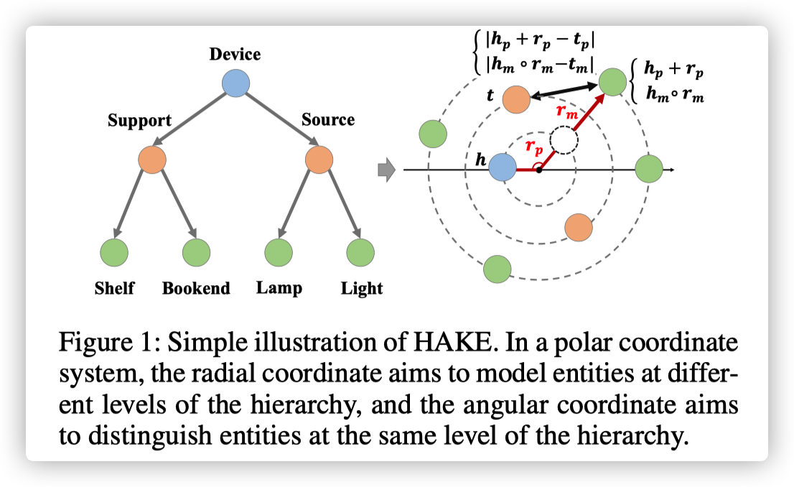
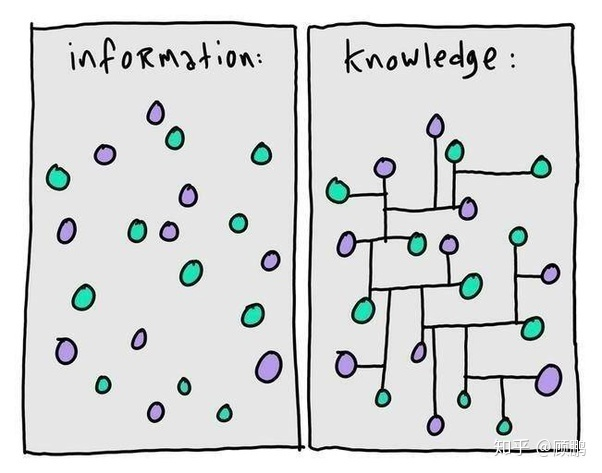
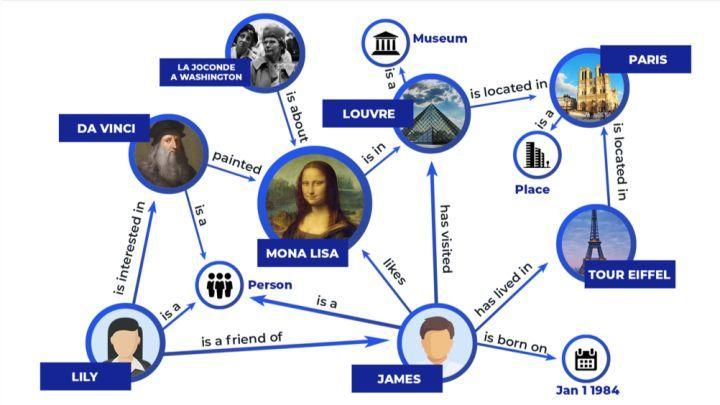
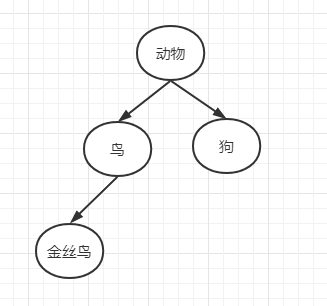

中文名：面向链路预测的学习层次感知知识图嵌入

# 1.干什么的

提出了Hierarchy-Aware Knowledge Graph Embeddings（HAKE模型），完善对知识图谱的建模

# 2.完善了什么

在这之前，TransE与RotatE也进行了对知识图谱的建模，不过都有不足之处

- **TransE：**可以建模互逆关系与复合关系，却难以建模对称关系
  
- **RotatE：**可以建模互逆关系与复合关系，还有对称关系，却难以建模在知识图谱中普遍存在的语义分层现象

所以，这篇论文解决的就是：建模在知识图谱中普遍存在的语义分层现象

# 3.怎么完善

HAKE模型通过***极坐标系***表示语义层级的树型结构，它将所有实体都嵌入、映射到同一个极坐标系中，其中

- 模长：用于表示分属不同层级的实体
  
- 角度：用于表示同一层级的实体

> 在论文中，这个`模长`与`角度`有更专业的术语，分别是`模量（Modules）`与`相位（Phase)`
>
> 下图中的p、m下标指的就是Modules与Phase的缩写

# 4.评价方法

通过链接预测任务来对模型的有效性进行评价

就是对于给定的三元组，先去掉他们的头实体或尾实体，然后生成测试三元组，然后再拿这些测试三元组进行嵌入补全测试，然后得到一个预测的完整三元组，然后再拿这个预测的三元组与真实的三元组进行比较，得到一个分数值，最后对该分数值进行降序排序。

还有，这个分数值采用`MRR(Mean Reciprocal Rank)`和`H@N(Hits at N)`作为评价指标，MRR为预测结果平均排名的指标，H@N为预测结果排在前N名中的比例，总之，越好的预测结果，MRR值与H@N值也越高

# 补漏

## 知识图谱

知识图谱，是一种揭示实体之间关系的语义网络

信息与知识的关系，就好比这个图，信息是零散的，对信息建立联系就变成了知识

所以，知识图谱是由一条条知识组成，这一条条的知识有个专业术语：事实（Fact）

事实（Fact）一般以三元组（Triple）的形式表示：<头实体，关系，尾实体>（<head entity，relation，tail entity>）

又比如下面这个图，<DA VINCI，painted，MONA LISA>就是一个三元组，表示DA VINCI painted MONA LISA。

参考：

[知乎-什么是知识图谱?](https://zhuanlan.zhihu.com/p/71128505)

[AAAI 2020 | 中科大：可建模语义分层的知识图谱补全方法](https://cloud.tencent.com/developer/article/1589421)

## 建模

建模就是将事物抽象化

即：对事物进行概括化、下定义（我的理解）

> 百度百科：
>
> 建模，就是建立模型，就是为了理解事物而对事物做出的一种抽象，是对事物的一种无歧义的书面描述。建立系统模型的过程，又称模型化。建模是研究系统的重要手段和前提。凡是用模型描述系统的因果关系或相互关系的过程都属于建模。
>
> 计算机建模，指借助于计算机建立数学模型、数值求解、定量研究某些现象或过程的研究方法。

## 语义分层

语义分层，英文：Semantic Hierarchies，语义层次，英文：semantic hierarchy，两者都差不多

> 百度百科：
>
> 语义层次模型是由柯林斯和奎利恩(Collins & Quillian, 1969)提出来的，是语义记忆研究领域中最著名的理论。
>
> 这个模型的基本思想是，语义记忆是由概念之间的相互联系形成的一个巨大网络，而这个网络是有一定层次结构的，知识的提取就是这个层次网络作用的结果。
>
> 在语义记忆中，概念被分层次地组织成有逻辑性的种属关系。
>
> 例如，“金丝鸟”的上位概念是“鸟”，“鸟”的上位概念是“动物”。每一类事物的特征总是储存在对应于该类别的层次上。
>
> 例如，“有翅膀”只储存在“鸟”这一层次，不会储存在“金丝鸟”等下位概念的层次，尽管“金丝鸟”也是有翅膀的。这样的安排可以体现“认知经济性原则”——各种特征或事实总是储存在尽可能最高的层次上，下属层次可以“共享”这些特征或事实而不必另外占用储存空间。

这时，我们会发现语义分层现象可以抽象为树型（Tree）结构：

- 处于最高语义层级的实体对应着树的根节点
  
- 拥有更高的语义层级的实体更加接近根节点
  
- 语义层级更低的实体更加接近叶子节点
  
- 处于相同语义层级的实体到根节点的距离相同

比如：

