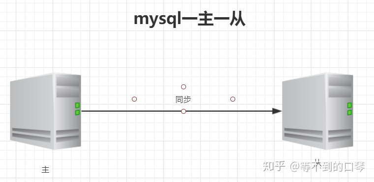
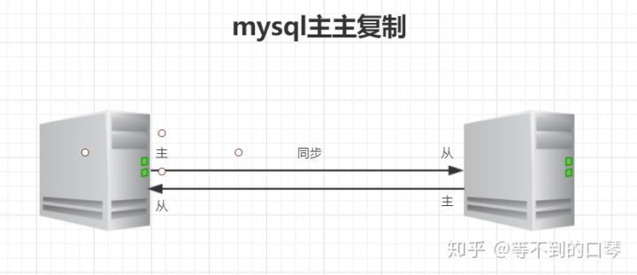
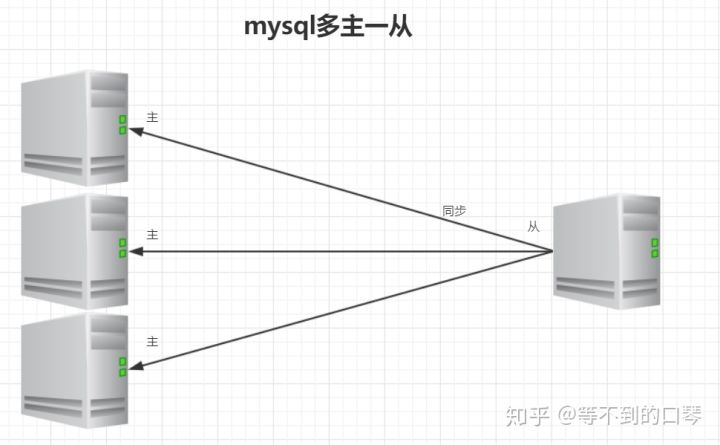
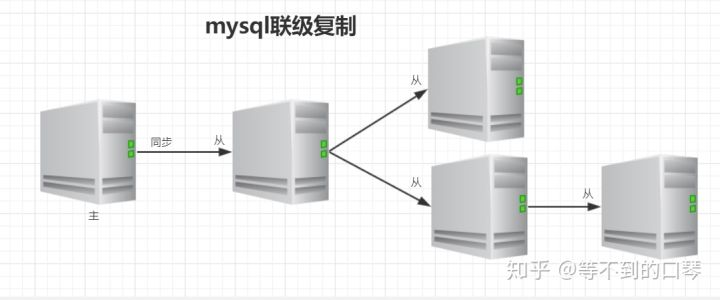

# 为什么需要主从复制

1. 实现服务器负载均衡。在业务复杂的系统中，有这么一个情景，有一句sql语句需要锁表，导致暂时不能使用读的服务，那么就很影响运行中的业务。使用主从复制，让主库负责写，从库负责读，这样，即使主库出现了锁表的情景，通过读从库也可以保证业务的正常运作。
1. 做数据的热备，提高数据库系统的可用性。
1. 架构的扩展。业务量越来越大，I/O访问频率过高，单机无法满足，此时做多库的存储，降低磁盘I/O访问的频率，提高单个机器的I/O性能。

# mysql的主从复制是？

MySQL 主从复制是指数据可以从一个MySQL数据库服务器主节点复制到一个或多个从节点。

MySQL 默认采用**异步复制**方式，这样从节点就不用一直访问主服务器来更新自己的数据，数据的更新可以在远程连接上进行，从节点可以复制主数据库中的所有数据库或者特定的数据库，或者特定的表。

# mysql复制原理

1. master（主）服务器启动 ***binlog线程*** 将数据的改变记录到`binlog二进制日志`，当master上的数据发生改变时，则将其改变写入`binlog二进制日志`中；
2. slave（从）服务器会定时对master的 `binlog二进制日志` 进行探测其是否发生改变，
3. 如果发生改变，从节点则开始一个 ***I/O 线程*** 请求master服务器中变化的 `binlog二进制日志` ，同时主节点会为每个I/O线程启动一个***log dump线程***，用于向其发送`binlog二进制日志`，并保存至从节点本地的`relay-log中继日志`中
4. 接着从节点会启动 ***SQL线程*** 从`relay-log中继日志`中读取二进制日志，解析成sql语句，逐一执行，使得其数据和主节点的保持一致
5. 最后 ***I/O 线程*** 和 ***SQL线程*** 将进入睡眠状态，等待下一次被唤醒。

# Mysql主从形式

1. **一主一从**

   

2. **主主复制**

   

3. **一主多从**

   

4. **多主一从**

   

5. **联级复制**

   

# Mysql主从复制延迟

**主从同步的延迟的原因：**

假如一个服务器开放 Ｎ 个连接给客户端，这样有会有大并发的更新操作, 但是从服务器的里面读取 binlog 的线程仅有一个， 当某个 SQL 在从服务器上执行的时间稍长或者由于某个 SQL 要进行锁表就会导致主服务器的 SQL 大量积压，未被同步到从服务器里。这就导致了主从不一致， 也就是主从延迟。

**主从同步延迟的解决办法：**

实际上主从同步延迟根本没有什么一招制敌的办法， 因为所有的 SQL 必须都要在从服务器里面执行一遍，但是主服务器如果不断的有更新操作源源不断的写入，那么一旦有延迟产生，那么延迟加重的可能性就会原来越大。当然我们可以做一些缓解的措施。

1. 我们知道因为主服务器要负责更新操作， 它对安全性的要求比从服务器高，所有有些设置可以修改，比如`sync_binlog=1`，`innodb_flush_log_at_trx_commit = 1` 之类的设置，而 slave 则不需要这么高的数据安全，完全可以将 `sync_binlog` 设置为 0 或者关闭 `binlog日志`、`innodb_flush_log_at_trx_commit` 也可以设置为 0 来提高 SQL 的执行效率。

   > - `sync_binlog` ：将缓存中的binlog同步到磁盘中。`sync_binlog=0` 指不作同步操作，`sync_binlog=n` 指每进行n次事务提交后就进行一次同步操作。
   > - `innodb_flush_log_at_trx_commit=0` ：提交事务后，不会立即将缓存日志写到磁盘文件中，而是每隔一秒将缓存日志写入到磁盘文件中，并调用fsync刷新IO缓存。
   > - `innodb_flush_log_at_trx_commit=1` ：提交事务后，立即将缓存日志写到磁盘文件中，并调用fsync刷新IO缓存。
   > - `innodb_flush_log_at_trx_commit=2` ：提交事务后，立即将缓存日志写到磁盘文件中，然后每隔一秒调用fsync刷新IO缓存。

2. 增加从服务器，这个目的还是分散读的压力， 从而降低服务器负载。

# 参考

1. [mysql主从复制原理](https://zhuanlan.zhihu.com/p/96212530)
2. [mysql实现主从复制/主从同步](https://www.jianshu.com/p/19cb0f16dea4)
2. [mysql sync_binlog 作用_mysql 中 sync_binlog 参数作用](https://blog.csdn.net/weixin_40003046/article/details/113435280)
2. [MySQL中innodb_flush_log_at_trx_commit的设置](https://www.cnblogs.com/jpfss/p/10772952.html)
2. 
