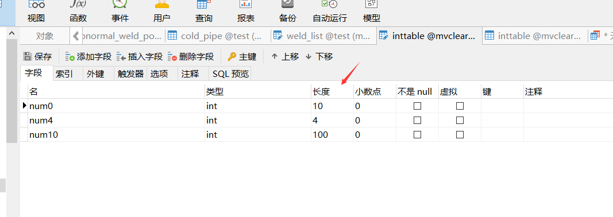

## 前言

最近在弄数据库，由于数据库非常地庞大，所以什么都要精打细算。于是对数据库数据设置长度感兴趣起来。

## What's it

#### int类型

对于int类型，如果不设置`填充零`的话，这个长度基本上是没啥用的

MySQL的int类型默认是32位，数据范围：-2147483648 ~ 2147483647

若设置`填充零`的话，它的数据范围还是：-2147483648 ~ 2147483647

不同的是，这个长度设置的是数据的显示长度，长度不够？没关系，用0补。长度超了？没关系，数据还是这么长。举个例子：

A设置了int(5),然后A添加数据100，然后A的数据框会显示00100；当A添加数据12345678，A的数据框会显示的还是12345678

#### varchar类型

对于varchar类型，这个长度就很有用了，它指的是字符串的可最大长度