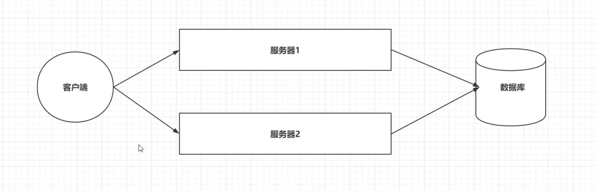
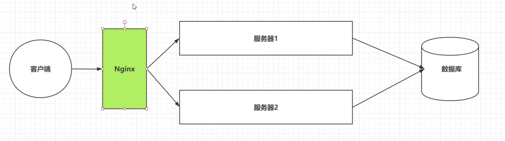
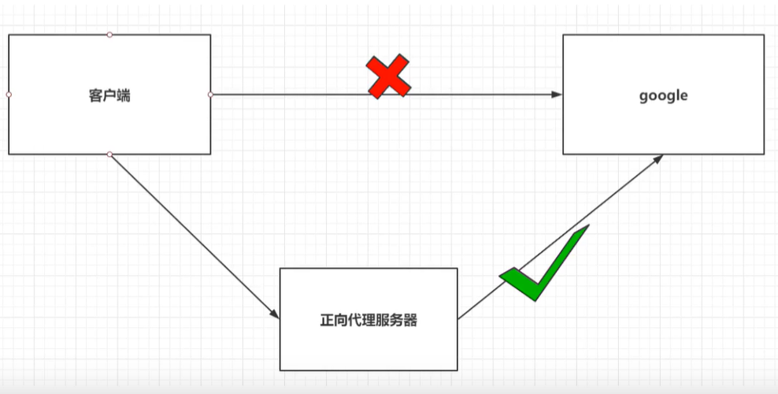
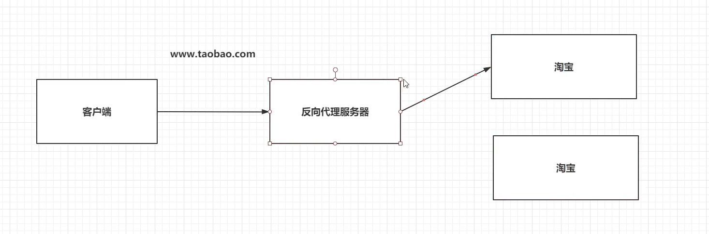
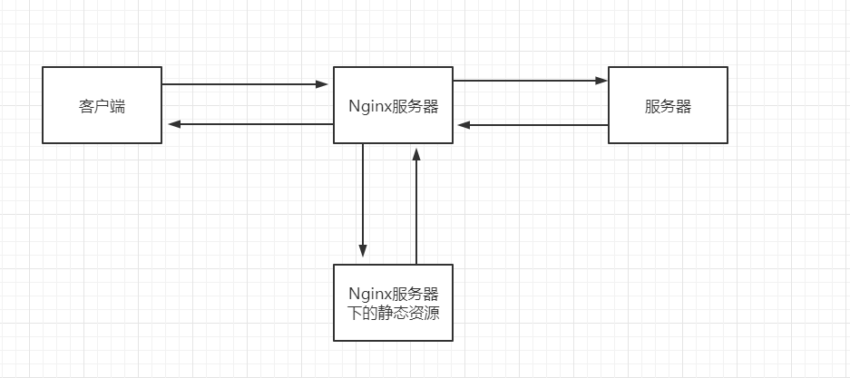

# Nginx介绍

## 引言

- 问题：双十一时会有大量用户访问淘宝，一个服务器肯定不行，需要多个服务器，那用户该访问哪一个服务器呢？

<div style="margin:0; width:90%">



</div>

这就用到Nginx了，

<div style="margin:0; width:90%">



</div>

客户端统一访问Nginx的服务器，然后由Nginx来做一个负载均衡的策略，根据一些算法来决定客户端的请求发给哪一个服务器，若是请求静态资源的话，还可以直接让Nginx的服务器发送给客户端。

此时这个Nginx的服务器，也叫`反向代理服务器`

## 介绍

Nginx是俄罗斯人写的！！厉害厉害

特点：

1. 稳定性极强

2. 占用内存小，并发能力强

# 代理

## 正向代理

1. 正向代理服务时由客户端设立

2. 客户端知道代理服务器和目标服务器是谁

3. 有助于客户端突破访问权限，提高访问速度，对目标服务器隐藏客户端的ip地址

<div style="margin:0; width:90%">



</div>

   > 典型应用：SSR

## 反向代理

1. 反向代理服务器是配置在服务端
2. 客户端不知道访问的是哪一台服务器
3. 有助于负载均衡，并且可以隐藏服务器真正的ip地址

<div style="margin:0; width:90%">



</div>

> 典型应用：Nginx


# Nginx安装

## 安装

### Docker安装


### 非Docker安装

在Ubuntu中，安装Nginx也很简单

```shell
# 切换到root用户
$ sudo -i
# 安装nginx
$ apt-get install nginx
# 验证
$ nginx -v
```


## Nginx配置文件

- Nginx的核心配置文件是`nginx.conf`

  ```yml
  user www-data;
  worker_processes auto;
  pid /run/nginx.pid;
  include /etc/nginx/modules-enabled/*.conf;
  
  # 以上是全局块
  # worker_processes的数值越大，Nginx的并发能力越强
  # pid：nginx运行的一个标识
  # include：引入该目录下的全部.conf文件配置
  # 有的还会有error_log /var/log/nginx/error.log; 指nginx错误日志的存放位置
  
  events {
  	worker_connections 768;
  	# multi_accept on;
  }
  
  # 以上是events块
  # worker_connections值越大，nginx并发能力越强
  
  http {
  	include /etc/nginx/mime.types;
  	default_type application/octet-stream;
  
  	
  	# Logging Settings
  	access_log /var/log/nginx/access.log;
  	error_log /var/log/nginx/error.log;
  
  
  	server {
          listen       80;
          server_name  localhost;
  
          location / {
             root   /home/Documents/nginx_html;
             index  index.html index.htm;
          }
          # location块
          # root：将接收到的请求根据/home/Documents/nginx_html去查找静态资源
          # index：默认去上述的路径中找index.html或index.htm
  	
  	}
  	# server块
  	# listen：代表Nginx监听的端口号
  	# server_name：代表Nginx接收请求的ip
  
  	include /etc/nginx/conf.d/*.conf;
  	include /etc/nginx/sites-enabled/*;
  } 
  
  # Http块
  # include代表引入一个外部的文件 ->mime.type中放着大量的媒体类型
  # include /etc/nginx/conf.d/*.conf; ->引入conf.d目录下的以.conf结尾的配置文件
  
  
  ```
  
- 修改了Nginx的配置文件后，需重启一下Nginx

  ```bash
  # Ubuntu系统
  $ service nginx stop
  $ service nginx start   
  ```
  

# Nginx常用配置

## 反向代理配置

```json
server{
	listen 80;
	server_name localhost;
	
	location / {
		proxy_pass http://192.168.199.109:8080/;
    	proxy_send_timeout 120;      # nginx发送数据到服务器的超时时间，默认60s
    	proxy_read_timeout 120;      # nginx接收服务器的数据的超时时间，默认60s
	}
}
# 当客户端访问Nginx服务器时，会映射到http://192.168.199.109:8080/
```

今天发现服务器上的网页，有个请求请求了1分钟，不多不少，然后报404错误；然后在本地运行的时候，那个请求请求了1分半后，200，并返回了数据。

弄了很久，才突然意识到是nginx的代理超时时间配置的问题

## location路径映射配置


```json
# 1. = 匹配
location = / {
	# 精准匹配，主机名后面不能带任何的字符串
}
```

```json
# 2. 通用匹配
location /xxx {
 	# 匹配所有以/xxx开头的路径   
}
```

```json
# 3. 正则匹配
location ~ /xxx {
	# 匹配所有以/xxx开头的路径
}
```

```json
# 4. 匹配开头路径
location ^~ /images/ {
    # 匹配所有以/images开头的路径
}
```

```json
# 5. 匹配结尾路径
location ~* \.(gif|jpg|png)$ {
	# 匹配以gif或jpg或png为结尾的路径
}
```

优先级关系：

（location =） > （location /xxx/yyy/zzz） > （location ^~） > （location ~，~*） > （location /起始路径）>（location / ）


## 负载均衡策略

  Nginx默认提供了三种负载均衡策略

  1. **轮询**：将客户端发起的请求，平均地分配给每一台服务器

     配置

     ```json
     http{
     	...
         upstream 名字{
             # 自己声明的变量一般不要用下划线，用下划线的一般是关键字
             server ip:port;
             server ip:port;
         	...
     	}
     	server{
             listen 80;
             server_name localhost;
             
             location / {
             	proxy_pass http://upstream的名字/;
         	}
         }
     }
     ```

     比如：

     ```json
     http{
     	...
         upstream my-server{
             # 自己声明的变量一般不要用下划线，用下划线的一般是关键字
             server 192.168.199.109:8080;
             server 192.168.199.109:8081;
     	}
     	server{
             listen 80;
             server_name localhost;
             
             location / {
             	proxy_pass http://my-server/;
         	}
         }
     }
     ```

     

  2. **权重**：会将客户端的请求，根据服务器的权重值来分配

     配置

     ```json
     http{
     	...
         upstream 名字{
             # 自己声明的变量一般不要用下划线，用下划线的一般是关键字
             server ip:port weight=权重值;
             server ip:port weight=权重值;
         	...
     	}
     	server{
             listen 80;
             server_name localhost;
             
             location / {
             	proxy_pass http://upstream的名字/;
         	}
         }
     }
     ```

     比如：

     ```json
     http{
     	...
         upstream my-server{
             # 自己声明的变量一般不要用下划线，用下划线的一般是关键字
             server 192.168.199.109:8080 weight=10;
             server 192.168.199.109:8081 weight=2;
     	}
     	server{
             listen 80;
             server_name localhost;
             
             location / {
             	proxy_pass http://my-server/;
         	}
         }
     }
     ```

     

  3. **ip_hash**：基于发起请求的客户端的ip地址不同，始终将请求发送到指定的服务器上

     配置

     ```json
     http{
     	...
         upstream 名字{
             # 自己声明的变量一般不要用下划线，用下划线的一般是关键字
             ip_hash;
         	server ip:port;
             server ip:port;
         	...
     	}
     	server{
             listen 80;
             server_name localhost;
             
             location / {
             	proxy_pass http://upstream的名字/;
         	}
         }
     }
     ```

     比如：

     ```json
     http{
     	...
         upstream my-server{
             # 自己声明的变量一般不要用下划线，用下划线的一般是关键字
         	ip_hash;
             server 192.168.199.109:8080;
             server 192.168.199.109:8081;
     	}
     	server{
             listen 80;
             server_name localhost;
             
             location / {
             	proxy_pass http://my-server/;
         	}
         }
     }
     ```


## 动静分离配置

对于这样的一个环境

<div style="margin:0; width:90%">



</div>


Nginx并发能力计算：

$$
Nginx最终的并发能力= worker\_processes * worker\_connections /4|2
$$

其中，除以4是请求动态资源时，除以2是请求静态资源时

这样，通过动静分离，有助于提升Nginx的并发能力，从而更快的给用户响应


### 动态资源代理

配置：

```json
location / {
    proxy_pass 路径;
}
```

也就是反向代理配置

### 静态资源代理

配置：

```json
# 访问 / 时的静态资源 （局部）
location / {
    root 静态资源路径;
    index 默认访问路径下的什么资源;
    autoindex on;  # 代表展示静态资源的全部内容，并以列表的形式展开 （可要可不要）
    expires 缓存时间;   # 启用缓存
}


# 访问Nginx服务器时的静态资源 （全局）
server{
    root 静态资源路径;
    index 默认访问路径下的什么资源;
    autoindex on;  # 代表展示静态资源的全部内容，并以列表的形式展开 （可要可不要）
    expires 缓存时间;   # 启用缓存
}
```

比如：

```json
server{
    root /home/lab1204/Documents/nginx_html;
	index index.html index.htm;
    expires 24h;  # 启用缓存,有效期为24小时
}
```


