# 题目

制作类似这样的金属字

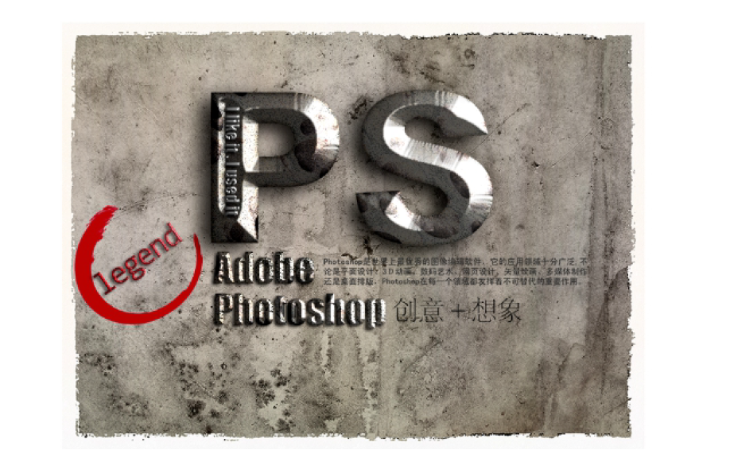

# 解题

1. 打开背景

   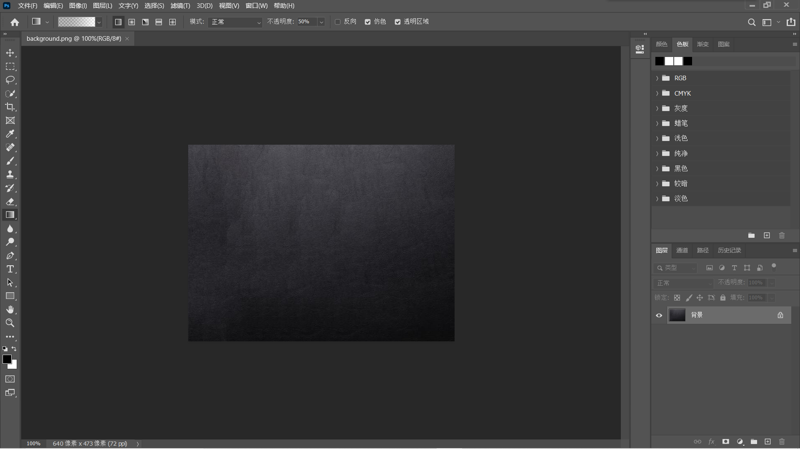

2. 选择`横排文字工具`，添加名字图层，适当修改文字样式

   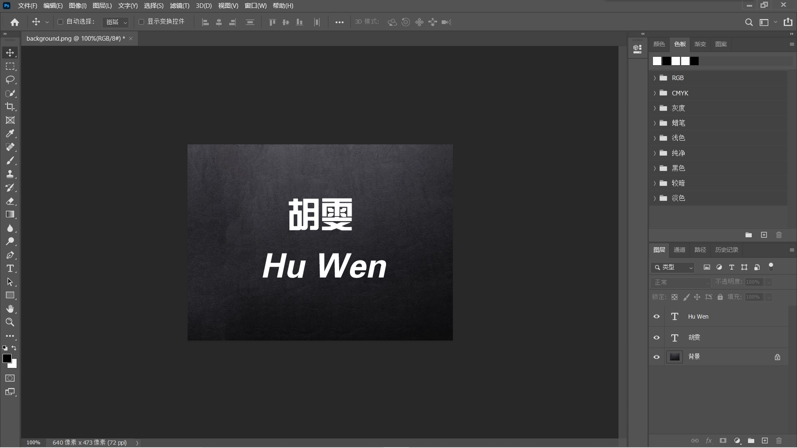

3. 分别按`Ctrl+j`拷贝两个文字图层，并将拷贝图层都设置为不可见

   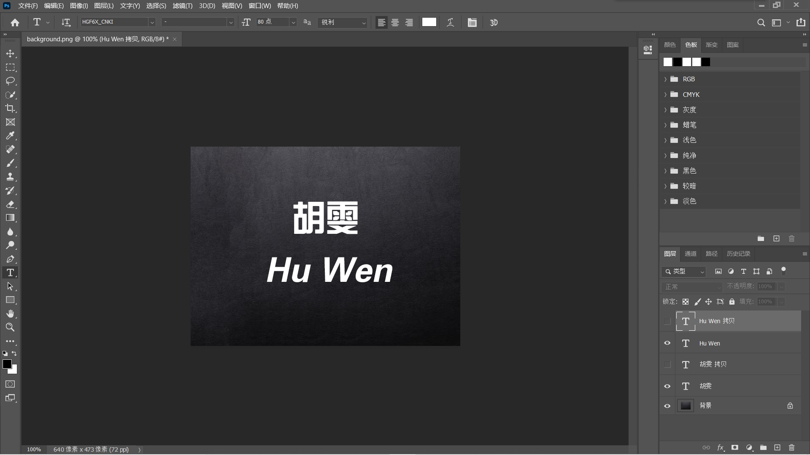

5. 右击Hu Wen图层，点击混合选项，点击斜面和浮雕，将深度设置为400%，然后点击渐变叠加，点击渐变，调整渐变编辑器，然后点击描边，大小为5像素，位置居中，填充类型为渐变，点击渐变，调整渐变编辑器，然后点击内发光，并调整内发光相关配置，然后点击光泽，并调整光泽相关配置，然后点击外发光，并调整外发光相关配置，然后点击投影，并调整投影相关配置，点击斜面和浮雕继续调整

   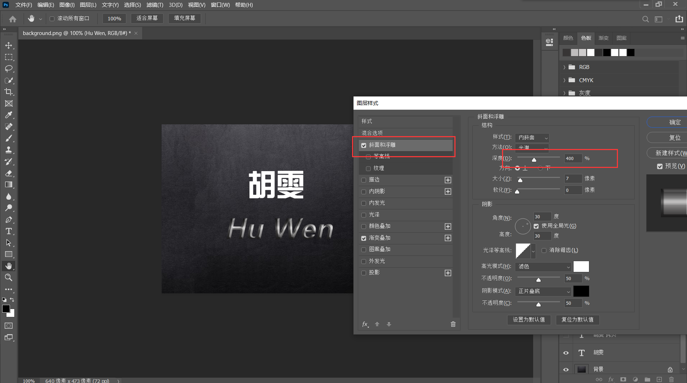
   
   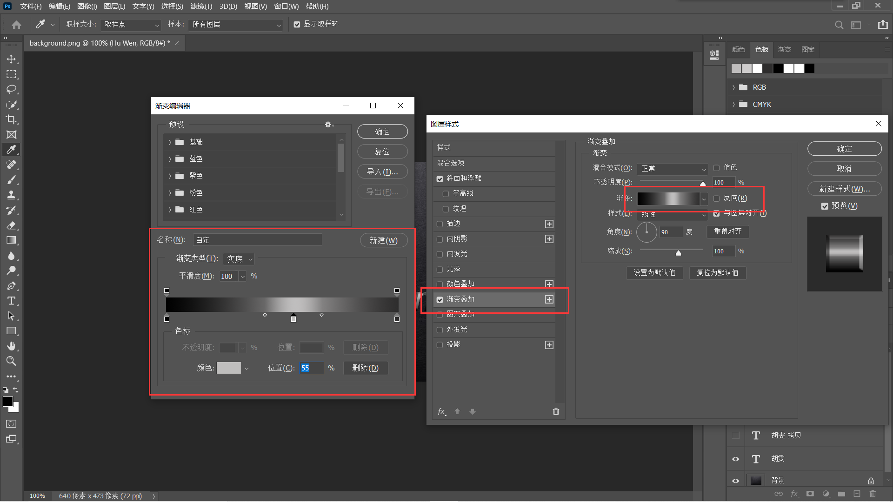
   
   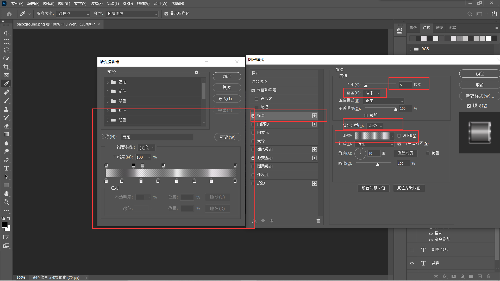
   
   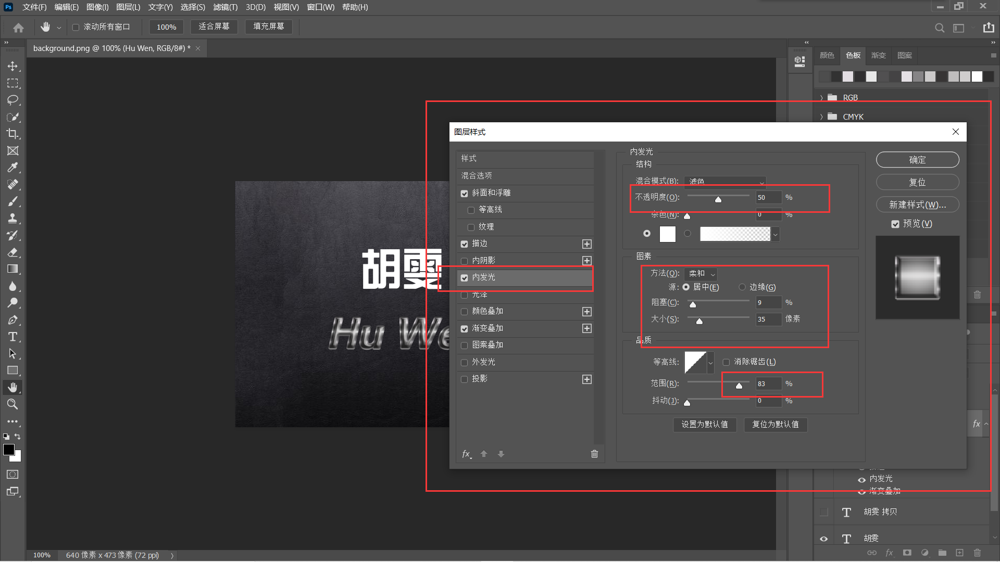
   
   
   
   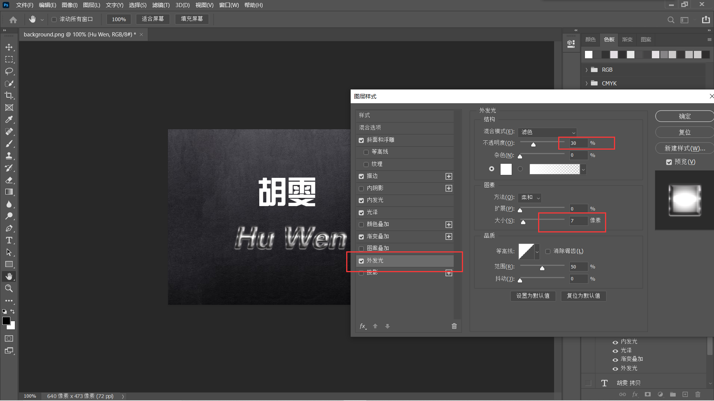
   
   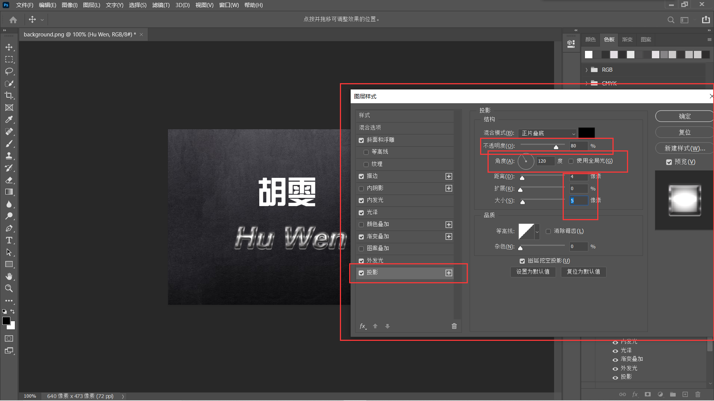
   
   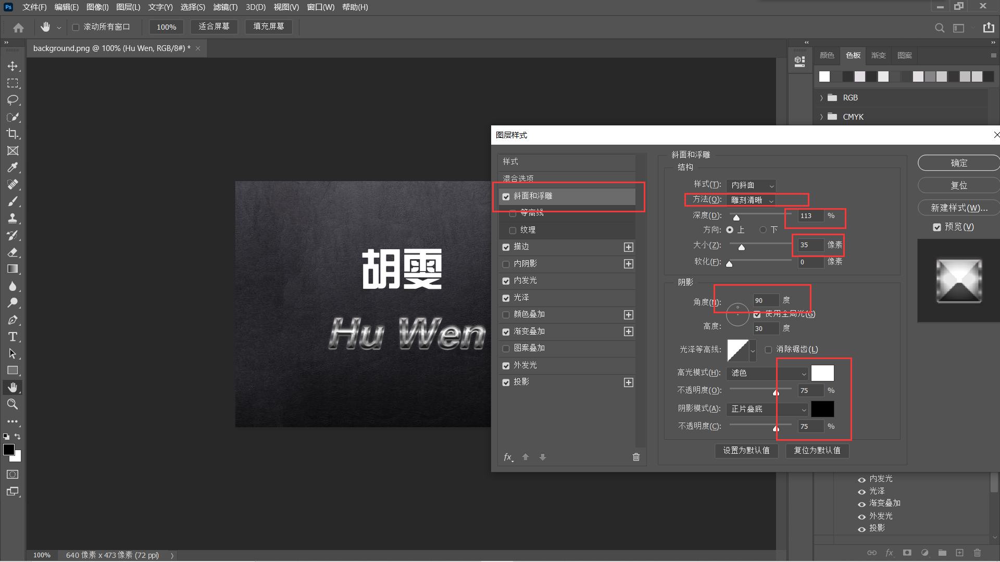

5. 对胡雯图层也做同样的操作

   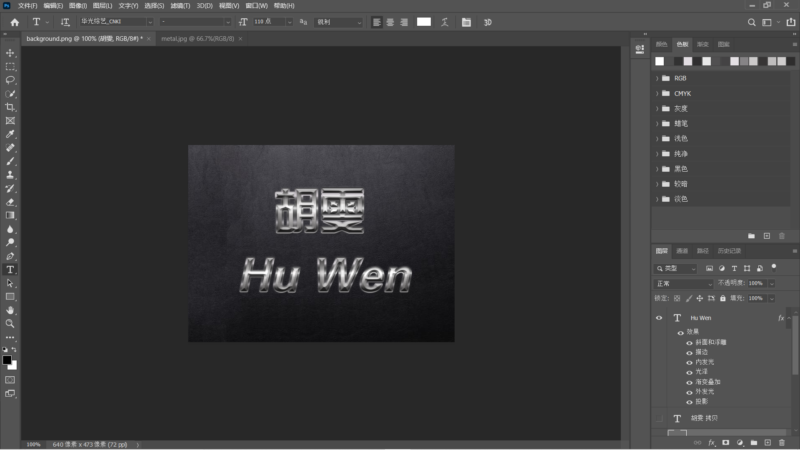