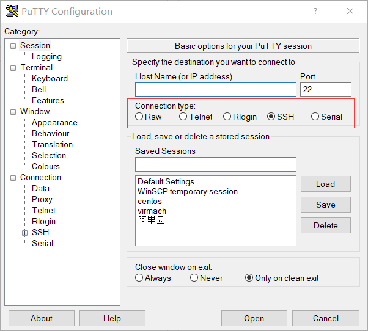

## 前言

之前在用Putty连接服务器时就见过SSH，只觉得它是用来保证安全connect & communicate的，一直没认真了解过，最近在学Hadoop时又遇到了它，于是……

## SSH是？

SSH全称：**Secure Shell**，又称：**安全外壳协议**

由 IETF 的网络小组（Network Working Group）所制定；SSH 为建立在应用层基础上的安全协议。SSH 是较可靠，专为  *远程登录会话*  和  *其他网络服务*  提供安全性的协议。利用 SSH 协议可以有效防止远程管理过程中的信息泄露问题。

之前互联网通信都是明文通信，一旦被截获，内容就会暴露，如ftp、pop和telnet，所以现在基本不怎么用telnet，而SSH保证即使截获，也不会暴露内容。

SSH只是一种协议，有多种实现，商业的，开源的。

## 安全机制

**1. 基于口令的安全验证**

通过账号、密码登录，然后所有传输的数据都会被加密，

原来之前我登录服务器都是用这个的

**2. 基于密匙的安全验证**

远程主机收到用户的登录请求，把自己的公钥发给用户

用户使用这个公钥，将登录密码加密后，发送回来

远程主机用自己的私钥，解密登录密码，如果密码正确，就同意用户登录

*****

非对称加密

这个过程本身是安全的，但是实施的时候存在一个风险：
如果有人截获了登录请求，然后冒充远程主机，将伪造的公钥发给用户，那么用户很难辨别真伪

至于这些公钥私钥，常见的是用户自己生成的。

## 有什么好？

1. 加密，安全

2. 传输的数据是经过压缩的，所以可以加快传输的速度

## 区别SSH框架

与SSH协议同缩写的还有一个是SSH框架，难怪我觉得乱！SSH框架是指：<b><i>Struts+Spring+Hibernate</i></b>，不过现在新开发的网页中基本没什么人用SSH框架了

 

>*参考：*
>1. [SSH协议百度百科](https://baike.baidu.com/item/SSH/10407)
>2. [Jack LDZ博文](https://blog.csdn.net/li528405176/article/details/82810342)
>3. [awesome_go博文](https://blog.csdn.net/u013452337/article/details/80847113)

