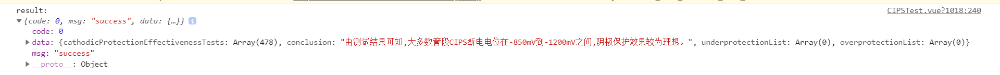
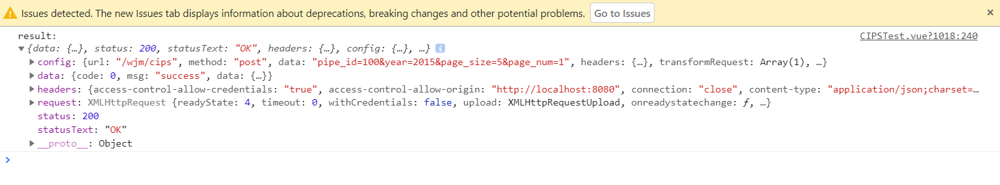

Typescript中的Map类型类似于Java中的Hashset

今天认识到了关于Typescript的Map的一种不知道叫什么名字的用法，直接来吧

```typescript
//随便取一段代码
const { data: result } = await this.$http.post('/wjm/cips', qs.stringify(this.queryInfo)).catch((err) => {
    alert(err)
})
console.log("result: ",result)
```

输出result变量：

<div style="margin:auto;">



</div>


这个const { data: result } 是什么意思呢？不急，只要将它替换成const result然后打印一下，就知道了

替换后输出result变量：

<div style="margin:auto;">



</div>

这个`data:`相当于一个选择的功能

