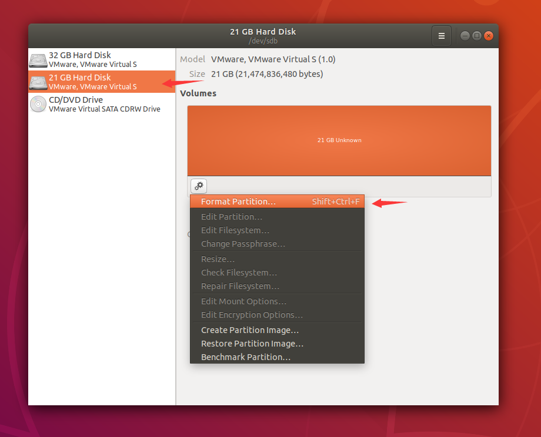
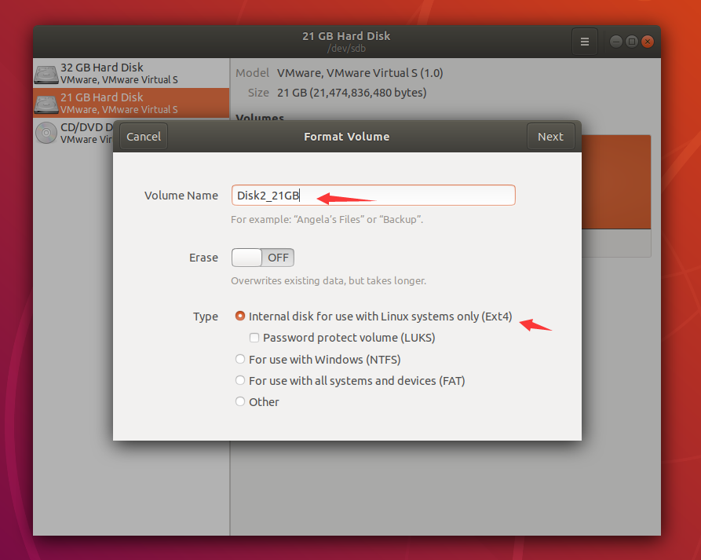
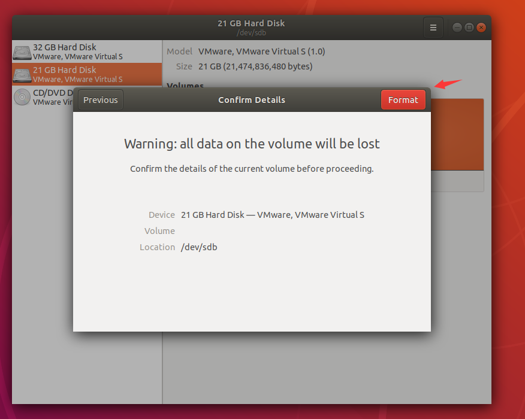
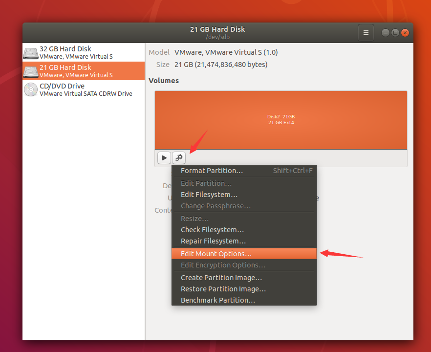
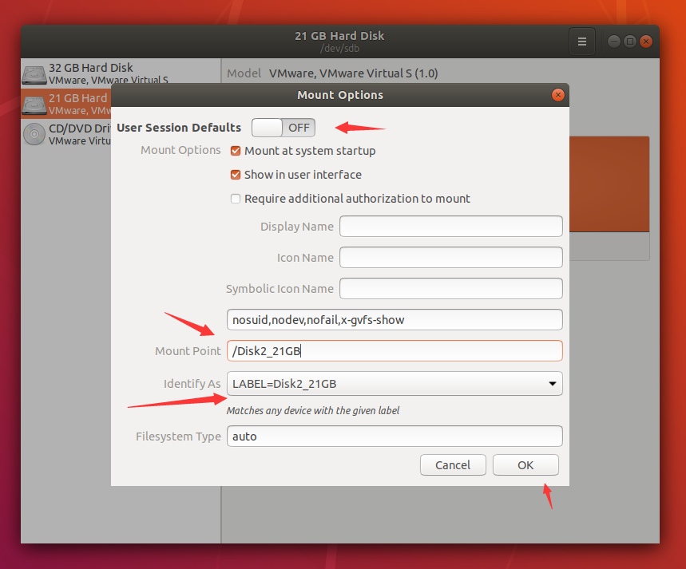
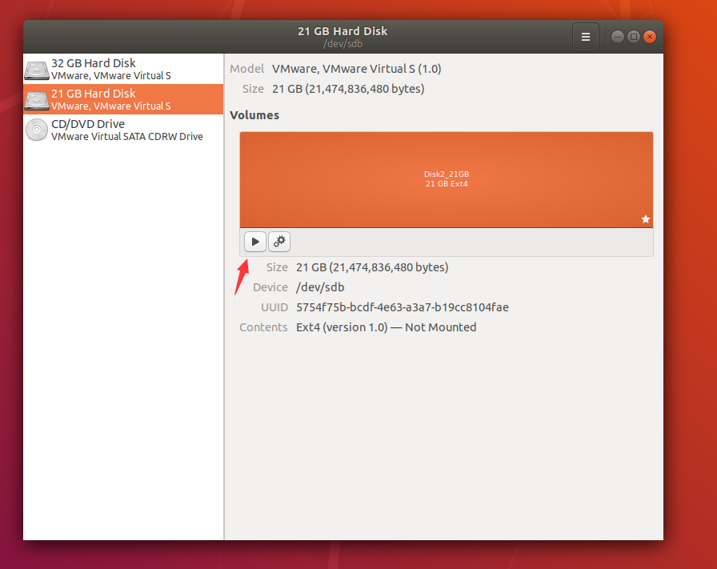
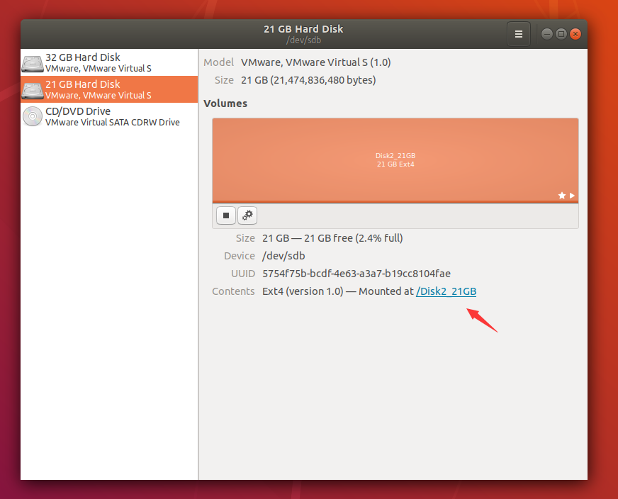
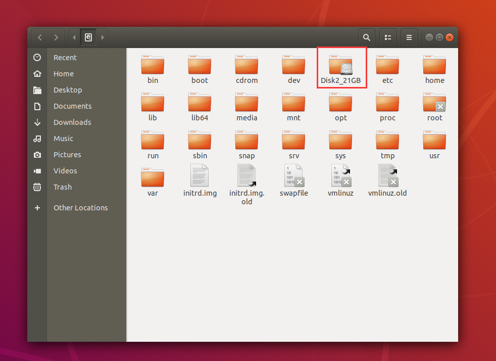

最近服务器又崩了，连接服务器运行jar包，一直显示`no space`没空间的错误，打开Ubuntu图形化界面才发现，硬盘空间爆了，available空间为0。

于是删了很多10个G的东西，可是`df -h`命令一看，挂载在根目录下的硬盘分区虽然腾出了一点空间出来，可是Avail还是为0，这时候我以为只是系统不太灵敏，重启一下就好了。

结果，不重启还好，一重启就出事了！！！

进不了图形界面，等了好久之后，一直显示`mysql community server`启动失败

后来才意识到，还是硬盘空间的问题，空间不够了！！

那没办法了，只能继续删了，先进去图形界面再说。

**解决办法：**

进入recovery模式，删除无用文件，释放磁盘空间。

1. 重启Ubuntu，随即长按shift进入grub菜单

2. 在grub菜单中，选择recovery mode，回车确认

3. 在Recovery Menu中，先选择clean，清理一下磁盘空间，同时也可以获取读写权限

4. 选择resume重启系统

5. 要是还是这个问题的话，重复1、2、3步骤

6. 选择root，输入root密码，进入root shell命令窗口

7. 使用`rm -rf`命令删除文件，在删除时注意使用`df -h`查看磁盘各个区的使用情况

8. 输入`reboot`命令重启系统

折腾了一上午，终于重回图形界面了，接着就是给服务器**装载硬盘**了。

在这里我使用的方法是图形界面法：`Disks软件`

由于服务器之前就插入了一块硬盘，所以我直接在`Disks`上面弄就好了

**步骤：**

1. 对新磁盘的每个分区都进行格式化`Format partition`（在这里只有一个分区）

   

   

2. 在想要挂载的地方建立一个文件夹，该文件夹的命名为刚刚磁盘卷的名字（比如这里为`Disk2_21GB`）

3. 设置挂载目录

   

   

   注意Mount Point的路径要与刚刚建立的目录对应起来

4. 挂载磁盘

   

5. 完成挂载

**参考：**

[ubuntu磁盘满导致无法开机](https://blog.csdn.net/qq_18998145/article/details/109091091)

[【Linux】Linux下挂载新硬盘（图形化使用Ubuntu自带Disks）](https://blog.csdn.net/weixin_43940314/article/details/110003820)

