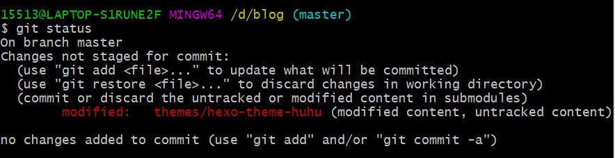
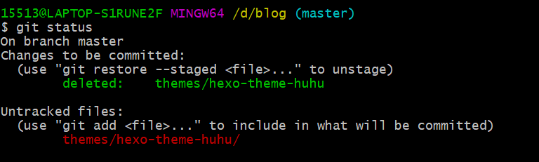

## 前言

- 记录一下在部署Hexo博客时的git问题

## 问题

最近在对Hexo博客源代码的上传时碰到一点问题，theme目录下的hexo-theme-huhu文件夹push不上去

- 输入

```bash
$ git status
```

- 结果



- 原因

之前在克隆别人的theme时，那个theme已经init了git，那个hexo-theme-huhu文件夹里有`.git/`的文件夹


## 解决

### 一般情况

- 将`themes/hexo-theme-huhu/.git`文件夹删除

- 重新添加该文件夹到git暂存区

```bash
$ git add themes/hexo-theme-huhu 
```

- 将该文件夹提交到本地库

```bash
$ git commit -m "commit message" themes/hexo-theme-huhu 
```

- 上传到GitHub 

```bash
$ git push
```


### 我的情况

当我删除了`themes/hexo-theme-huhu/.git`文件夹，再重新添加该文件夹到git暂存区时，结果显示不需要添加，提交到本地库时也是显示不需要提交

- 原因： 由于我之前已经将该文件夹push了上去，不过虽然我push了上去，可是在GitHub上那个文件夹是打不开的。


### 我的解决方法

- 清除git关于hexo-theme-huhu分支上的文件

```bash
$ git rm --cache theme/hexo-theme-huhu
```

- 上传到GitHub,覆盖原来的版本

```bash
$ git push
```

- 将`themes/hexo-theme-huhu/.git`文件夹删除

- 这是输入

```bash
$ git status
```

会显示



- 重新添加该文件夹到git暂存区

```bash
$ git add themes/hexo-theme-huhu 
```

- 将该文件夹提交到本地库

```bash
$ git commit -m "commit message" themes/hexo-theme-huhu 
```

- 上传到GitHub 

```bash
$ git push
```


