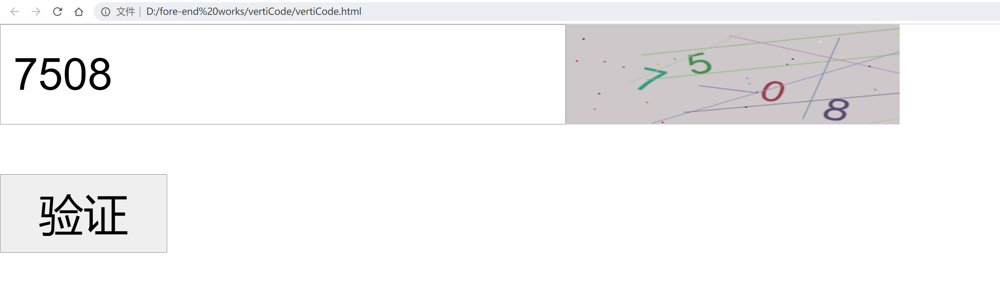
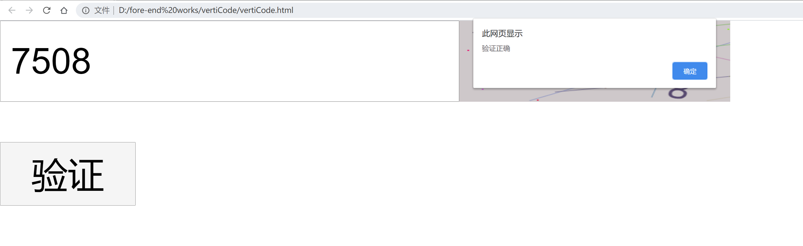

我这个验证码的实现主要用的是canvas标签，然后获取canvas的CanvasRenderingContext2D，然后用它来手动绘画

**代码**

```html
<!DOCTYPE HTML>
<html>
<head>
  <script type="text/javascript">
    var canvasWidth = 400; //验证码宽度 （与px的对不上，可能是单位问题）
    var canvasHeight = 155; //验证码高度

    var codeLength = 4; //验证码长度

    var backgroundColorMin = 200; //验证码图片背景色最小值
    var backgroundColorMax = 220; //验证码图片背景色最大值

    var fontColorMin = 50; //数字颜色最小值
    var fontColorMax = 160; //数字颜色最大值

    var fontSizeMin = 45; // 字体最小值
    var fontSizeMax = 55; // 字体最大值

    var degMin = -30; //旋转最小角度
    var degMax = 30; //旋转最大角度

    var lineColorMin = 100; //干扰线颜色最小值
    var lineColorMax = 200; //干扰线颜色最大值
    var lineNum = 10; //干扰线数量

    var dotColorMin = 0; //干扰点颜色最小值
    var dotColorMax = 255; //干扰点颜色最大值
    var dotNum = 30; //干扰点数量

    var code="";

    window.onload = drawPic;

    function drawPic() {
      document.getElementById("codeInput").value="";
      var verticalCode = document.getElementById("verticalCode");
      var content2d = verticalCode.getContext("2d"); //获得CanvasRenderingContext2D 实例
      content2d.fillStyle = randomColor(backgroundColorMin, backgroundColorMax); //设置背景颜色
      content2d.fillRect(0, 0, canvasWidth, canvasHeight); //根据当前的填充样式，填充矩形
      for (var i = 0; i < codeLength; i++) {
        drawText(content2d, i);
      }
      drawLine(content2d);
      drawDot(content2d);
    }

    //生成随机颜色
    function randomColor(min, max) {
      var r = Math.floor(Math.random() * (max - min) + min);
      var g = Math.floor(Math.random() * (max - min) + min);
      var b = Math.floor(Math.random() * (max - min) + min);
      return 'rgb(' + r + ',' + g + ',' + b + ')';
    }

    //绘制随机数字
    function drawText(content2d, i) {
      content2d.fillStyle = randomColor(fontColorMin, fontColorMax); //随机生成字体颜色
      content2d.font = Math.floor(Math.random() * (fontSizeMax - fontSizeMin) + fontSizeMin) + 'px SimHei'; //设置字体
      var x = (i + 1) * (canvasWidth / (codeLength+3));
      var y = Math.floor(Math.random() * (canvasHeight - 5 - fontSizeMax) + fontSizeMax);
      var deg = Math.floor(Math.random() * (degMax - degMin) + degMin); //随机角度
      var txt = Math.floor(Math.random() * 9).toString(); //随机数
      if(i==0){
        code="";
      }
      code+=txt;
      // 修改坐标原点和旋转角度
      content2d.translate(x, y); //移动坐标原点
      content2d.rotate(deg * Math.PI / 180); //旋转
      content2d.fillText(txt, 0, 0);

      //恢复坐标原点和旋转角度
      content2d.rotate(-deg * Math.PI / 180);
      content2d.translate(-x, -y)
    }

    // 绘制干扰线
    function drawLine(content2d) {
      for (var i = 0; i < lineNum; i++) {
        content2d.strokeStyle = randomColor(lineColorMin, lineColorMax); //设置画笔的颜色
        content2d.beginPath(); //清空子路径列表，并开始一个新路径
        var moveToX = Math.floor(Math.random() * canvasWidth);
        var moveToY = Math.floor(Math.random() * canvasHeight);
        content2d.moveTo(moveToX, moveToY); //移动路径的起点

        var lineToX = Math.floor(Math.random() * canvasWidth);
        var lineToY = Math.floor(Math.random() * canvasHeight);
        content2d.lineTo(lineToX, lineToY); //使用直线连接路径的终点到x，y坐标，注意：并不会真正地绘制
        content2d.stroke(); //绘制当前或已经存在的路径的方法
      }
    }

    // 绘制干扰点
    function drawDot(content2d) {
      for (var i = 0; i < dotNum; i++) {
        content2d.fillStyle = randomColor(dotColorMin, dotColorMax);
        content2d.beginPath();
        var x = Math.floor(Math.random() * canvasWidth); //圆心的 x 轴坐标。
        var y = Math.floor(Math.random() * canvasHeight); //圆心的 y 轴坐标。
        var radius = 1; //圆弧的半径
        var startAngle = 0; //圆弧的起始点
        var endAngle = 2 * Math.PI; //圆弧的终点
        content2d.arc(x, y, radius, startAngle, endAngle); //绘制圆弧路径
        content2d.fill(); //根据当前的填充样式，填充当前或已存在的路径
      }
    }

    function vertify(){
      var codeInput=document.getElementById("codeInput").value;
      if(codeInput==code){
        alert("验证正确");
      }else{
        alert("验证错误");
      }
      document.getElementById("codeInput").value="";
    }
  </script>
</head>

<body style="margin:0px;">
  <div style="width:100%;display:flex; ">
    <input id="codeInput" type="text" maxlength=4 required></input>
    <canvas id="verticalCode" style="width:100px;height:30px;" onclick="drawPic()"></canvas>
  </div>
  <input type="button" style="width:50px;margin-top:15px;" value="验证" onclick="vertify()"></input>
</body>

</html>
```

**运行结果：**

<div style="margin:auto">





</div>


站在巨人的肩膀上

<br/>

参考：
1.[MDN-canvas标签](https://developer.mozilla.org/zh-CN/docs/Web/API/Canvas_API)
2.[MDN-CanvasRenderingContext2D API](https://developer.mozilla.org/zh-CN/docs/Web/API/CanvasRenderingContext2D)