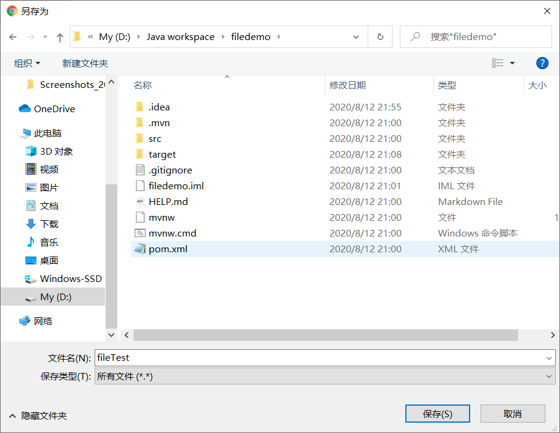

## 上传

**后端**

```java
    @PostMapping("/uploadFile")
    public void uploadFile(@RequestParam("fileName") MultipartFile file){
        File newFile=new File("D:/Java workspace/filedemo/src/main/resources/static/files/"+file.getOriginalFilename());
        try {
            InputStream in=file.getInputStream();
            FileOutputStream out=new FileOutputStream(newFile);
            byte[] bytes=new byte[1024*4];
            int len;
            while((len=in.read(bytes))!=-1){
                out.write(bytes,0,len);
            }
            in.close();
            out.close();
        } catch (IOException e) {
            e.printStackTrace();
        }
    }

```

对于spring项目，还要对上传文件的大小作限制，如限制30MB：

```properties
spring.servlet.multipart.max-file-size=30MB
spring.servlet.multipart.max-request-size=30MB
```


上传文件到服务器某个位置不难，难的是对文件做相应的解析


## 下载


```java
    @GetMapping("/fileTest")
    public void fileTest(HttpServletResponse response){
        File file=new File("D:/Java workspace/filedemo/src/main/resources/static/files/java实现文件的上传与下载.md");
        try {
            FileInputStream fileInput=new FileInputStream(file);
            OutputStream out=response.getOutputStream();
            response.setContentType("application/octet-stream");      //告诉浏览器这是要下载的
            response.setHeader("Content-Disposition", "attachment; filename=" + file.getName());     

            byte[] bytes=new byte[1024*4];
            int len;
            while((len=fileInput.read(bytes))!=-1){
                out.write(bytes,0,len);
            }
            fileInput.close();
            out.close();
        } catch (FileNotFoundException e) {
            e.printStackTrace();
        } catch (IOException e) {
            e.printStackTrace();
        }
    }

```

**Content-Type设置**

Content-Type应设置为： `application/x-msdownload` 或 `application/octet-stream` 

不过，据说Mac的Safari对`application/x-msdownload`的支持不佳

其中`application/octet-stream`，这是应用程序文件的默认值。对于未知的应用程序文件 ，浏览器一般不会自动执行或询问执行。浏览器会像对待设置了HTTP头Content-Disposition 值为 attachment 的文件一样来对待这类文件。

那么`application/octet-stream` 对于常见的如.txt文件会怎样呢？测试了一下，结果还是一样，弹出的下载框所显示的文件类型还是 `.`

<div style="width:70%;margin:auto;">



</div>


**Header设置**

对于Content-Type应设置为： `application/x-msdownload`的，需要设置`Content-Disposition` 为 `attachment`，后面的filename是附带的，是用来初始化下载框的文件名，可要可不要

这里`attachment`只是`Content-Disposition`的一种属性，具体可看[MDN web docs关于Content-Disposition的介绍](https://developer.mozilla.org/zh-CN/docs/Web/HTTP/Headers/Content-Disposition)


而对于Content-Type应设置为： `application/octet-stream`的，可不用设置，因为它已经默认`Content-Disposition` 为 `attachment`


## 最后

在网络上文件的传送绝大部分都是以binary的形式传送


<br/>

参考：
1.[lizeyang博文](https://blog.csdn.net/lizeyang/article/details/8982155)
2.[MDN web docs](https://developer.mozilla.org/zh-CN/docs/Web/HTTP/Basics_of_HTTP/MIME_types)