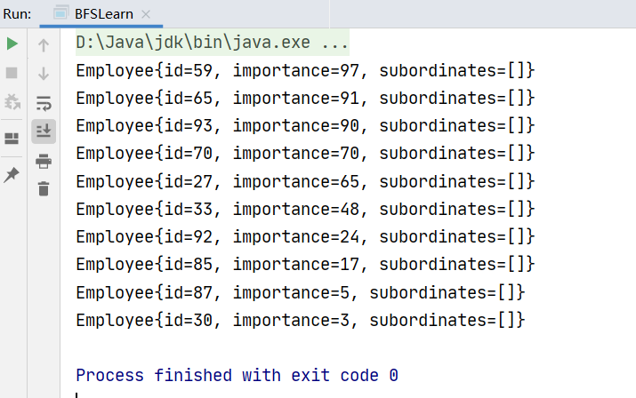

# 简单的

```java
public class ListSortLearn {
    public static void main(String[] args) {
        List<Double> list=new ArrayList<>();
        list.add(21.211);
        list.add(140.21);
        list.add(13.21);
        list.add(10.20);
        list.add(41.121);
        list.add(14.21);
        list.add(10.221);

        Collections.sort(list);
        System.out.println(list.toString());
    }
}
```

结果：


# 复杂的

方法一：对要排序的类实现`Comparable`接口

```java
public class ListSortLearn {
    public static void main(String[] args) {
        List<MenuRecord> menuRecordList=new ArrayList<>();
        menuRecordList.add(new MenuRecord(1,10));
        menuRecordList.add(new MenuRecord(2,4));
        menuRecordList.add(new MenuRecord(3,75));
        menuRecordList.add(new MenuRecord(4,31));
        menuRecordList.add(new MenuRecord(5,8));
        menuRecordList.add(new MenuRecord(6,10));
        menuRecordList.add(new MenuRecord(7,170));
        menuRecordList.add(new MenuRecord(8,210));

        Collections.sort(menuRecordList);
        System.out.println(menuRecordList.toString());
    }
}


class MenuRecord implements Comparable<MenuRecord>{
    private int menuId;
    private int num;

    public MenuRecord() {
    }

    public MenuRecord(int menuId, int num) {
        this.menuId = menuId;
        this.num = num;
    }

    public int getMenuId() {
        return menuId;
    }

    public void setMenuId(int menuId) {
        this.menuId = menuId;
    }

    public int getNum() {
        return num;
    }

    public void setNum(int num) {
        this.num = num;
    }

    @Override
    public int compareTo(MenuRecord o) {
        return o.getNum()-this.num;
    }

    @Override
    public String toString() {
        return "("+menuId+","+num+")";
    }
}

```

结果：


方法二：传入自己实现的`Comparable`接口

```java
public class Employee {
    public int id;
    public int importance;
    public List<Integer> subordinates;

    @Override
    public String toString() {
        return "Employee{" +
                "id=" + id +
                ", importance=" + importance +
                ", subordinates=" + subordinates +
                '}';
    }
    
    public static void main(String[] args) {
        List<Employee> list=new ArrayList<>();
        for(int i=0;i<10;i++){
            Employee employee=new Employee();
            employee.id=(int) (Math.random()*100);
            employee.importance=(int) (Math.random()*100);
            employee.subordinates=new ArrayList<>();
            list.add(employee);
        }
        
        Collections.sort(list, new Comparator<Employee>() {
            @Override
            public int compare(Employee o1, Employee o2) {
                return o2.importance-o1.importance;    //根据importance从大到小排序
            }
        });
        
        for (Employee employee : list) {
            System.out.println(employee.toString());
        }
    }
}
```

结果：




代码优化：

`Comparable`接口只有一个方法，可以使用Lamda表达式

```java
public static void main(String[] args) {
    //同上
    Collections.sort(list, (Employee o1,Employee o2) ->{
        return o2.importance-o1.importance;    //根据importance从大到小排序
    });
    //同上
}
```


