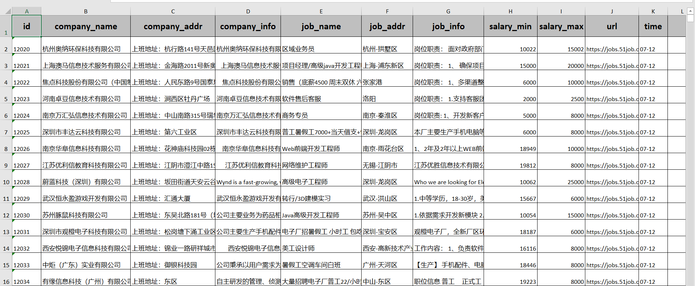
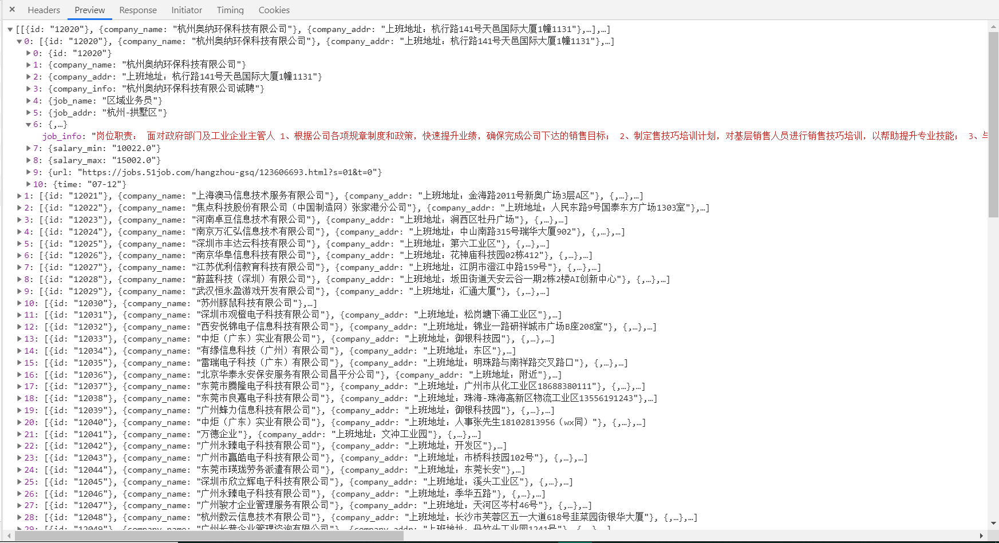
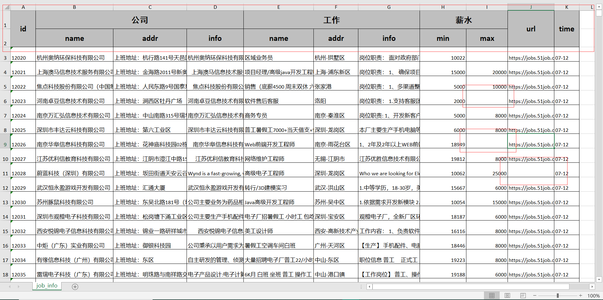
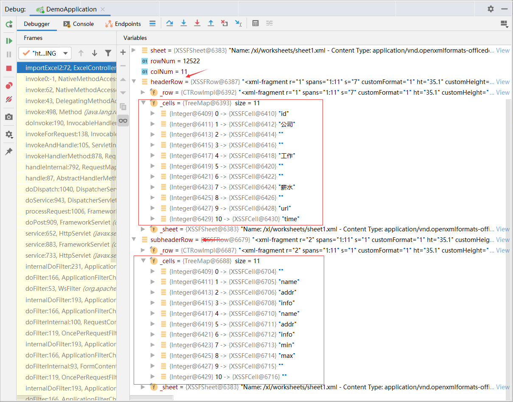
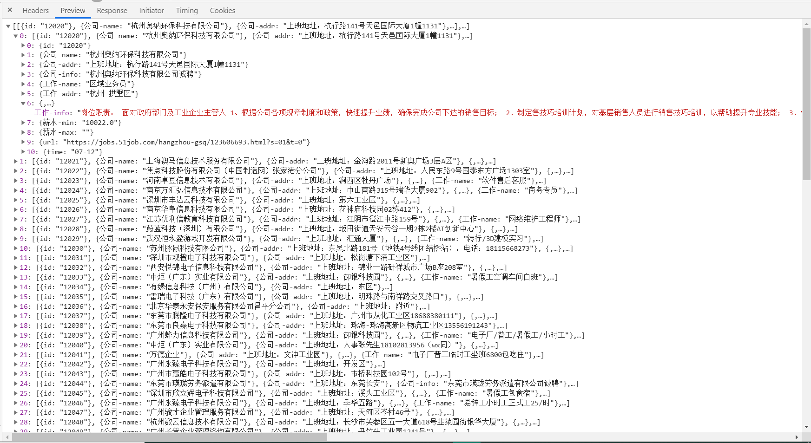

Java解析Excel文件常用[Apache的POI](http://poi.apache.org/)

## Maven导入Jar包

```xml
<dependency>
    <groupId>org.apache.poi</groupId>
    <artifactId>poi-ooxml</artifactId>
    <version>4.1.0</version>
</dependency>
```

## 解析简单表

先来个解析类似这样的简单表

<div style="width:100%;margin:auto">



</div>

**代码**

```java
@PostMapping("/importExcel")
public List importExcel(@RequestParam("excelFile") MultipartFile excelFile){
    List<List> returnList=new ArrayList<>();
    try {
        InputStream inputStream=excelFile.getInputStream();
        
        //根据inputStream的类型自动建立 HSSFWorkbook 或 XSSFWorkbook的 Workbook对象
        //其中HSSFWorkbook用来解析xls格式的excel，XSSFWorkbook用来解析xlsx格式的excel
        Workbook workbook=WorkbookFactory.create(inputStream);

        Sheet sheet=workbook.getSheetAt(0);   //获取表格对象
        int rowNum=sheet.getPhysicalNumberOfRows();    //获取表格行数
        int colNum=sheet.getRow(0).getPhysicalNumberOfCells();      //获取表格第一行的列数
        
        //从第二行开始解析
        //由于数据量过多，chrome的DevTools显示不了，所以先来99个
        for(int i=1;i<100;i++){   
            List<Map> tempList=new ArrayList<>();
            Row row=sheet.getRow(i);
            int j=0;
            for(Cell cell:row){
                Map<String,String> tempMap=new HashMap<>();
                if(cell.getCellType().equals(CellType.NUMERIC)){    //数字的获取数字，字符串的获取字符串，不可弄混
                    tempMap.put(sheet.getRow(0).getCell(j).getStringCellValue(),cell.getNumericCellValue()+"");
                }else if(cell.getCellType().equals(CellType.STRING)){
                    tempMap.put(sheet.getRow(0).getCell(j).getStringCellValue(),cell.getStringCellValue());
                }else if(cell.getCellType().equals(CellType.BOOLEAN)){
                    tempMap.put(sheet.getRow(0).getCell(j).getStringCellValue(),String.valueOf(cell.getBooleanCellValue()));
                }
                j++;
                tempList.add(tempMap);
            }
            returnList.add(tempList);
        }
    } catch (IOException e) {
        e.printStackTrace();
    }
    return returnList;
}

```

**结果**

<div style="width:100%;margin:auto">



</div>


## 解析复杂表

再来个解析类似这样的较为复杂的表，表里的部分内容为空

<div style="width:100%;margin:auto">



</div>


```java
Row headerRow=sheet.getRow(0);
Row subheaderRow=sheet.getRow(1);
```

获取表格的第一行和第二行数据，结果如下：

<div style="width:100%;margin:auto">



</div>

这时候就根据这个来分析表头就好了

**代码**

```java
@PostMapping("/importExcel2")
public List importExcel2(@RequestParam("excelFile") MultipartFile excelFile){
    List<List> returnList=new ArrayList<>();
    try {
        InputStream inputStream=excelFile.getInputStream();

        //根据inputStream的类型自动建立 HSSFWorkbook 或 XSSFWorkbook的 Workbook对象
        //其中HSSFWorkbook用来解析xls格式的excel，XSSFWorkbook用来解析xlsx格式的excel
        Workbook workbook=WorkbookFactory.create(inputStream);
        Sheet sheet=workbook.getSheetAt(0);   //获取表格对象
        int rowNum=sheet.getPhysicalNumberOfRows();    //获取表格行数
        int colNum=sheet.getRow(0).getPhysicalNumberOfCells();      //获取表格第一行的列数

        Row headerRow=sheet.getRow(0);    //获取表格的第一行
        Row subheaderRow=sheet.getRow(1);    //获取表格的第二行

        for(int i=2;i<100;i++) {    //从第三行开始解析
            List<Map> tempList=new ArrayList<>();
            Row row=sheet.getRow(i);
            int headerIndex=0;
            int subheaderIndex=0;
            for(Cell cell:row){
                Map<String,String> tempMap=new HashMap<>();
                String key;
                if(headerIndex==0){
                    key=headerRow.getCell(headerIndex++).getStringCellValue();
                    subheaderIndex++;
                }else if(headerIndex<4){
                    key=headerRow.getCell(1).getStringCellValue()+"-"+subheaderRow.getCell(subheaderIndex++).getStringCellValue();
                    headerIndex++;
                }else if(headerIndex<7){
                    key=headerRow.getCell(4).getStringCellValue()+"-"+subheaderRow.getCell(subheaderIndex++).getStringCellValue();
                    headerIndex++;
                }else if(headerIndex<9){
                    key=headerRow.getCell(7).getStringCellValue()+"-"+subheaderRow.getCell(subheaderIndex++).getStringCellValue();
                    headerIndex++;
                }else{
                    key=headerRow.getCell(headerIndex++).getStringCellValue();
                }

                //数字的获取数字，字符串的获取字符串，空白的取空，不可弄混
                if(cell.getCellType().equals(CellType.NUMERIC)){
                    tempMap.put(key,cell.getNumericCellValue()+"");
                }else if(cell.getCellType().equals(CellType.STRING)){
                    tempMap.put(key,cell.getStringCellValue());
                }else if(cell.getCellType().equals(CellType.BLANK)){
                    tempMap.put(key,"");
                }
                tempList.add(tempMap);
            }
            returnList.add(tempList);
        }
    } catch (IOException e) {
        e.printStackTrace();
    }
    return returnList;
}

```


**结果**

<div style="width:100%;margin:auto">



</div>


<br/>

<br/>

站在巨人的肩膀上