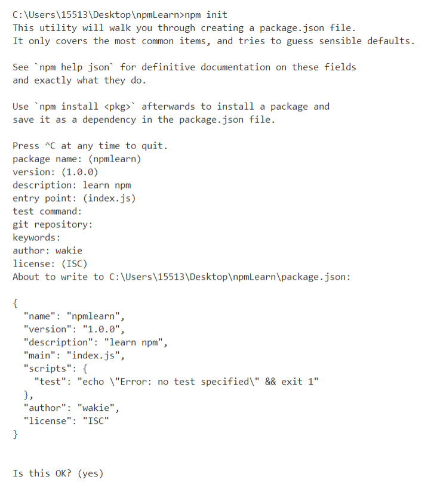
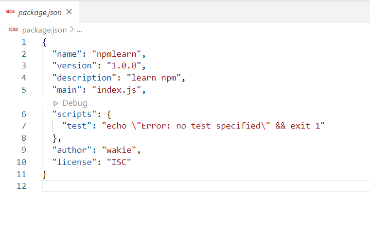

## 前言

使用了大半年了Npm，一直都对它模模糊糊，今天对其整理一下。

Npm（Node Package Manager）是一个包管理工具，在安装Node.js时会自动安装好，它很方便让JavaScript开发者下载、安装、上传以及管理已经安装的包。

## 一般命令

- 查看Npm版本

```bash
$ npm -v
```

- 查看Npm全局目录

```bash
$ npm root -g
```

- 初始Npm项目

一般cd到项目根目录，然后执行下面命令

```bash
$ npm init
```

其运行结果：



> 在配置过程中，直接按回车表示默认

快速初始命令：

```bash
$ npm init -y
```

> `-y` 表示在初始项目时，Package.json文件的各种参数采用默认值，之后可以自己慢慢改


初始完成后，会在该初始目录下新建package.json文件：



其中package.json文件中的

```json
  "scripts":{
    "test": "echo \"Error: no test specified\" && exit 1"
  }
```

是npm的一些小脚本，"test"是脚本名字，后面是其内容,当输入

```bash
$ npm test
```

会运行该脚本，此时结果是输出"Error: no test specified"


## 常用命令


### 安装Package

```bash
$ npm install [package name]

$ npm i [package name]    ##简写
```

该命令默认安装当前Package的最新版本，当需要安装某一个版本时，可在[package name]后添加`@[版本]`

当安装的Package已存在，将自动替换掉已有的Package

查找Package可到[Npm官网](https://www.npmjs.com/)

当非全局安装Package完成后，该项目会出现node_modules文件夹，存放Package，同时package.json文件也会变动


#### npm install常见后缀

1. `无后缀`

默认安装到生产环境中，在package.json中可见

```json
  "dependencies": {    //"包名": "版本号"
    "bootstrap": "^4.5.0",
    "jquery": "^3.5.1"
  }
```

2. `-g` 

```bash
  $ npm install -g [package name]
```

全局安装，安装的包放在全局目录下，并且可以直接在命令行里使用。

3. `--save`

```bash
  $ npm install --save [package name]
```

效果跟无后缀一样


4. `--save-dev`

```bash
  $ npm install --save-dev [package name]
```

安装到开发环境中，在package.json中可见

```json
  "devDependencies": {    //"包名": "版本号"
    "primeng": "^9.1.0"
  }
```

> 生产环境：正式提供对外服务的环境 <br> 开发环境：


### 删除Package

```bash
$ npm uninstall [package name]
```

非全局删除Package，即删除项目中node_modules文件夹中的Package，同时package.json文件也会变动

#### npm install常见后缀

1. `-g`

```bash
$ npm uninstall -g [package name]
```

全局删除

2. `无后缀`

本地删除，删除的是生产依赖，所以package.json中的`dependencies`会变动

3. `--save`

```bash
$ npm uninstall --save [package name]
```

同无后缀

4. `--save-dev`

```bash
$ npm uninstall --save-dev [package name]
```

本地删除，删除的是开发依赖，所以package.json中的`devdependencies`会变动


### 安装package.json文件的依赖

```bash
$ npm install
```

当有了package.json文件，执行上面命令将自动下载项目的各种依赖。
