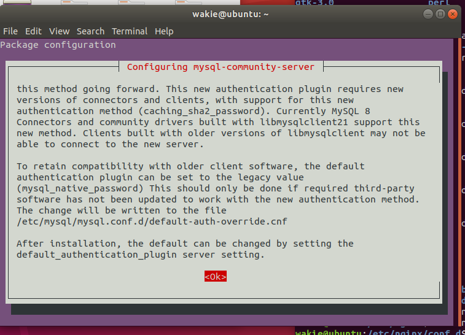
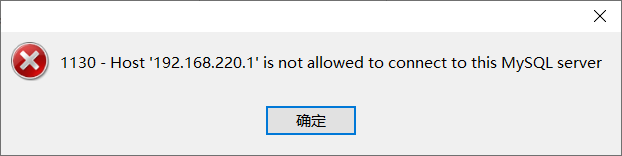

# 在线安装


去mysql官网上获取apt安装包

复制下载地址，比如：https://dev.mysql.com/get/mysql-apt-config_0.8.17-1_all.deb

运行下面命令：

```bash
wget https://dev.mysql.com/get/mysql-apt-config_0.8.17-1_all.deb
```

该命令会默认将mysql安装包下载到当前目录

到mysql安装包目录下运行：

```bash
sudo dpkg -i mysql-apt-config_0.8.17-1_all.deb
```

默认选择OK

更新APT软件仓库：

```bash
sudo apt-get update
```

安装mysql server：

```bash
sudo apt-get install mysql-server
```

在该过程中会配置root密码

然后就到这里



这里`Tab`回车`OK`

然后配置身份认证方式，默认即可

然后就安装完成，这时候所有的服务、环境变量都会启动和配置好，无须手动配置。


服务管理：

1. 查看服务状态

   ```bash
   sudo service mysql status
   ```

2. 停止服务

   ```bash
   sudo service mysql stop
   ```

3. 启动服务

   ```bash
   sudo service mysql start
   ```

4. 重启服务

   ```bash
   sudo service mysql restart
   ```


# 离线安装


下载Mysql Community Server压缩包

解压：

```bash
tar -xvf mysql-server_8.0.24-1ubuntu16.04_amd64.deb-bundle.tar
```

然后按下面顺序安装包

```bash
dpkg -i mysql-community-client-plugins_8.0.24-1ubuntu16.04_amd64.deb
dpkg -i mysql-community-client-core_8.0.24-1ubuntu16.04_amd64.deb
dpkg -i mysql-common_8.0.24-1ubuntu16.04_amd64.deb
dpkg -i mysql-community-client_8.0.24-1ubuntu16.04_amd64.deb
dpkg -i libmysqlclient21_8.0.24-1ubuntu16.04_amd64.deb
dpkg -i libmysqlclient-dev_8.0.24-1ubuntu16.04_amd64.deb

dpkg -i libaio1_0.3.110-5_amd64.deb
dpkg -i libmecab2_0.996-5_amd64.deb

dpkg -i mysql-client_8.0.24-1ubuntu16.04_amd64.deb
dpkg -i mysql-community-server-core_8.0.24-1ubuntu16.04_amd64.deb
dpkg -i mysql-community-server_8.0.24-1ubuntu16.04_amd64.deb
dpkg -i mysql-server_8.0.24-1ubuntu16.04_amd64.deb
```

部分可能会缺少`libaio1`和`libmecab2`包，需要自行下载

比如我：


# 问题

**问题一：**

刚安装好mysql8时，用ip地址连接mysql时，可能会有如下问题：



解决：修改`mysq`l数据库中的`user`表

```sql
mysql -uroot -p  -- 登录

use mysql;   -- 连接mysql scheme

select user,host from user; 

update user set host='%' where user='root';    -- 原来host字段是localhost,root用户只能被本地连接

flush privileges;   -- 刷新
```

再不行的话就重启mysql

```bash
sudo service mysql restart
```


