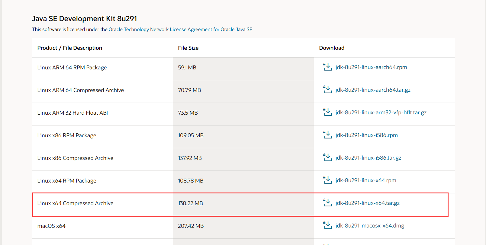

先去[Oracle官网](https://www.oracle.com/cn/java/technologies/javase/javase-jdk8-downloads.html)下载jdk8的压缩包




比如下载的文件是：`jdk-8u291-linux-x64.tar.gz`


创建目录：

```bash
sudo mkdir /usr/local/java
```


然后解压到该目录下：

```bash
sudo tar -zxvf jdk-8u291-linux-x64.tar.gz -C /usr/local/java
```

这时解压后得到的文件夹是`jdk1.8_291`


打开环境变量文件：

```bash
sudo gedit /etc/profile
```


这里若是找不到`gedit`命令的话，就先安装`gedit`

```bash
sudo apt-get update 
sudo apt-get install gedit-gmate                 
sudo apt-get install gedit-plugins               
sudo apt-get remove gedit 
sudo apt-get install gedit
```


在该文件的最后添加以下内容：

```bash
#Jdk Config
export JAVA_HOME=/usr/local/java/jdk1.8.0_291
export JRE_HOME=$JAVA_HOME/jre
export CLASSPATH=.:$JAVA_HOME/lib:$JRE_HOME/lib:$CLASSPATH
export PATH=$JAVA_HOME/bin:$JRE_HOME/bin:$PATH
```


保存文件，让环境变量生效：

```bash
source /etc/profile
```


