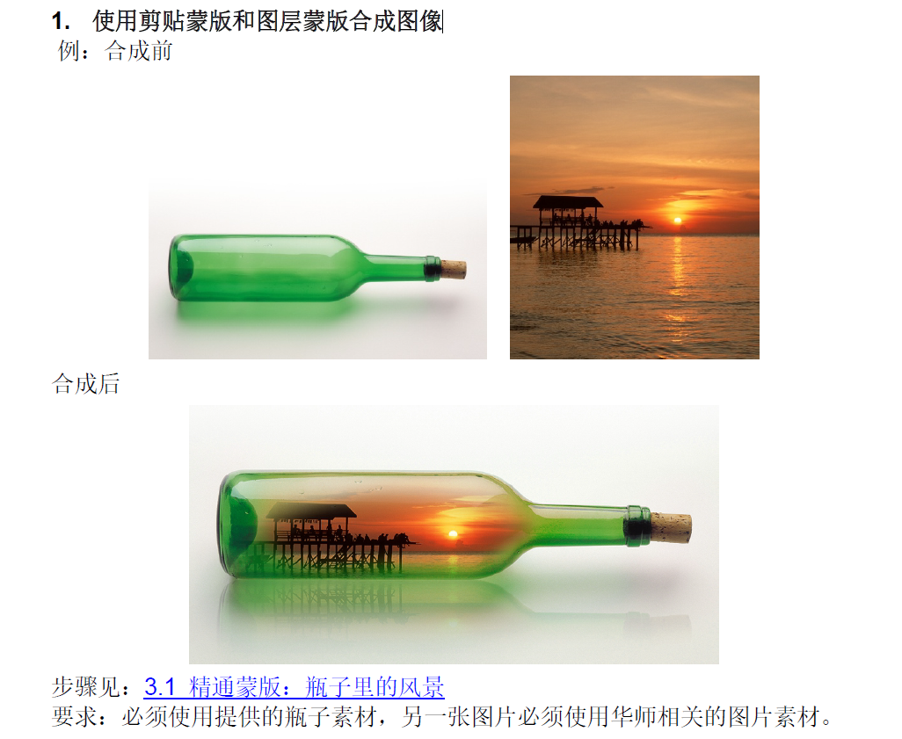
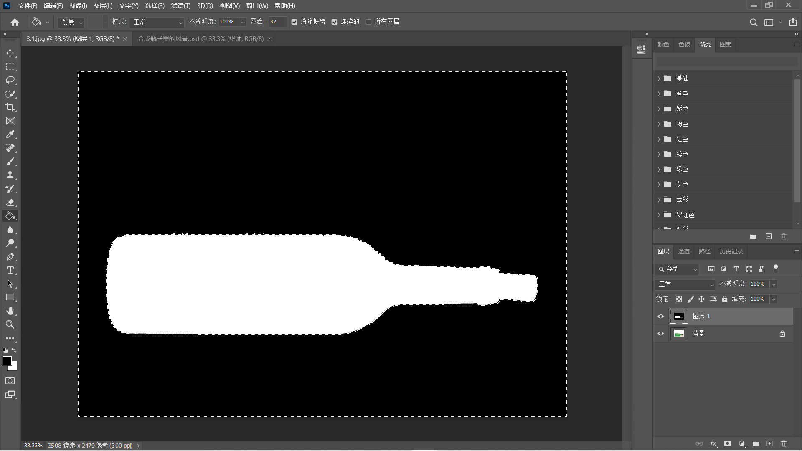
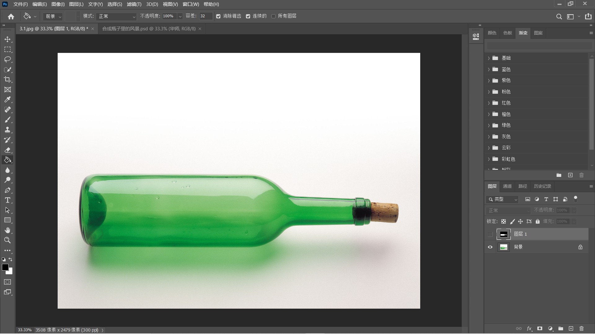
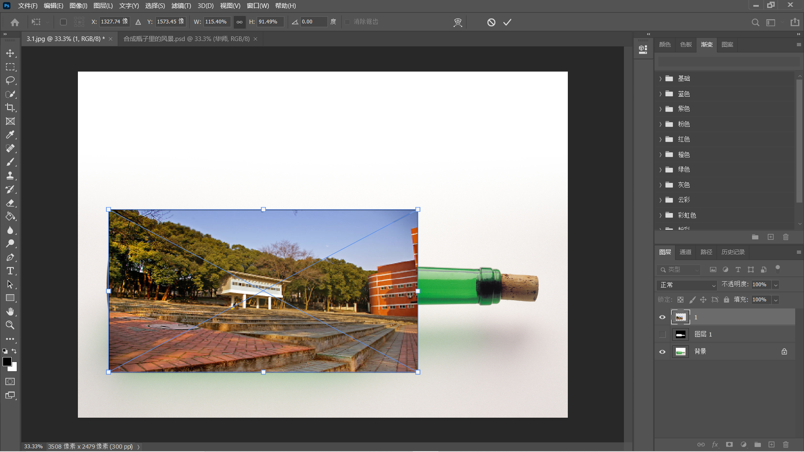
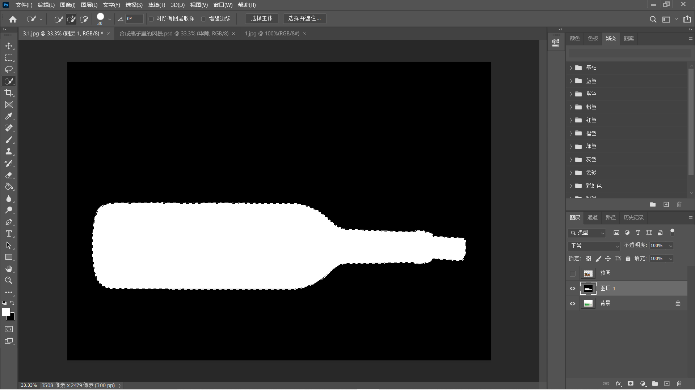
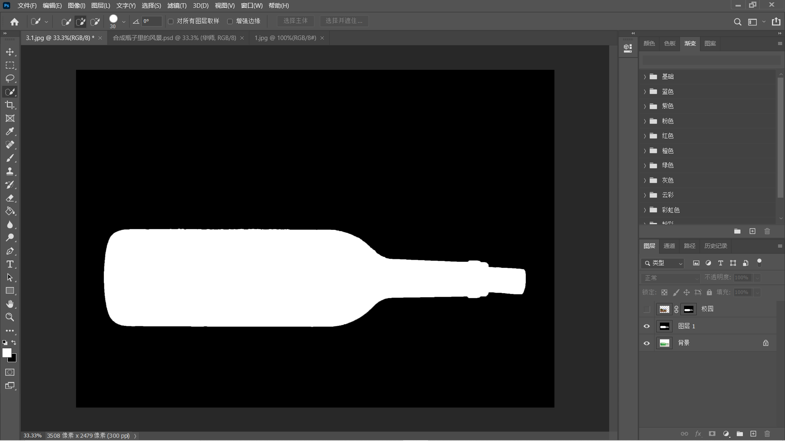
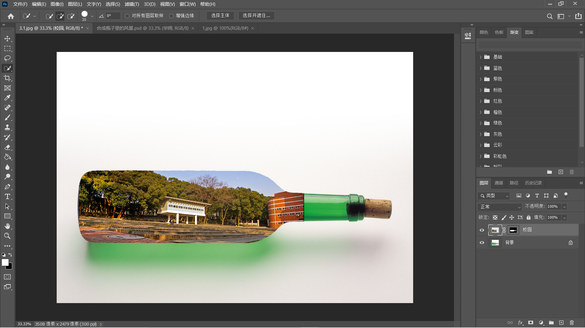
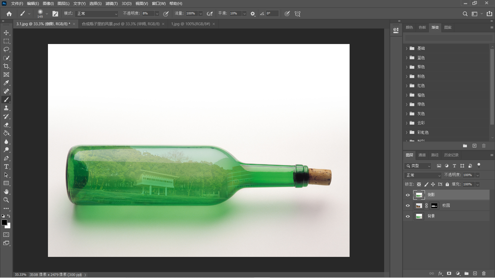
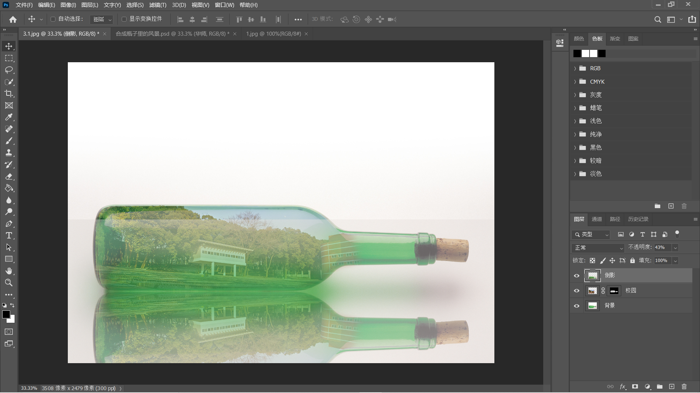
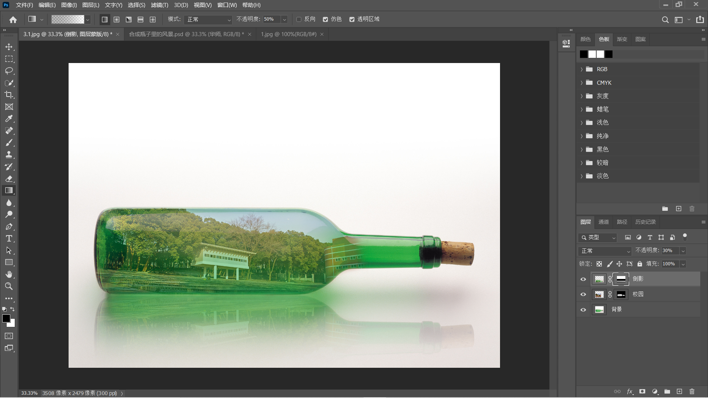

# 题目

# 做法

1. 选择`新增图层`，然后将图层填充为白色，然后将图层1设置为不可见

2. 使用`快速选择工具`，选择瓶子，然后鼠标右击点击`反选`

   

3. 选择图层1，并将图层1设置为可见，然后选择`填充工具`，将选择区域填充为黑色

   

4.  快捷键`Ctrl+D` 取消选择，并将图层1设置为不可见，选择背景图层

   

5. 将校园图片拖进PS中，然后对其适当的自由拉伸

   

6. 点击上方的`✔`，然后将该图层命名为`校园`，然后右击该图层，点击`转换为图层`

   

7. 将校园图层设置为不可见，选择图层1，将图层1设置为可见，选择`快速选择工具`，将白色区域选中

   

8. 选择校园图层，并点击`图层工具栏`下方的`添加图层蒙版`

   

9. 将校园图层设置为可见，删除图层1

   

10. 将校园图层的`不透明度`设置为70%

    

11. 快捷键`Ctrl+T`将校园图片进行适当的自由拉伸

    

12. 选择蒙版图层，然后选择`画笔工具`，然后将`前景色`设置为黑色，然后对露出来的校园图层进行涂黑

    

13. 调整画笔`不透明度`，对蒙版图层的水瓶和风景图片的边缘进行适当的涂黑

    

14. 将背景图层设置为非锁定，选择背景图层和校园图层，快捷键`Alt+Ctrl+E`将这两个图层盖印图层，并将盖印图层命名为`倒影`

    

15. 快捷键`Ctrl+t`自由变换倒影图层，右击选择`垂直翻转`，设置`不透明度`为30%，拖动倒影图层成水瓶的倒影

    

16. 对倒影图层添加蒙版，选择蒙版图层，选择`矩形选择工具`，将倒影中间线往上的地方选中，选择`填充工具`，对选取填充为黑色

    

17. 快捷键`Ctrl+D`取消选择，然后选择倒影中间线往下的地方，选择`渐变工具`，对选区进行渐变，然后取消选择

    

