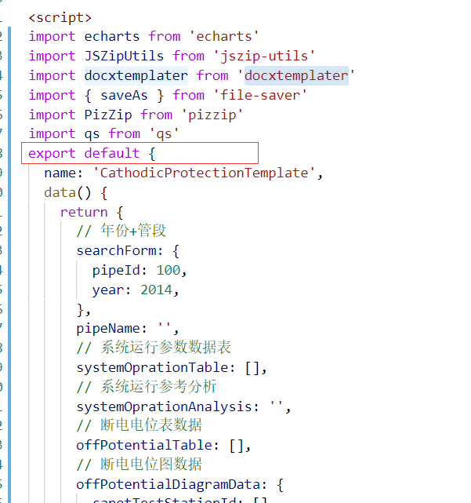
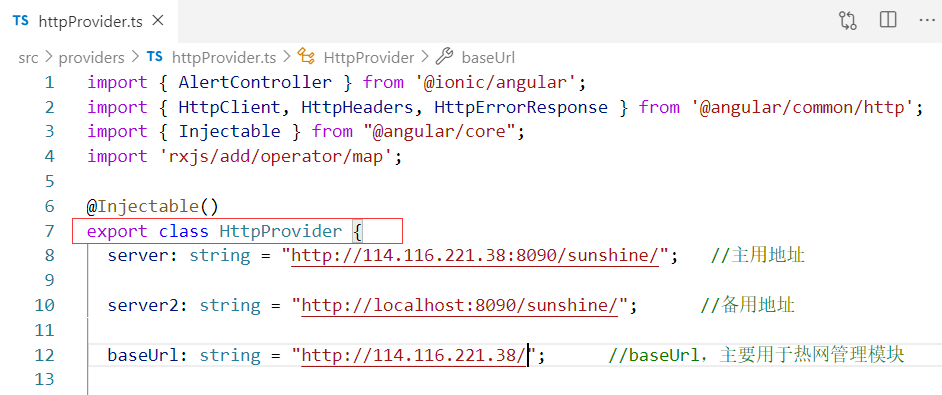

之前在弄Ionic4时，还有现在在弄的Vue中，都多次接触到`export default`与`export`的字样，如：

<div style="margin:auto; width:60%">



</div>

<div style="margin:auto; width:80%">



</div>


export：输出、出口

望文生义，这两个都是用来输出常量、函数、模块等

**区别**


|                        | export default    | export       |
| ---------------------- | ----------------- | ------------ |
| import 导入方式        | 导入时不用加{}    | 导入时要加{} |
| 一个文件or模块可有数量 | <=1，有的话only 1 | 可有多个     |

<br/>

**用法**

```javascript
// your.js
export class Your{

  name="Your Class";
  
  constructor(){}

  yourTest(){
    console.log("yourTest function");
  }
}

export default yourStr="default give"; 


//my.js
import {Your} from './your'
import yourStr from './your'

class My{
  name="My Class"

  constructor(){}

  myTest(){
    console.log("myTest function");
    let your=new Your();
    your.yourTest();
    console.log("Your name: ",your.name);
    console.log("Your str: ",yourStr)
  }
}
```

