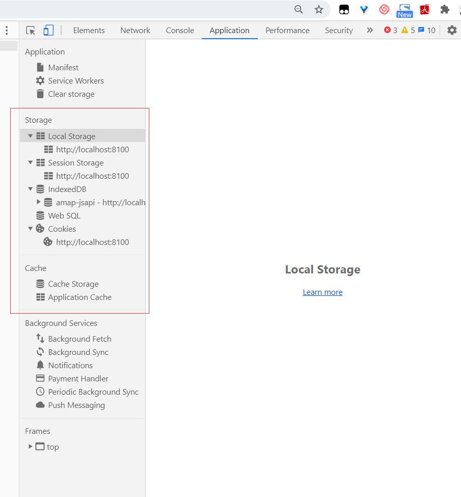
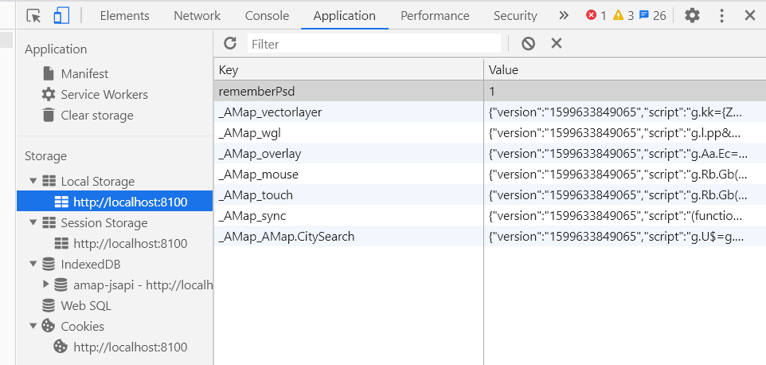
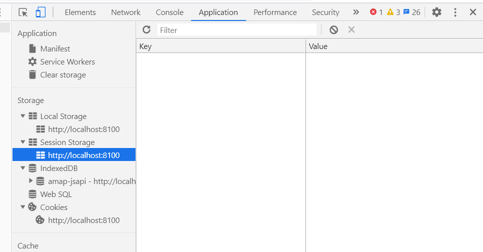
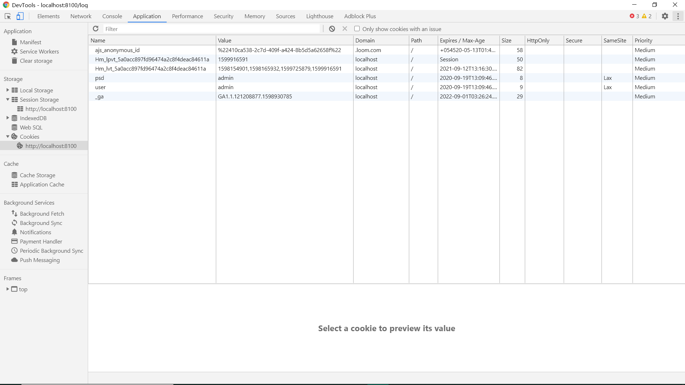

之前在弄记住密码时接触到部分前端缓存的皮毛，大为震惊！！没想到还有这东西！！当时就想一定要记录一下

----

前端常用的缓存技术有，如下图所示：(或许我这个称呼不太对)

- **Local Storage**

- **Session Storage**

- **Cookies**


<div style="width:60%;margin:auto">



</div>


至于上图中的**IndexedDB**、**Web SQL**、**Cache Storage**、**Application Cache**，我还不太熟悉


## Local Storage

在HTML5中，新加入了一个localStorage特性，这个特性主要是用来作为本地存储来使用的，解决了cookie存储空间不足的问题(cookie中每条cookie的存储空间为4k)，localStorage中一般浏览器支持的是5M大小

[测试localStorage、sessionStorage在浏览器中支持的存储大小](http://dev-test.nemikor.com/web-storage/support-test/)


<div style="width:80%;margin:auto">



</div>


**localStorage的优势**

- localStorage拓展了cookie的4K限制

- 将第一次请求的数据直接存储到本地，节约带宽

**localStorage的局限**

- 浏览器的大小不统一，并且在IE8以上的IE版本才支持localStorage这个属性

- 目前所有的浏览器中都会把localStorage的值类型限定为string类型，这个在对我们日常比较常见的JSON对象类型需要一些转换

- localStorage在浏览器的隐私模式下面是不可读取的

- localStorage本质上是对字符串的读取，如果存储内容多的话会消耗内存空间，会导致页面变卡

- localStorage不能被爬虫抓取到


### 使用

**测试可用性**

由于部分浏览器在某些情况下会禁用Local Storage，如私有浏览模式、用户手动禁用，所以在使用前最好先判断一下，测试一下Local Storage可用性

```javascript
//测试函数
function storageAvailable(type) {
    var storage;
    try {
        storage = window[type];
        var x = '__storage_test__';
        storage.setItem(x, x);
        storage.removeItem(x);
        return true;
    }
    catch(e) {
        return e instanceof DOMException && (
            // everything except Firefox
            e.code === 22 ||
            // Firefox
            e.code === 1014 ||
            // test name field too, because code might not be present
            // everything except Firefox
            e.name === 'QuotaExceededError' ||
            // Firefox
            e.name === 'NS_ERROR_DOM_QUOTA_REACHED') &&
            // acknowledge QuotaExceededError only if there's something already stored
            (storage && storage.length !== 0);
    }
}

//使用时判断
if (storageAvailable('localStorage')) {
  // Yippee! We can use localStorage awesomeness
}
else {
  // Too bad, no localStorage for us
}
```

**从存储中设置/获取/删除值**

```javascript
//设置local storage的font键值对
localStorage.setItem('font', document.getElementById('font').value);

//设置local storage的json键值对
var data = {
    name:'xiecanyong',
    sex:'man',
    hobby:'program'
};
var d = JSON.stringify(data);     //json字符串化
localStorage.setItem("data",d);

//获取local storage的font键值对
var currentFont = localStorage.getItem('font');    

//获取local storage的json键值对
var json = localStorage.getItem("data");
var jsonObj = JSON.parse(json);

//删除local storage的font键值对
localStorage.removeItem('font');   

//删除local storage的全部内容
localStorage.clear();   

```

## Session Storage

Session Storage与Local Storage很类似，只不过localStorage里面存储的数据没有过期时间设置，而Session Storage只用于存储当前会话的数据，当会话结束后，Session Storage的数据会随之销毁。

sessionStorage中一般浏览器支持的也是5M大小

[测试localStorage、sessionStorage在浏览器中支持的存储大小](http://dev-test.nemikor.com/web-storage/support-test/)


<div style="width:80%;margin:auto">



</div>

- 页面会话在浏览器打开期间一直保持，并且重新加载或恢复页面仍会保持原来的页面会话

- 在新标签或窗口打开一个页面时会复制顶级浏览会话的上下文作为新会话的上下文，这点和 session cookies 的运行方式不同

- 打开多个相同的URL的Tabs页面，会创建各自的sessionStorage

- 关闭对应浏览器tab，会清除对应的sessionStorage


### 使用

**测试可用性**

```javascript
//测试函数
function storageAvailable(type) {
    var storage;
    try {
        storage = window[type];
        var x = '__storage_test__';
        storage.setItem(x, x);
        storage.removeItem(x);
        return true;
    }
    catch(e) {
        return e instanceof DOMException && (
            // everything except Firefox
            e.code === 22 ||
            // Firefox
            e.code === 1014 ||
            // test name field too, because code might not be present
            // everything except Firefox
            e.name === 'QuotaExceededError' ||
            // Firefox
            e.name === 'NS_ERROR_DOM_QUOTA_REACHED') &&
            // acknowledge QuotaExceededError only if there's something already stored
            (storage && storage.length !== 0);
    }
}

//使用时判断
if (storageAvailable('localStorage')) {
  // Yippee! We can use localStorage awesomeness
}
else {
  // Too bad, no localStorage for us
}
```


**从存储中设置/获取/删除值**

```javascript
//设置session storage的font键值对
sessionStorage.setItem('font', document.getElementById('font').value);

//设置session storage的json键值对
var data = {
    name:'xiecanyong',
    sex:'man',
    hobby:'program'
};
var d = JSON.stringify(data);     //json字符串化
sessionStorage.setItem("data",d);

//获取session storage的font键值对
var currentFont = sessionStorage.getItem('font');    

//获取session storage的json键值对
var json = sessionStorage.getItem("data");
var jsonObj = JSON.parse(json);

//删除session storage的font键值对
sessionStorage.removeItem('font');   

//删除session storage的全部内容
sessionStorage.clear();   

```

> Local Storage 与 Session Storage统称为Web Storage


## Cookies

<div style="width:80%;margin:auto">



</div>

这里的Cookies也叫`Http Cookie`、`Web Cookie`、`浏览器Cookie`，是服务器发送到用户浏览器并保存在本地的一小块数据，它会在浏览器下次向同一服务器再发起请求时被携带并发送到服务器上。通常，它用于告知服务端两个请求是否来自同一浏览器，如保持用户的登录状态。Cookie 使基于无状态的HTTP协议记录稳定的状态信息成为了可能

Cookie 曾一度用于客户端数据的存储，因当时并没有其它合适的存储办法而作为唯一的存储手段，但现在随着现代浏览器开始支持各种各样的存储方式，Cookie 渐渐被淘汰。由于服务器指定 Cookie 后，浏览器的每次请求都会携带 Cookie 数据，会带来额外的性能开销（尤其是在移动环境下）。新的浏览器API已经允许开发者直接将数据存储到本地，如使用 Web storage API （本地存储和会话存储）或 IndexedDB


这里先记录Cookies在Angular下的使用，其实也是一样的，只不过等一下记录的那个是经过封装过的

### 使用

1. 先安装`ngx-cookie-service`的npm包

```terminal
npm i ngx-cookie-service
```

2. 在`app.modules.ts`那里注入服务

```typescript
  @NgModule({
  declarations: [AppComponent],
  entryComponents: [],
  imports: [
    //import modules
  ],
  providers: [
    CookieService,
    //import providers
  ],
  bootstrap: [AppComponent]
})
export class AppModule {}

```

3. 在构造函数中声明`CookieService`变量

```typescript
export class AcotPage {
  constructor(
    private cookieService:CookieService,
  ) {}
}
```

**从存储中设置/获取/删除值**

```typescript
//set 函数
/**
  * @param name     Cookie name
  * @param value    Cookie value
  * @param expires  Number of days until the cookies expires or an actual `Date`
  * @param path     Cookie path
  * @param domain   Cookie domain
  * @param secure   Secure flag
  * @param sameSite OWASP samesite token `Lax`, `None`, or `Strict`. Defaults to `Lax`
  */
set(name: string, value: string, expires?: number | Date, path?: string, domain?: string, secure?: boolean, sameSite?: 'Lax' | 'None' | 'Strict'): void;

//设置Cookies键值对 此时设置的有效时间为7天
this.cookieService.set("name","value",7);


//get 函数
/**
  * @param name Cookie name
  * @returns property value
  */
get(name: string): string;

//获取Cookies值
let value=this.cookieService.get("name");

//check 函数
/**
  * @param name Cookie name
  * @returns boolean - whether cookie with specified name exists
  */
check(name: string): boolean;

//delete 函数
/**
  * @param name   Cookie name
  * @param path   Cookie path
  * @param domain Cookie domain
  */
delete(name: string, path?: string, domain?: string, secure?: boolean, sameSite?: 'Lax' | 'None' | 'Strict'): void;
```

<br/>

参考：
1.[Maze的前端常用缓存技术](https://www.cnblogs.com/crj1998/articles/12385939.html)
2.[MDN 使用 Web Storage API](https://developer.mozilla.org/zh-CN/docs/Web/API/Web_Storage_API/Using_the_Web_Storage_API)
3.[MDN sessionStorage](https://developer.mozilla.org/zh-CN/docs/Web/API/Window/sessionStorage)
4.[梦殇918的sessionStorage详解](https://blog.csdn.net/mengshang529/article/details/98735158)
5.[MDN 使用 Web Storage API](https://developer.mozilla.org/zh-CN/docs/Web/API/Web_Storage_API/Using_the_Web_Storage_API)
6.[MDN http cookies](https://developer.mozilla.org/zh-CN/docs/Web/HTTP/Cookies)