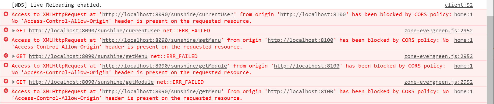
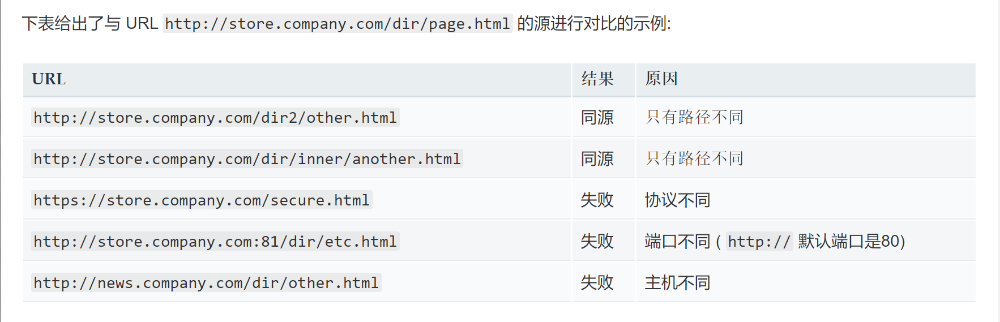
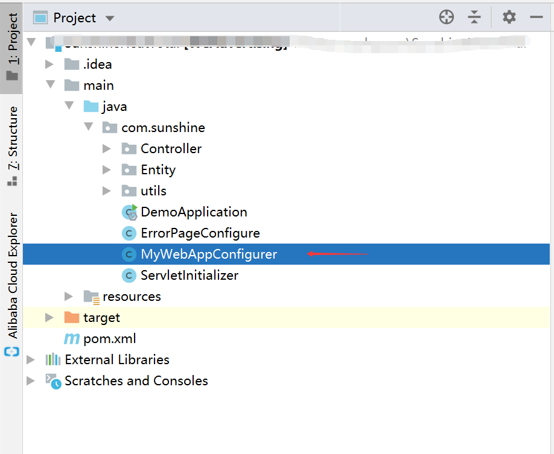

记得在弄毕业设计时，遇到一个问题，至今我都印象深刻：

<div style="margin:auto;">



</div>

当时我懵了了好久，what？？'Access-Control-Allow-Origin' header是什么鬼？CORS policy又是什么鬼？

经过几天百度，才知道这是跨域问题，是前后端分离后一定要处理的问题

# Why跨域

跨域是因为浏览器的[同源策略](https://developer.mozilla.org/zh-CN/docs/Web/Security/Same-origin_policy)

所以，跨域在某种程度上就算跨源

## 同源策略

同源策略是一个安全策略，它用于限制一个源的资源与另一个源的资源进行交互

同源指两个url的协议、端口、主机（域名）相同，比如：

<div style="margin:auto;">



</div>

这就是为什么我那个前后端分离的项目出现不同源问题

为什么需要同源策略呢？

1. 预防[CSRF攻击](https://www.cnblogs.com/hyddd/archive/2009/04/09/1432744.html)

CSRF，Cross-site request forgery，跨站请求伪造：攻击者盗用了你的身份，以你的名义发送恶意请求

2. 预防非同源的Dom查询，比如：

```html
//HTML
<iframe name="yinhang" src="www.yinhang.com"></iframe>
```

```javascript
//JS
//由于没有同源策略的限制，钓鱼网站可以直接拿到别的网站的Dom
const iframe=window.frames['yinhang']
const node=iframe.document.getElementById('你输入账号密码的Input')
console.log("密码",node.value)
```

我现在才知道，为什么当时我修改不了iframe里面的css样式


# 跨源访问

跨源访问常见的有几种方法

1. CORS
   
2. 服务器代理

## CORS

CORS，Cross-Origin Resource Sharing，跨源资源共享，也称跨域资源共享

该机制使用附加的HTTP头来告诉浏览器，准许运行在一个源上的Web应用访问位于另一不同源选定的资源

CORS需要浏览器和服务器同时支持。目前，绝绝绝大部分浏览器都支持CORS，所以实现CORS的关键是服务器

想当年，我毕设就是通过配置CORS来解决这个朦朦胧胧的跨域问题

对Spring boot后端，我的解决方法：

1、新建配置类：`MyWebAppConfigurer.java`，比如：

<div style="margin:auto;">



</div>


2、添加下面代码：

```java
@Configuration
public class MyWebAppConfigurer implements WebMvcConfigurer {

    @Override
    public void addCorsMappings(CorsRegistry registry) {
        registry.addMapping("/**")     //允许跨域访问接口    '/**'表示全部接口
                .allowedOrigins("http://localhost:8100","http://localhost")    //允许哪些源可跨域访问
                .allowedMethods("GET","POST","HEAD","DELETE","OPTIONS")      //允许跨域的请求方法
                .allowCredentials(true);     //允许cookies跨域
    }
}

```


## 服务器代理

这个不同的前端框架往往会不一样，不过思想都是一样的，就是将前端的源转成与后端同源。


<br/>

参考：
1.[MDN-浏览器的同源策略](https://developer.mozilla.org/zh-CN/docs/Web/Security/Same-origin_policy)
2.[写Bug兄弟的一篇NB博文](https://segmentfault.com/a/1190000015597029)
3.[hyddd关于CSRF的博文](https://www.cnblogs.com/hyddd/archive/2009/04/09/1432744.html)
4.[MDN-跨源资源共享(CORS)](https://developer.mozilla.org/zh-CN/docs/Web/HTTP/Access_control_CORS)
5.[阮一峰博文-跨域资源共享 CORS 详解](http://www.ruanyifeng.com/blog/2016/04/cors.html)