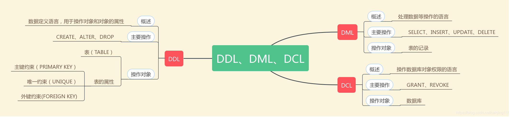

# DDL

DDL（Data Definition Language）数据定义语言，用于**操作数据库对象（表）**。

比如常用的 `create table` 、`alter table` 、`drop table`、`truncate table` 、`create index` 、`drop index` 就属于DDL。

# DML

DML（data manipulation language）数据操纵语言，用于**操作数据库对象（表）中的数据**，即操作的单位是记录。

比如我们平时常用的 `select` 、`update` 、 `insert` 、 `delete` 就属于DML

# DCL

DCL（Data Control Language）数据控制语言，用来授予或回收访问数据库的某种特权，并控制数据库操纵事务发生的时间及效果，对数据库实行监视等。总的来说，**DCL操作是数据库对象的权限**，这些操作的确定使数据更加的安全。

比如常见的 `grant` 、 `revoke` 、 `commit` 、 `savepoint` 、 `rollback` 就属于DCL

# 参考

1. [MySQL基础系列之 DDL、DML和DCL的区别与理解](https://blog.csdn.net/caiqing116/article/details/84404802)
2. [DDL与DML区别](https://www.cnblogs.com/index01/p/13323975.html)
3. [DDL与DML的区别](https://blog.csdn.net/julia294/article/details/80486293)
