## 概述

浏览器缓存，也叫Http缓存，其机制是根据HTTP报文的缓存标识进行的

其缓存过程是这样的：当浏览器第一次向服务器发起请求，拿到请求结果后，会根据响应报文中HTTP头的缓存标识，决定是否缓存结果，是，则将请求结果和缓存标识存入浏览器缓存中

其中，根据验证缓存是否有效的方式上，是将缓存过程分为两个部分，分别是 **强制缓存** 和 **协商缓存** 

## 强制缓存

在第一次访问服务器取到数据之后，在过期时间之内不会再去重复请求，在过期时间内重复请求，会返回200状态码，并且这状态码为灰色，size那里会显示memory cache或disk cache

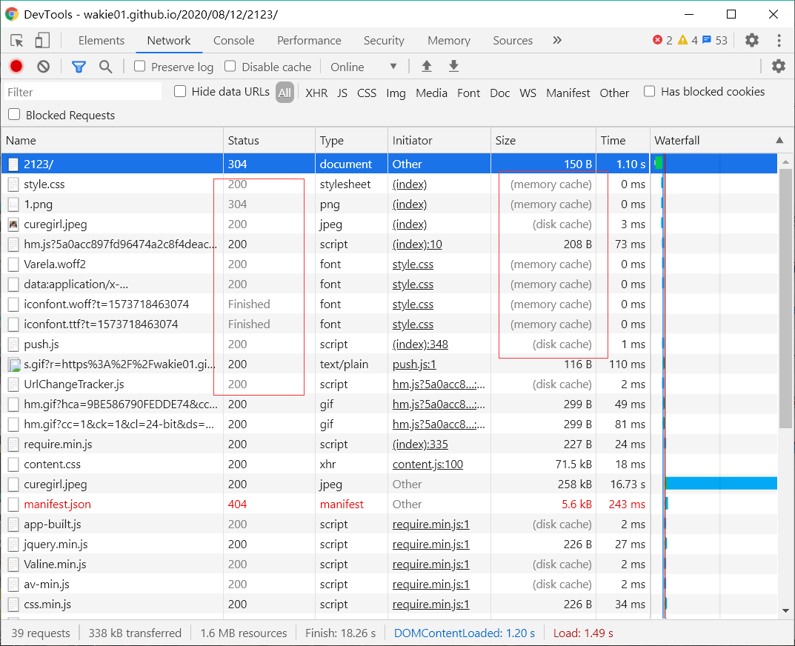

**流程图**

强缓存失效

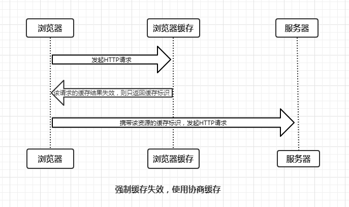

强缓存有效

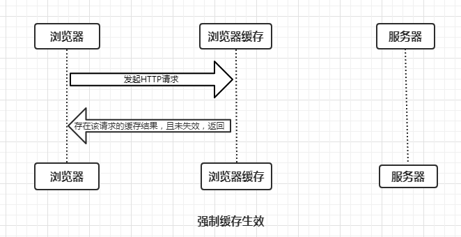

**缓存规则**

当浏览器向服务器发起请求时，服务器会将缓存规则放入HTTP响应报文的HTTP头中和请求结果一起返回给浏览器，控制强制缓存的字段分别是Expires和Cache-Control，其中Cache-Control优先级比Expires高。

#### Expires

Expires是HTTP/1.0控制网页缓存的字段，其值为服务器返回该请求结果缓存的到期时间，即再次发起该请求时，如果客户端的时间小于Expires的值时，直接使用缓存结果。

但，现在浏览器默认使用的是HTTP/1.1，

到了HTTP/1.1，Expire已经被Cache-Control替代，原因在于Expires控制缓存的原理是使用客户端的时间与服务端返回的时间做对比，那么如果客户端与服务端的时间因为某些原因（例如时区不同；客户端和服务端有一方的时间不准确）发生误差，那么强制缓存则会直接失效

比如这个，我打开博客的时间是2020/08/13 23:00左右，而服务器那边设置的Expires时间是这个，很明显不合理，毕竟这个github的服务器当前在荷兰

但，为了兼容HTTP/1.0，还是会将Expire设置上

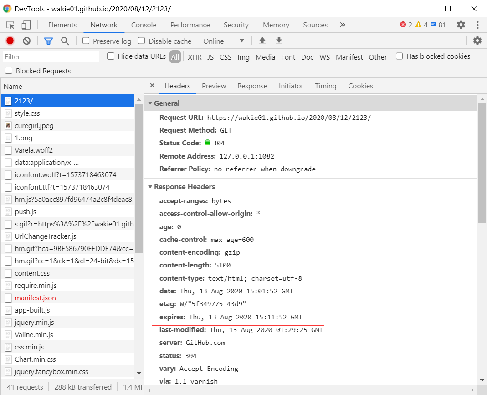

#### Cache-Control

Cache-Control是HTTP/1.1控制网页缓存的字段，其主要取值为：

- **public：** 客户端和代理服务器都可缓存内容

- **private：** 客户端可以缓存内容，代理服务器不可以，Cache-Control的默认取值

- **no-cache：** 客户端可以缓存内容，不用强制缓存，直接走协商缓存

- **no-store：** 全都不用缓存

- **max-age=xxx：** 缓存内容将在xxx秒后失效

常见用法：
cache-control: max-age=xxxx,public      
cache-control: no-cache

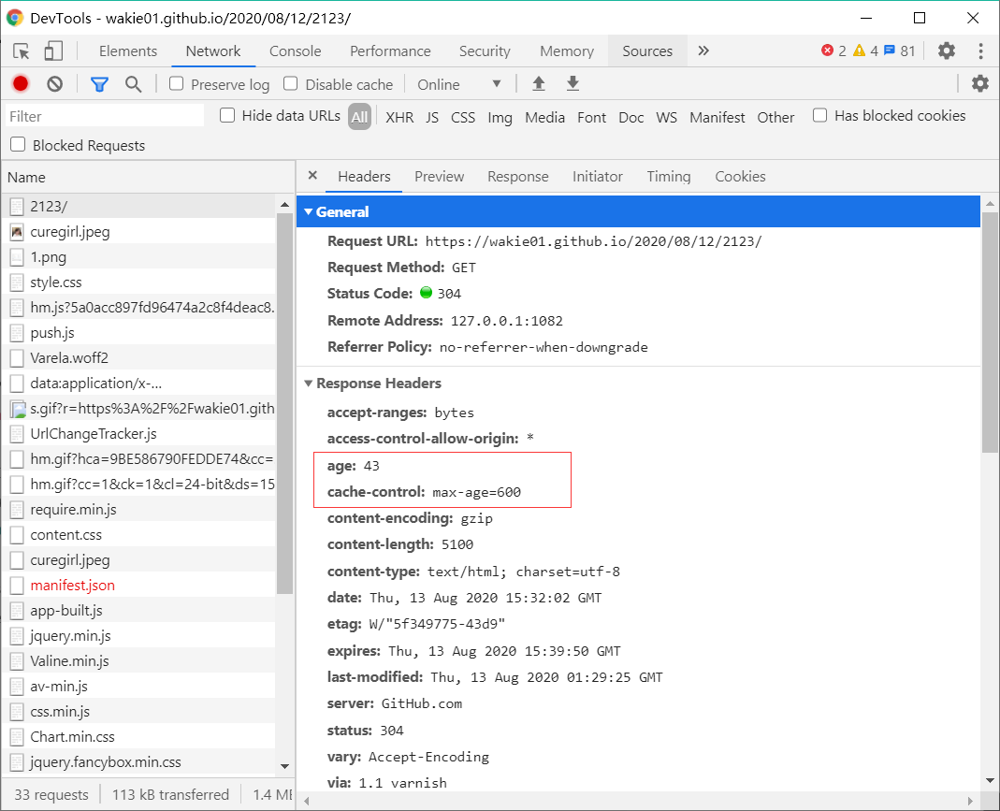

如上图显示，响应头的缓存规则是：在600秒内再次发起该请求，则会直接使用缓存结果，强制缓存生效，而`age`的作用是计时，当前距上一次请求已过了43秒，**可是** 这里的状态码是304，显示用的是协商缓存，为什么呢？

**Cache-Control在请求头与响应头中的作用**

- **在请求头：** 通知服务器自己用什么强制缓存规则，比如no-cache、max-age=0，告诉服务器自己直接走协商缓存

- **在响应头：** 通知浏览器可以用什么强制缓存规则，当然浏览器可以选择不用，比如max-age=600，告诉浏览器600s内可直接使用强制缓存

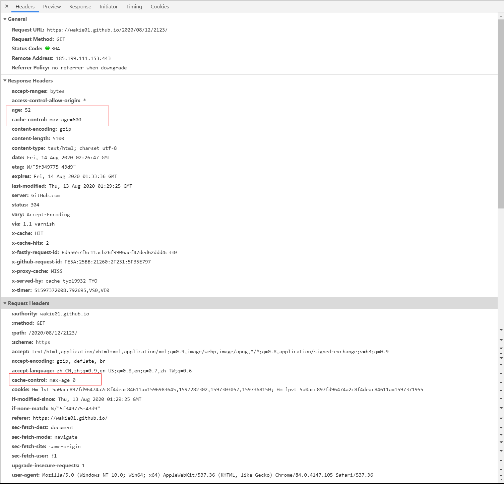

## 协商缓存

在第一次访问服务器取到数据之后，每次读取数据时都需要跟服务器通信，向服务器发送的是缓存标识，用来验证缓存内容是否没变。
没变，服务器则返回304状态码，浏览器就读取本地缓存数据   
变，服务器会将新数据和新的缓存标识一起返回到浏览器，然后浏览器更新缓存标识，此时状态码是200

**流程图**

协商缓存生效，返回304

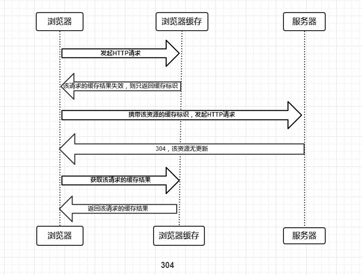

协商缓存失效，返回200和请求结果结果

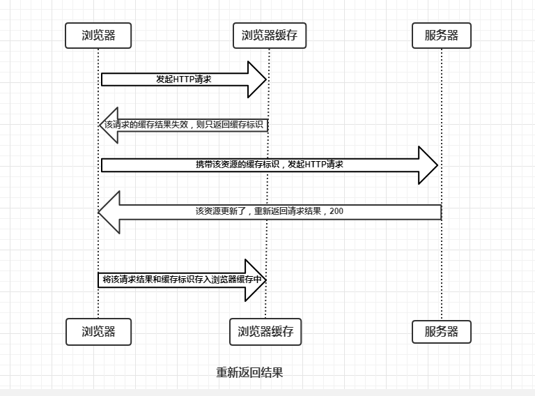

例子

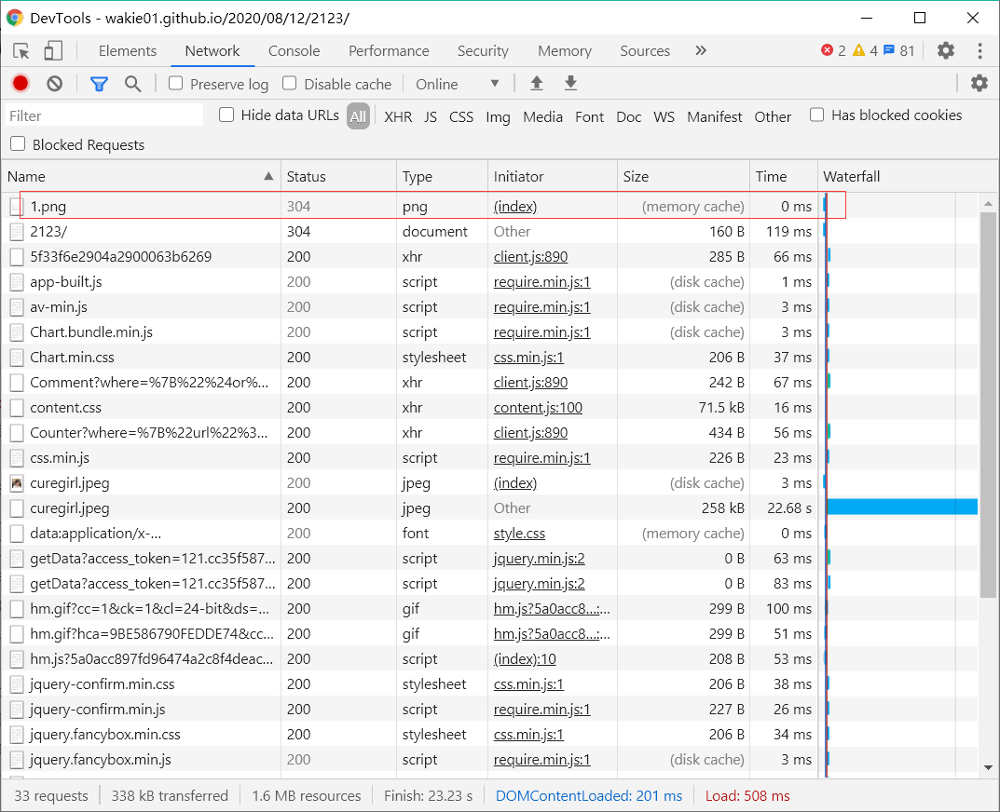

由上图可知，有个304状态码也是灰色的，并且在那旁边会显示from memory cache或from disk cache

那不是灰色的304又是怎么回事呢？不是灰色的话，旁边没有from memory cache或from disk cache（**待解决**）

#### Last-Modified / If-Modified-Since

Last-Modified / If-Modified-Since 是HTTP/1.0控制网页缓存的字段

- **Last-Modified：** 服务器响应请求时，返回该资源文件在服务器最后被修改的时间

- **If-Modified-Since：** 客户端再次发起该请求时，携带上次请求返回的Last-Modified值，通过此字段值告诉服务器该资源上次请求返回的最后被修改时间。服务器收到该请求，发现请求头含有If-Modified-Since字段，则会根据If-Modified-Since的字段值与该资源在服务器的最后被修改时间做对比，若服务器的资源最后被修改时间大于If-Modified-Since的字段值，则重新返回资源，状态码为200；否则则返回304，代表资源无更新，可继续使用缓存文件

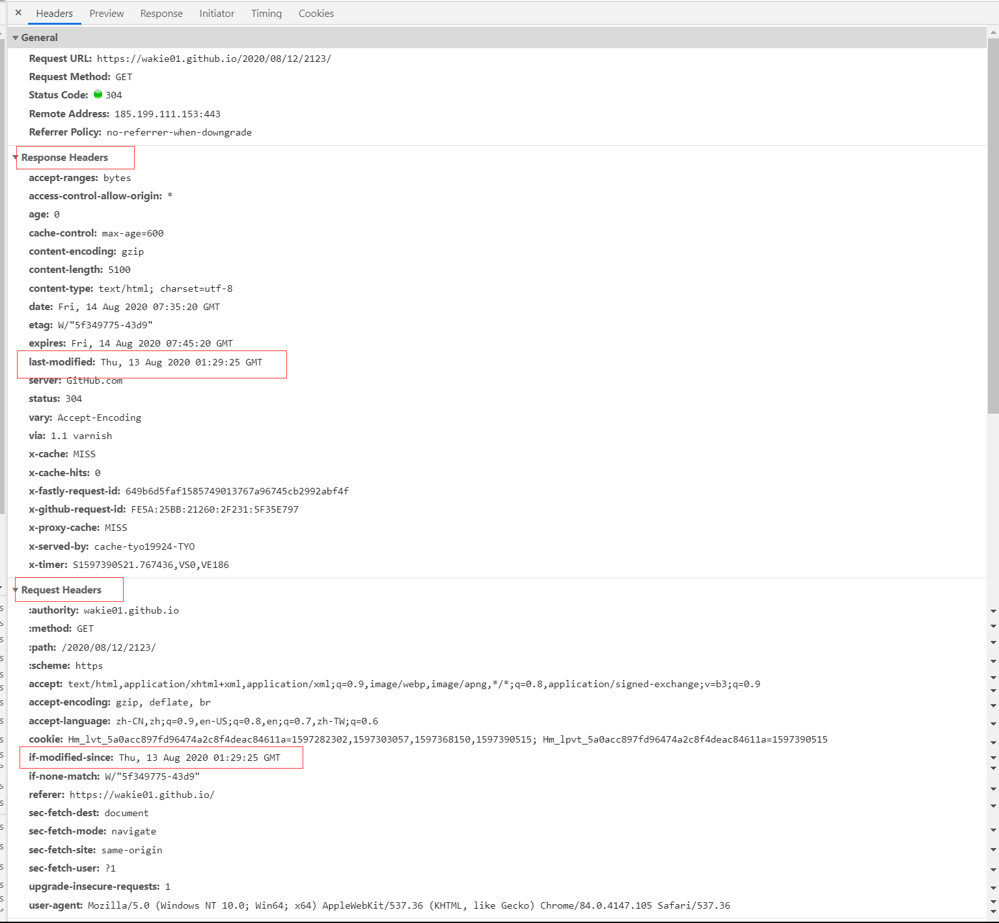

#### Etag / If-None-Match

Etag / If-None-Match 是HTTP/1.1控制网页缓存的字段

- **Etag：** 服务器响应请求时，返回当前资源文件的一个唯一标识(由服务器生成)

- **If-None-Match：** 是客户端再次发起该请求时，携带上次请求返回的唯一标识Etag值，通过此字段值告诉服务器该资源上次请求返回的唯一标识值。服务器收到该请求后，发现该请求头中含有If-None-Match，则会根据If-None-Match的字段值与该资源在服务器的Etag值做对比，一致则返回304，代表资源无更新，继续使用缓存文件；不一致则重新返回资源文件，状态码为200

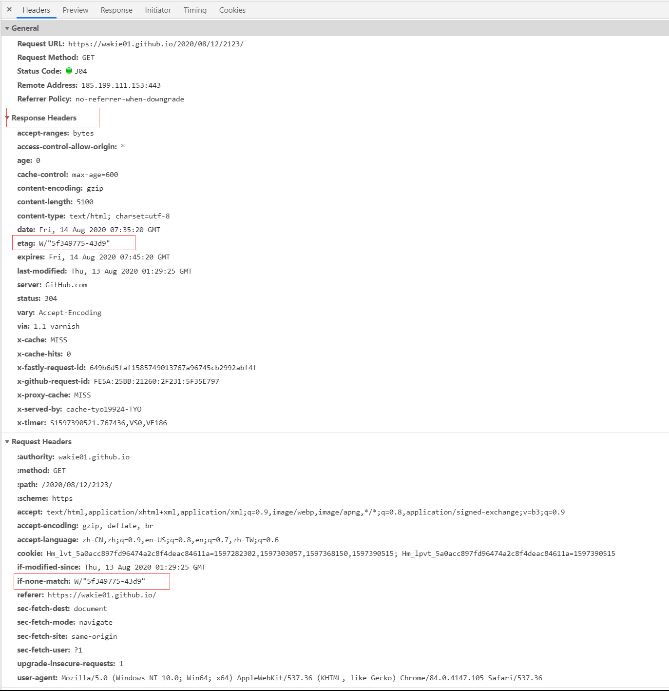

>Etag / If-None-Match优先级高于Last-Modified / If-Modified-Since，同时存在则只有Etag / If-None-Match生效。 其实就是HTTP/1.1优先级高于HTTP/1.0

到这里，我就有个疑问❓了，服务器该怎么验证这个标识值有没有改变呢？重新获取一次资源，然后计算该资源的标识值，然后对比？若是一样的话，就告诉浏览器使用缓存即可，不同就把资源传给浏览器？这样的话又快在哪里呢？（**待解决**）

## 两者关系

当浏览器两种缓存机制都用时，浏览器会先用强制缓存，当强制缓存失效时，再使用协商缓存

## 优缺点

- **优点：** 减少不必要的数据传输，节省带宽；减少服务器负担，提升网站性能；加快客户端加载网页的速度，用户体验友好

- **缺点：** 服务端资源更新后，客户端更新滞后    

## 总结

强制缓存优先于协商缓存进行，若强制缓存(Expires和Cache-Control)生效则直接使用缓存，若不生效则进行协商缓存(Last-Modified / If-Modified-Since和Etag / If-None-Match)，协商缓存由服务器决定是否使用缓存，若协商缓存失效，那么代表该请求的缓存失效，重新获取请求结果，再存入浏览器缓存中；生效则返回304，继续使用缓存

最后的最后，这个Http缓存在一般的前后端分离的应用中该怎么应用呢？这又是另一篇章了

 

参考：
1.[heyingye的博文](https://heyingye.github.io/2018/04/16/%E5%BD%BB%E5%BA%95%E7%90%86%E8%A7%A3%E6%B5%8F%E8%A7%88%E5%99%A8%E7%9A%84%E7%BC%93%E5%AD%98%E6%9C%BA%E5%88%B6/)
2.[Thomas赵骐的博文](https://www.jianshu.com/p/256d0873c398)
3.[Cedric's Blog](https://www.cnblogs.com/cckui/p/11506514.html)
4.[sliiva blog](https://blog.csdn.net/lncci/article/details/82182788)
5.[蜗牛1T blog](https://blog.csdn.net/happyqyt/article/details/89642013)