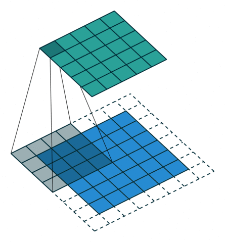

# 论文介绍

Dumoulin V, Visin F. A guide to convolution arithmetic for deep learning[J]. arXiv preprint arXiv:1603.07285, 2016.

引用量：1268

藉此文章来了解一下**卷积** 

# 卷积

<table style="width:100%; table-layout:fixed;">
  <tr>
    <td style="text-align:center"></td>
    <td style="text-align:center"></td>
    <td style="text-align:center"></td>
    <td style="text-align:center"></td>
  </tr>
  <tr>
    <td style="text-align:center">No padding, no strides</td>
    <td style="text-align:center">Arbitrary padding, no strides</td>
    <td style="text-align:center">Half padding, no strides</td>
    <td style="text-align:center">Full padding, no strides</td>
  </tr>
  <tr>
    <td style="text-align:center"></td>
    <td style="text-align:center"></td>
    <td style="text-align:center"></td>
    <td style="text-align:center"></td>
  </tr>
  <tr>
    <td style="text-align:center">No padding, strides</td>
    <td style="text-align:center">Padding, strides</td>
    <td style="text-align:center">Padding, strides (odd)</td>
    <td style="text-align:center"></td>
  </tr>
</table>

卷积输出结果尺寸计算：
$$
o= \lfloor \frac {i+2p-k} s \rfloor +1
$$
其中：

- $o$ ：输出矩阵尺寸（output）
- $i$ ：输入矩阵尺寸（input）
- $p$ ：在四周填充数（padding）
- $k$ ：卷积核尺寸（kernel）
- $s$ ：步长（stride）

关于padding，可分为：

1. Zero padding：对填充数没定死
2. Half（same） padding：填充数为 $\lfloor k/2 \rfloor$ ，其中 $k$ 为卷积核尺寸，且 $k$ 为奇数
3. full padding：填充数为 $k-1$ 

一般来说，padding填充的值为0

关于步长，指每次移动卷积核的步长。

在CNN中，常用到多卷积核对输入进行卷积操作，所以，常定义一组卷积核：

$$
(n,m,k_1, \dots ,k_N)
$$
其中：

- $n$ ：输出特征矩阵的个数
- $m$ ：输入特征矩阵的个数
- $N$ ：输入特征矩阵的维度（通道数）
- $k_j$ ：某个维度的卷积核（ $1 \leq j \leq N$ ）

# 转置卷积

<table style="width:100%; table-layout:fixed;">
  <tr>
    <td style="text-align:center"></td>
    <td style="text-align:center"></td>
    <td style="text-align:center"></td>
    <td style="text-align:center"></td>
  </tr>
  <tr>
    <td style="text-align:center">No padding, no strides, transposed</td>
    <td style="text-align:center">Arbitrary padding, no strides, transposed</td>
    <td style="text-align:center">Half padding, no strides, transposed</td>
    <td style="text-align:center">Full padding, no strides, transposed</td>
  </tr>
  <tr>
    <td style="text-align:center"></td>
    <td style="text-align:center"></td>
    <td style="text-align:center"></td>
    <td style="text-align:center"></td>
  </tr>
  <tr>
    <td style="text-align:center">No padding, strides, transposed</td>
    <td style="text-align:center">Padding, strides, transposed</td>
    <td style="text-align:center">Padding, strides, transposed (odd)</td>
    <td style="text-align:center"></td>
  </tr>
</table>

这些padding是比较常见的，不限死。

