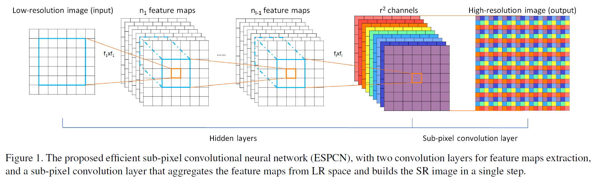

# 论文介绍

Shi W, Caballero J, Huszár F, et al. Real-time single image and video super-resolution using an efficient sub-pixel convolutional neural network[C]//Proceedings of the IEEE conference on computer vision and pattern recognition. 2016: 1874-1883.

引用量：3156

# 动机

1. 以往的上采样方法——双三次插值，效果不够好，且增加了模型的计算复杂度
2. 以往的SR模型是预上采样，计算复杂度较高

# 贡献

1. 提出亚像素卷积层（sub-pixel convolution layer），并藉此来对图像进行上采样。

## ESPCN

本论文提出的网络是ESPCN 。

ESPCN有 $L$ 层，其中前 $L-1$ 层做特征提取，最后一层做上采样操作。

其中前 $L-1$ 层的操作如下：
$$
\begin{align}
f^{\,1}({\bf{I}}^{LR};W_1,b_1) & =\phi \left(W_1 * {\bf{I}}^{LR}+b_1 \right) \\
& \\
f^{\,l}({\bf{I}}^{LR};W_{1:l},b_{1:l}) & = \phi \left( W_l * f^{l-1}({\bf{I}}^{LR})+b_l \right)
\end{align}
$$
其中：

- $\phi$ ：非线性激活函数
- $W_l$ ：第 $l$ 层的卷积核，尺寸：$n_{l} \times n_{l-1} \times k_l \times k_l$ 
  - $k_l \times k_l$ ：第 $l$ 层的卷积核的长、宽
  - $n_l$ ：第 $l$ 层的卷积核卷积过后输出的特征数，注意 $n_0=C$ ，$C$ 为输入图像的通道数
- $*$ ：卷积操作
- $b_{\,l}$ ：第 $l$ 层的偏差，尺寸： $1 \times n_l$ 
- $l$ ：$l \in (1,L-1)$ 
- $f^{\,l}$ ：第 $l$ 层卷积操作

总的来说，前 $L-1$ 层的操作就是做 $L-1$ 次卷积，做特征提取。

第 $L$ 层的操作为将LR特征矩阵转化为HR图像 ${\bf{I}}^{SR}$ ，操作如下：
$$
{\bf{I}}^{SR}=f^L({\bf{I}}^{LR})={\mathcal{PS}} \left( W_L * f^{\,L-1} ({\bf{I}}^{LR}) + b_L \right)
$$
其中：

- ${\mathcal{PS}}$ ：周期洗牌算子，将 $H \times W \times C \cdot r^2$ 张量转化为 $rH \times rW \times C$ 
- $W_L$ ：第 $L$ 层的卷积核，尺寸： $n_{L-1} \times r^2C \times k_L \times k_L$ 

## 亚像素卷积

上图的最后一层就是亚像素卷积，其运作如下：

1. 假设输入图像尺寸： $3 \times 3$ ，缩放因子： $r$ 
2. 对输入图像进行Half Padding卷积操作，提取特征，得到 $r^2 \times 3 \times 3$ 特征矩阵
3. 对特征矩阵进行周期筛选（periodic shuffling），如上图所示排列，得到尺寸为 $r*3 \times r*3$ 的超分图像。

其特点：

1. 利用图像信息
2. 快

